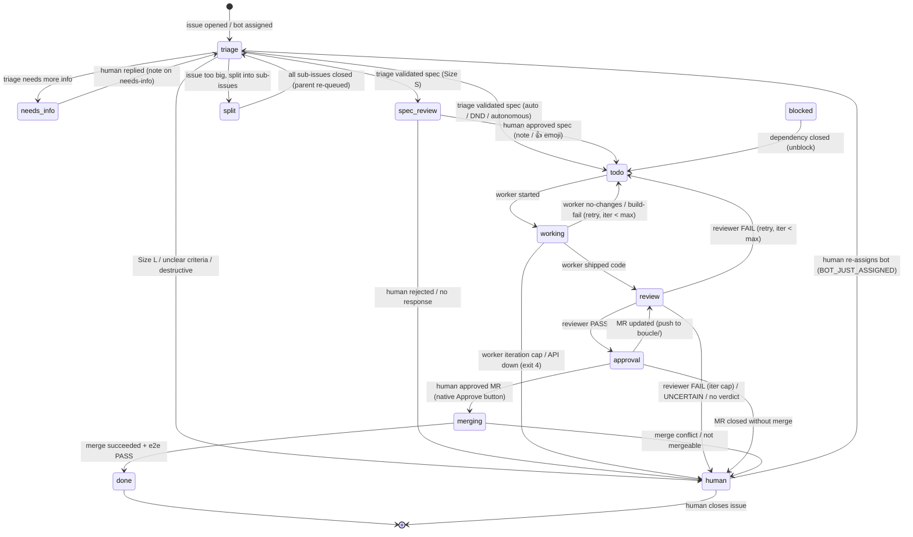

# SKILL.md — Boucle protocol

> **Source of truth for the boucle protocol.** This file is the behavioral
> contract: the labels, markers, state machine, and handoff rules that boucle
> speaks. It is runtime-agnostic (does not reference jcode internals) and
> forge-agnostic (covers GitLab + GitHub). A local harness (opencode, jcode,
> pi, or any agent runtime that reads markdown) loads this skill to "speak
> boucle" — interact with a boucle loop on any consumer repo correctly.
>
> **Projection at install:** `bin/setup` symlinks `.jcode/skills/boucle/SKILL.md`
> → `../../SKILL.md` so the consumer's harness loads it from the conventional
> skills directory. The source is this file; the symlink is the projection.
>
> **Enforcement:** `bin/check-doc-sync` validates that the labels and markers
> in the engine code match this file. A label or marker in code that is absent
> here fails CI red — this file is the spec, not a description.
>
> **Relationship to other charters:**
> - `AGENTS.md` — contribution conventions + lessons learned (incident
>   catalog). Lessons that state a current protocol invariant cross-reference
>   this file (`See SKILL.md §<id>`); the normative text lives here.
> - `ARCHITECTURE.md` — engine implementation (code structure, forge adapters,
>   CI stages). The *how*, not the *what*.
> - `CONTEXT.md` — identity, audience, philosophy, constraints. The *why*.
> - `README.md` — overview, getting started. The *entry*.

---

## 1. Invariants

The protocol rests on ten invariants. Every agent (CI or local harness) and
every human interacting with boucle MUST honor them. The AGENTS.md lessons are
incident catalogs that instantiate these invariants; the normative statement
lives here.

### I1 — Forge-native

Boucle lives in the forge. NEVER introduce a new frontend, a server, or a
computer to keep running. The forge is the UI; labels are the state; comments
are the channel. (CONTEXT.md §7, AGENTS.md lesson #55.)

### I2 — Label-driven state machine

Labels are the source of truth. No external database, no separate state API.
The state machine is driven by `boucle:*` labels (detail axis) + `boucle::status::*`
labels (gross axis: `bot`/`human`/`done`). A label change IS the state
transition. (CONTEXT.md §7.)

### I3 — Async by design

The human is not in front of the screen. Work happens asynchronously, driven
by labels and comments. The loop does not wait for a human reply — it progresses
to the next gate and parks at a human-readable state (`boucle:spec-review`,
`boucle:approval`, `boucle:human`). (CONTEXT.md §1.)

### I4 — Post-early

Post the comment or verdict FIRST, then refine. An incomplete draft posted is
ALWAYS better than a refinement never posted. Step-budget waste (the agent
exhausts its budget without posting) is bug #1. (AGENTS.md lesson #1, #2, #5.)

### I5 — Idempotence

All `bin/*` scripts and label writes MUST be idempotent. Re-running a script
produces no additional side effects. A label PUT that does not change the label
set is skipped (the forge records a Resource Label Event on every PUT, even a
no-op — CONTEXT.md §8). (AGENTS.md lesson #4.)

### I6 — SHA-anchored verdicts

Reviewer and e2e verdicts MUST include the commit SHA as bare hex: no quotes, no
whitespace, no angle brackets. Exact format:
`<!-- boucle:verdict v=1 role=reviewer sha=abc123def456 -->`. The CI parser
FAILS if the format is not respected. (AGENTS.md lesson #6, #41, #47.)

### I7 — Marker-based self-recognition

Boucle recognizes its own writes by an invisible stamp
(`<!-- boucle:agent -->`), NEVER by the actor's identity. A comment posted
without the stamp is treated as a human reply and routed. This is mono-user-safe
(when bot and human share an account, the marker discriminates; the actor does
not). Every comment a harness posts MUST carry the stamp, or dispatch will treat
it as a human reply and re-route. (AGENTS.md lesson #55.)

### I8 — Doc-as-code

A doc that describes a system that no longer exists is a bug. Charter docs are
maintained as part of each work cycle: triage identifies impacted docs, worker
updates them in the same MR, reviewer verifies conformance, e2e verifies
production match. `bin/check-doc-sync` enforces code ↔ SKILL.md sync in CI.
(AGENTS.md "Documentation self-maintenance".)

### I9 — Upstream-first

Fix upstream (in boucle) FIRST, then update the consumer, then remediate
existing data. NEVER patch a consumer to work around a boucle defect. NEVER
introduce a local workaround that won't be reported upstream. (CONTEXT.md §7,
`.jcode/UPSTREAM-FIX-WORKFLOW.md`.)

### I10 — Serial merge

Merges are serialized via `resource_group: boucle-merge`. Each rebase is
against a `master`/`main` that includes previously-merged MRs. NEVER
parallelize merges — a concurrent rebase against a stale branch produces
conflicts and race conditions. (CONTEXT.md §7, AGENTS.md lesson #8.)

---

## 2. State machine

The state machine is two-axis: a **detail** label (`boucle:<state>`) that
answers "what is the loop doing?" and a **gross** label
(`boucle::status::<owner>`) that answers "whose side is this on?". In
mono-user mode (`BOUCLE_MONO_USER=true`) the gross axis is dropped (one actor
owns both sides — the question is meaningless).

### 2.1 Detail labels

| Label | Meaning | Owner (gross) |
|---|---|---|
| `boucle:triage` | Awaiting triage analysis | bot |
| `boucle:needs-info` | Triage needs more info from the reporter | human |
| `boucle:spec-review` | Spec validated by triage, awaiting human spec approval | human |
| `boucle:todo` | Spec approved, queued for the worker | bot |
| `boucle:working` | Worker is running | bot |
| `boucle:review` | Worker shipped, awaiting reviewer verdict | bot |
| `boucle:approval` | Reviewer PASSed, MR ready, awaiting human MR approval | human |
| `boucle:merging` | Merger is running (rebase + merge) | bot |
| `boucle:done` | Loop complete (merged + e2e PASS) | done |
| `boucle:human` | Escalated to a human (iteration cap, unclear criteria, destructive change, etc.) | human |
| `boucle:blocked` | Waiting on a dependency (sub-issue not closed) | bot |
| `boucle:split` | Parent issue split into sub-issues, waiting for them | bot |
| `boucle:dnd` | Transient flag: spec gate auto-validated during DND window | (rides along) |
| `boucle:autonomous` | Transient flag: spec gate skipped per-issue opt-in | (rides along) |
| `boucle:board` | The status-board issue (never dispatched) | — |
| `boucle:scheduled` | Issue created by a schedule (cron template) | — |

**Removed (dead labels, pruned from `bin/setup`):** `boucle:approved`,
`boucle:spec-approved`. MR approval uses the native forge Approve button; spec
approval uses a reply/emoji on `boucle:spec-review`. Neither uses a label.

### 2.2 Gross labels

| Label | Meaning |
|---|---|
| `boucle::status::bot` | The loop owns the next action (issue assigned to bot) |
| `boucle::status::human` | A human owns the next action (issue assigned to human reporter) |
| `boucle::status::done` | Terminal (loop complete) |

### 2.3 State diagram

### 2.4 Transition table

The transition table is derived from the handoff primitives in §4. Every
transition is effected by `set_boucle_label <iid> <detail> <gross>` (lib/boucle.sh:626),
which preserves non-boucle labels, writes the detail+gross pair idempotently,
reassigns the issue (bot on `boucle::status::bot`, human reporter on
`boucle::status::human`), and fires the outbound notification on the
transition (never on the state).

---

## 3. Marker reference

<!-- TODO: marker reference table — pending extraction (explorer task). -->

Boucle communicates via invisible HTML-comment markers stamped on issue/MR
comments and via structural sections in comment bodies. The markers are
machine-readable; the structural sections are detected by pattern.

### 3.1 Self-recognition marker

| Marker | Format | Written by | Parsed by | Purpose |
|---|---|---|---|---|
| `<!-- boucle:agent -->` | bare HTML comment | `stamp_agent_marker` (bin/forge/common.sh:81) on every `forge_issue_note` / `forge_mr_note` | `has_agent_marker` (bin/forge/common.sh:92) in dispatch.sh:99-103 | Distinguishes boucle's own writes from human replies. The primary anti-loop guard (invariant I7). |

### 3.2 Verdict / triage markers

<!-- TODO: verdict + triage + draft markers — pending extraction. -->

### 3.3 Dependency / hierarchy markers

<!-- TODO: depends-on, split-parent, sibling-blocked, blocked, e2e-origin, conflict-retry — pending extraction. -->

### 3.4 Operational markers

<!-- TODO: board, unblocked, obligations, sub-issue, catchup, commit, diagnostic, schedule — pending extraction (verify each exists in code). -->

### 3.5 Structural signals (not HTML comments)

<!-- TODO: ## TL;DR + ## Disposition, ## Parent issue #N, ## Depends on, ## Approach, emoji thumbsup, BOT_JUST_ASSIGNED, VERDICT: line — pending extraction. -->

---

## 4. Handoff protocol

The handoff protocol defines how a human (via the forge UI or a local harness)
interacts with the loop. Every handoff is a webhook event routed by dispatch.
The primitives below are extracted from `lib/boucle-ci/dispatch.sh` — they are
the real mechanisms, not invented verbs.

### 4.1 Re-queue after `boucle:human` — bot reassignment

**`boucle:human` is a dead-end for comments.** A plain note on an issue at
`boucle:human` matches no dispatch branch and falls through to `exit 0` —
nothing happens. The ONLY re-queue path is **re-assigning the issue to the bot**.

When a human assigns the bot to an issue (any idle state: `boucle:human`,
`boucle:needs-info` without reply, unlabeled, `boucle:todo`, `boucle:spec-review`),
the `issue update` webhook fires with an assignee change. Dispatch detects
`BOT_JUST_ASSIGNED` (dispatch.sh:504-539) and routes to triage from any idle
state. This is the explicit "reopen and resume" signal.

**A local harness that wants to re-queue a `boucle:human` issue MUST
re-assign the bot, not post a comment.** (AGENTS.md lesson #11, #44.)

### 4.2 Spec approval — reply or emoji

To approve a spec (issue at `boucle:spec-review`), the human either:
- posts a **non-bot note** on the issue (dispatch.sh:570-578), OR
- awards a **`thumbsup` emoji** on a note (dispatch.sh:579-587, gated by
  `BOUCLE_SPEC_APPROVAL_EMOJIS="thumbsup"`).

Either triggers `chain_to_role worker`. A note by the bot account (carrying
`<!-- boucle:agent -->`) is skipped — only human notes/emojis count.

### 4.3 MR approval — native forge button

To approve an MR (issue at `boucle:approval`), the human clicks the forge-native
**Approve** button on the MR. This fires the `merge_request approved` webhook
(dispatch.sh:167-185) → `chain_to_role merger`. A 👍 emoji on the MR does NOT
trigger the merger (emoji approval is spec-only).

**Native-approval race** (reviewer.sh:487-497): if the human approves the MR
*before* the reviewer finishes (issue still at `boucle:review`), the `approved`
webhook is silently dropped (dispatch requires `boucle:approval`/`human`). The
reviewer's PASS branch checks `forge_mr_approvals` and triggers the merger
directly to recover.

### 4.4 Push to `boucle/<iid>` — re-review

A push to the worker branch (`boucle/<iid>`) fires `merge_request update`
(dispatch.sh:187-205). If the issue was at `boucle:approval`, it reverts to
`boucle:review` and re-runs the reviewer (the approval is invalidated by the
push). Otherwise it re-runs the reviewer on the updated MR.

### 4.5 MR close — label-dependent

Closing the MR (not merging) fires `merge_request close` (dispatch.sh:207-258):
- `boucle:done` / `boucle:human` → no-op (terminal).
- `boucle:approval` → escalate to `boucle:human` (user decision).
- any other (`boucle:todo`/`working`/`review`/`merging`) → revert to
  `boucle:todo` + `chain_to_role worker` (fresh start).

### 4.6 Comment on MR — worker re-run with feedback

A human comment on the MR (dispatch.sh:331-359) reverts the issue to
`boucle:todo` and re-runs the worker with `BOUCLE_ITERATION=verdicts+1` and the
MR notes injected as `BOUCLE_REVIEWER_FEEDBACK`. This is the feedback channel
that feeds human amendments forward (AGENTS.md lesson #16, #53).

### 4.7 Closed-issue guard

Any webhook (note/emoji/update) on a **closed issue** is a no-op
(dispatch.sh:385-411) — EXCEPT bot assignment, which is the explicit
"reopen and resume" signal (dispatch.sh:404-412). A local harness MUST NOT
re-trigger a closed issue by any other means. (AGENTS.md lesson #44.)

### 4.8 Anti-loop filters (apply to ALL events)

| Filter | Condition | Action |
|---|---|---|
| boucle's own comment | note body has `<!-- boucle:agent -->` marker | skip (I7) |
| bot-originated event | `ACTOR == BOUCLE_BOT_USERNAME` and action ≠ `merge` | skip |
| system note | `object_attributes.system == true` | skip (AGENTS.md #34) |
| non-boucle branch | source_branch not `boucle/<iid>` | skip |

A local harness posting a comment MUST let the stamp be applied (via
`forge_issue_note` / `forge_mr_note` or by including `<!-- boucle:agent -->`
manually) or its comment will be treated as a human reply and re-route the
loop. (I7.)

### 4.9 Cross-role chaining

Every role transition funnels through `chain_to_role <iid> <role> [var=value]`
(lib/boucle.sh:1030) → `forge_trigger_role` (bin/forge/gitlab.sh:503 /
github.sh:514), which fires a pipeline trigger with `BOUCLE_ISSUE` +
`BOUCLE_ROLE` + extra vars. A local harness does NOT call `chain_to_role`
directly — it sets the label and lets dispatch route on the next webhook, OR
it re-assigns the bot (§4.1) to re-trigger triage.

---

## 5. Forge abstraction contract

The engine speaks to the forge through a thin seam (`bin/forge/<forge>.sh` +
`bin/forge/common.sh`). A local harness interacting with boucle SHOULD use the
same primitives (or their forge-native equivalents) so its writes are
indistinguishable from the engine's.

| Primitive | Signature | Effect |
|---|---|---|
| `forge_issue_note <iid> <msg>` | post a comment on an issue (stamped `<!-- boucle:agent -->`) | |
| `forge_mr_note <mr_iid> <msg>` | post a comment on an MR (stamped) | |
| `forge_issue_labels_get <iid>` | read current labels (comma-separated) | |
| `forge_issue_labels_set <iid> <labels>` | write labels (replaces boucle: set, preserves non-boucle) | |
| `forge_issue_assign <iid> <user_id>` | assign the issue | |
| `forge_mr_diff <mr_iid>` | fetch MR diff | |
| `forge_mr_approvals <mr_iid>` | check native approval state | |
| `forge_mr_check_suites <mr_iid>` | fetch CI check suites | |
| `forge_trigger_role <iid> <role> [vars]` | trigger a role pipeline | |
| `set_boucle_label <iid> <detail> <gross>` | write detail+gross labels idempotently + reassign + notify | |

**Marker stamping is mandatory.** Every comment posted via `forge_issue_note`
or `forge_mr_note` carries `<!-- boucle:agent -->`. A harness that posts via the
raw forge API MUST add the marker manually, or dispatch will treat the comment
as a human reply (I7).

---

## 6. Branch contract

The worker branch is `boucle/<iid>` (e.g. `boucle/42`). The lifecycle:
- **Worker** creates the branch from `master`/`main`, implements, pushes, opens
  an MR targeting `master`/`main`.
- **Reviewer** reviews the MR diff / deployed preview.
- **Merger** rebases the MR onto `master`/`main` (serially, via
  `resource_group: boucle-merge`) and merges.
- **Catchup** closes the issue after merge.

A local harness taking over an issue at `boucle:human` SHOULD work on the
existing `boucle/<iid>` branch (not a new branch) to preserve the worker's
commits. If the branch is stale, rebase onto `master`/`main` before pushing.
If the branch is absent, create `boucle/<iid>` from `master`/`main`.

**Never push to `master`/`main` directly** — the merger owns that transition.
A harness that pushes to `master`/`main` bypasses the serial-merge guard (I10)
and may produce conflicts with in-flight MRs.

---

## 7. Known gaps

- **Dogfood suspended.** The engine repo no longer dogfoods on a consumer
  (urgence-palestine.fr split out). Dogfooding will resume via a dedicated test
  consumer once the engine/consumer separation is stable. Until then, the
  62 AGENTS.md lessons remain as the incident catalog; new classes of bugs are
  discovered on real consumers. (CONTEXT.md §1.)
- **`boucle:files` planned, not yet implemented.** Documented in AGENTS.md
  lesson #62 and a design spec, but not in the engine code. A harness MUST NOT
  emit the `<!-- boucle:files v=1 paths=... -->` marker — the loop does not
  parse it yet.
- **Lesson numbering drift.** AGENTS.md has duplicate lesson numbers (#17,
  #22, #23, #24, #27, #28, #29, #41, #42, #47 appear twice). The doc's own rule
  says "never renumber — a pruned entry leaves a gap, not a shift", but
  collisions are not gaps. A curation pass will resolve this; until then,
  reference lessons by their unique first sentence, not by number alone.

---

## See also

- [AGENTS.md](AGENTS.md) — contribution conventions + lessons learned (incident catalog)
- [ARCHITECTURE.md](ARCHITECTURE.md) — engine implementation (code structure, forge adapters, CI stages)
- [CONTEXT.md](CONTEXT.md) — identity, audience, philosophy, constraints
- [README.md](README.md) — overview, getting started
- [.jcode/UPSTREAM-FIX-WORKFLOW.md](.jcode/UPSTREAM-FIX-WORKFLOW.md) — upstream fix workflow
