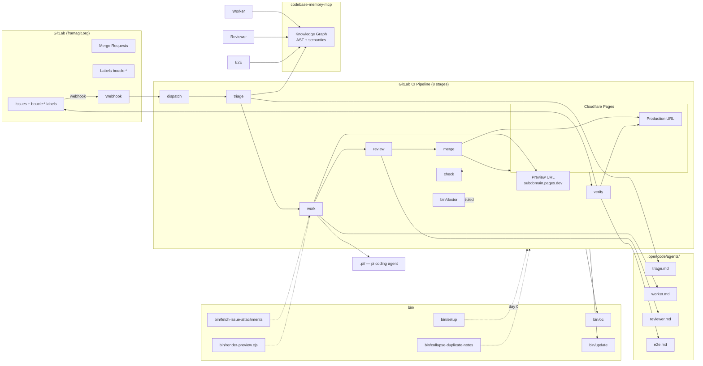
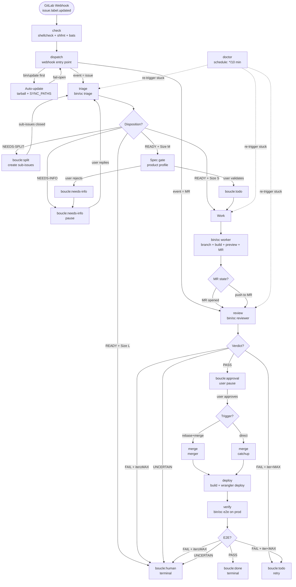
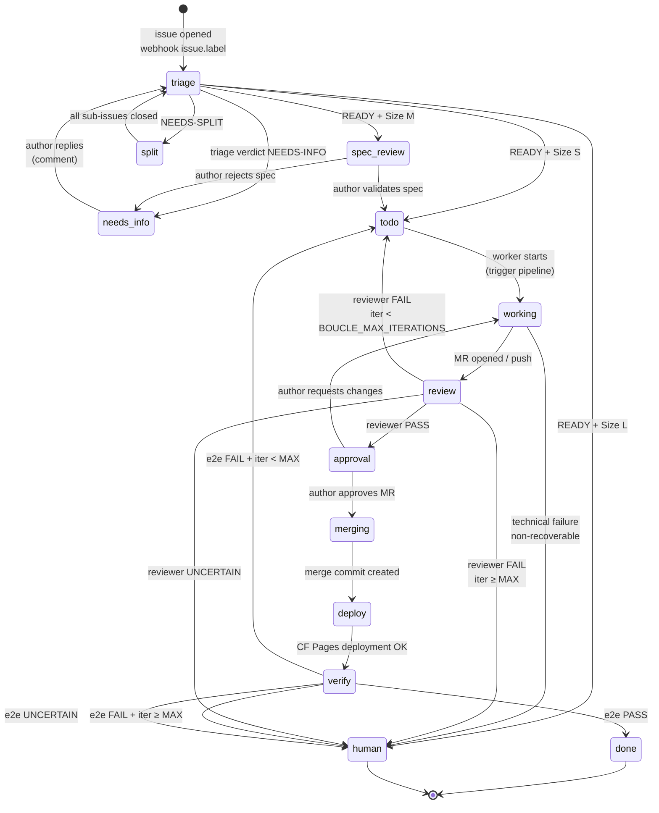
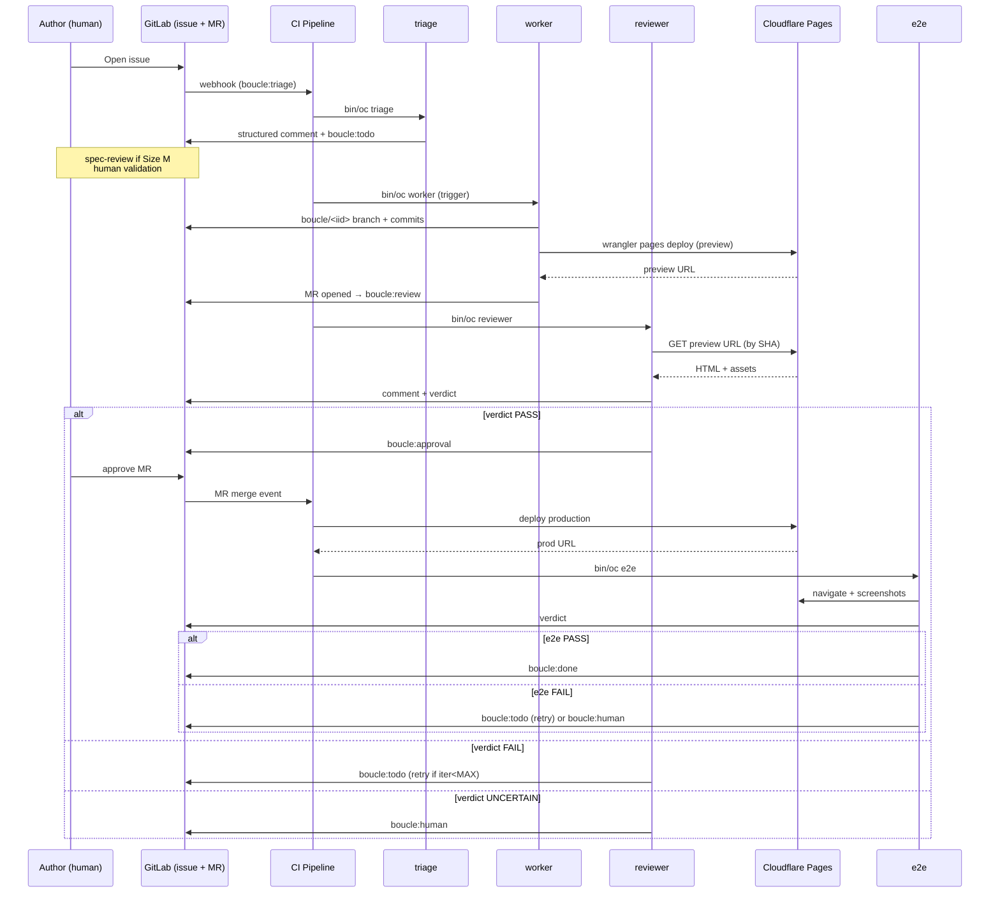
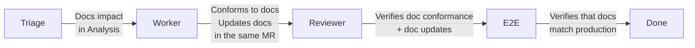

# ARCHITECTURE.md — Boucle Architecture

> **Maintenance** — This document is the architectural reference for boucle.
> Any change to the code, the CI pipeline, or the agents MUST update this
> document accordingly. See [AGENTS.md](AGENTS.md) for contribution
> conventions.

---

## 1. Overview

Boucle is an autonomous development loop: a GitLab issue triggers a CI pipeline that orchestrates 4 AI agents (triage, worker, reviewer, e2e) to analyze, implement, review, merge, and deploy on Cloudflare Pages. The state machine is driven by GitLab labels (`boucle:*`).

**Core principle** — the loop is driven by **GitLab labels**, not by a central orchestrator. Every state transition is a CI job that observes the labels, acts, and re-applies a new label. This makes the system resilient to failures (a failed job is simply re-run), distributed (any runner can resume), and auditable (every transition is visible in the issue timeline).

**Human guardrails** — boucle never acts alone for two decisions:
1. **Specification validation** (`boucle:spec-review`) — the issue author MUST confirm that the spec produced by triage matches their need.
2. **Merge Request approval** (`boucle:approval`) — a human MUST click "Merge" on the MR.

Everything else — triage, implementation, review, deployment, e2e checks — is automatic.

---

## 2. General architecture



---

## 3. CI Pipeline

The CI pipeline is composed of **8 stages** that chain through GitLab triggers (webhook, trigger API, schedule). Every stage is idempotent: a job re-run after a failure resumes the current label state without corrupting the state machine.



**Pipeline notes**
- `check` runs on branches and tags — it is a quality gate (shellcheck, shfmt, bats) that does not depend on boucle state.
- `dispatch` is the **only** webhook entry point. It ALWAYS runs `bin/update` first to stay up to date.
- `merge` has two sub-flows: **merger** (interactive rebase + merge after approval) and **catchup** (direct merge when the MR is already approved but the merge pipeline has failed).
- `doctor` is **scheduled** (cron `*/10 min`) and **observes** stuck issues (threshold `BOUCLE_STALENESS_THRESHOLD`) to re-trigger them.

---

## 4. Label state machine



**Conventions**
- Labels are **always** singular in the state machine and plural in comments (readability).
- An issue **MUST NEVER** have two `boucle:*` labels active at the same time (the runner uses `replace_labels`).
- Transitions to `human` or `done` are **terminal**: no agent removes these labels.
- Reopening an issue resets the state to `triage` after cleaning up the other `boucle:*` labels.

---

## 5. Agent architecture

### Agent table

| Agent | Model | Steps | Role |
| --- | --- | --- | --- |
| **triage** | `ollama-cloud/minimax-m3` | 200 | Analyzes the issue, posts a structured comment (TL;DR + Analysis + Acceptance criteria + Classification S/M/L + Questions + Disposition `READY`/`NEEDS-INFO`/`NEEDS-SPLIT`) |
| **worker** | `ollama-cloud/minimax-m3` | 50 | Implements on a `boucle/<iid>` branch, builds, deploys the Cloudflare preview, creates the MR |
| **reviewer** | `ollama-cloud/glm-5.2` | 35 | Adversarial review against the preview URL, verdict `PASS`/`FAIL`/`UNCERTAIN` anchored by commit SHA |
| **e2e** | `ollama-cloud/kimi-k2.7-code` | 20 | Verifies on the production URL, verdict `PASS`/`FAIL`/`UNCERTAIN` |

### Interaction sequence



**Agent notes**
- Each agent is defined in `.opencode/agents/<role>.md` and invoked via `bin/oc <role>`.
- The **harness** (`bin/oc`) wraps `opencode run`, applies the model mapping, handles retry (3x exponential backoff), captures logs, and applies an **empty-output guard** (empty output → exit 3 → retry).
- The **reviewer** and **e2e** are **adversarial**: they MUST actively look for defects, not validate.
- The **triage** agent **MUST NEVER** modify code — it only produces a structured comment on the issue.

---

## 6. bin/ scripts

| Script | Role |
| --- | --- |
| `bin/oc` | Harness entrypoint: wraps `opencode run`, role mapping (triage→m3, worker→m3, reviewer→glm-5.2, e2e→kimi-k2.7), 3x retry with exponential backoff, **empty-output guard** (empty output → exit 3 → retry), log capture to `.boucle/<issue>/`, Prometheus metrics, configurable timeout |
| `bin/setup` | Day-0 infrastructure setup (**idempotent**): creates the runner tag, CI variables, `boucle:*` labels, the board, the protected `main` branch, adds the bot as a member, generates the trigger token, configures the webhook, creates the Cloudflare Pages project |
| `bin/update` | Auto-update from upstream: fetch latest tag/commit, tarball download, extraction of `SYNC_PATHS`, **fail-open** (any error → warning + exit 0), tracking via `.boucle-version`, modes `release` (latest tag) or `dev` (latest commit on main), anti-feedback-loop guard (skip on `push-source`) |
| `bin/doctor` | Day-0 verification and diagnostics: ~20 checks (labels present, CI variables, branch protection, runner available, agents resolvable, CF Pages reachable, `.boucle-version` up to date) |
| `bin/fetch-issue-attachments` | Downloads issue attachments to `.boucle/<issue>/attachments/` with quotas `BOUCLE_IMAGE_MAX_BYTES` and `BOUCLE_IMAGE_TOTAL_MAX_BYTES`. Inherits attachments from the parent issue (one level) when the issue is a sub-issue carrying a `## Parent issue` section; disable with `BOUCLE_PARENT_ATTACHMENTS_DISABLE` |
| `bin/render-preview.cjs` | Renders `preview.html` → `preview.png` via `@sparticuz/chromium` + `puppeteer-core` (visual preview layer attached to MRs) |
| `bin/collapse-duplicate-notes` | Collapses duplicate comments: if an agent posts v2, CI replaces the first one (stable Note ID) |

---

## 7. Auto-update mechanism

Boucle self-updates from its own upstream. This lets consumers receive fixes without manual intervention.

**Configuration**
- `SYNC_PATHS` (constant in `bin/update`):
  - `bin`
  - `.pi`
  - `.gitlab-ci.yml`
  - `.opencode/opencode.json`
  - `.opencode/agents`
- `.boucle-version` (file at the consumer root): short SHA of the last sync.

**Modes**
- `release` (default): downloads the latest **tag** from GitHub/GitLab. Stable, no surprises.
- `dev`: downloads the latest **commit on main**. For testers, may break.

**Guardrails**
- **Fail-open**: any network, HTTP, or extraction error is converted to a warning + exit 0. The pipeline continues with the previous version. A loop that stops updating itself is less harmful than a loop that breaks deployments.
- **Anti-feedback-loop**: on pipelines where the push source is the `update` job itself (`$CI_PIPELINE_SOURCE == "push"`), `bin/update` is skipped. Otherwise, the push of `.boucle-version` would immediately re-trigger another update.
- **First run**: if `.boucle-version` does not exist, `bin/update` creates it with the current SHA, commits, and pushes. This prevents a fresh consumer from triggering a spurious diff on its first pipeline.

**Workflow**
1. `dispatch` starts → `bin/update` runs first.
2. Compares the upstream tag/commit with the local `.boucle-version`.
3. If different, downloads the tarball, extracts `SYNC_PATHS`, writes `.boucle-version`, commits, pushes.
4. The push triggers a new `dispatch` (but update is skipped thanks to the feedback-loop guard).

---

## 8. Extension points

Boucle exposes **5 seams** — documented, stable extension points. To extend boucle, modify one of these seams:

### 1. State machine (labels)
The contract is: **one `boucle:<state>` label per issue, exactly one**. To add a state:
1. Add the label via `bin/setup` (idempotent — tolerates duplicates).
2. Add the transition in the CI YAML (an extra job or a branch in an existing job).
3. Document the transition in this file (section 4).

### 2. Agent roles
Each agent is a `.opencode/agents/<role>.md` file invoked by `bin/oc <role>`. To add a role (e.g. `security-reviewer`):
1. Create `.opencode/agents/security-reviewer.md` with frontmatter `{model, steps}`.
2. Add the model mapping in `bin/oc`.
3. Add a CI stage that invokes it after a trigger label.

### 3. Harness (bin/oc)
The harness is intentionally thin: it wraps `opencode run`. To add a feature (e.g. model cache, custom telemetry), patch `bin/oc` while keeping the API stable: `bin/oc <role> <issue-iid>`.

### 4. Forge (GitLab API)
All GitLab calls go through `glab` (official CLI). To support another forge (GitHub, Gitea), replace the implementation behind the helpers in `bin/oc` without touching the agents.

### 5. Work state (.boucle/<issue>/state.md)
Each issue has a state file at `.boucle/<issue>/state.md`, **seeded from triage**. Agents read/write their progress, assumptions, and discoveries there. To add a field (e.g. `## Testing strategy`), document the schema in this file (section 5) and update the triage prompt.

### 5b. Feedback channel (reviewer + human → worker)
On every worker run, the worker job fetches ALL non-system notes from the issue's open MR (`boucle/<iid>` source branch) and exports them as `BOUCLE_REVIEWER_FEEDBACK`. `bin/oc` injects them into the worker's prompt as a "Prior feedback on the MR" section. This covers all 4 re-trigger paths (reviewer FAIL, human MR comment, empty MR, rebase conflict) with a single fetch — no per-path variable passing needed. On the first run, no MR exists yet, so the feedback is empty. The worker MUST address every actionable item before claiming done (see [AGENTS.md](AGENTS.md) lesson #16).

### 5c. MR description refresh on re-runs
When the worker reuses an existing MR (iteration 2+), the worker job calls `glab mr update` to refresh the title and description with the new preview URL, commit summary, and Approach. Without this, the MR description stays stale (wrong preview URL, empty Approach) and the reviewer tests the wrong deployment (see [AGENTS.md](AGENTS.md) lesson #19). The `## Approach` section of `state.md` is extracted into the MR description; if the worker leaves it as the seed placeholder, CI substitutes an explicit note so the description is never the literal seed text (see [AGENTS.md](AGENTS.md) lesson #20).

### 5d. Preview freshness verification
After the build, the worker job writes a commit-SHA marker into the build output (`__boucle_commit__.txt` + an HTML comment in `index.html`). After the deploy, the assertion fetches the marker from the preview URL with a retry loop (`BOUCLE_PREVIEW_PROPAGATION_WAIT`, default 60s, 5s backoff) until the deployed SHA matches the head SHA. The wrangler exit code is captured separately from the URL extraction (subshell + log file, not a swallowing pipeline under `set +o pipefail`). Without this, a stale preview (CDN cache, wrangler no-op on identical build output, or a failed redeploy swallowed by the pipeline) passes the old HTTP-200-only assertion and the reviewer FAILs on "preview doesn't match the commit" (see [AGENTS.md](AGENTS.md) lesson #21).

---

## 9. CI variables

All boucle configuration variables are prefixed with `BOUCLE_`. No other variable MUST be read by `bin/oc`.

| Variable | Description | Default |
| --- | --- | --- |
| `BOUCLE_ENABLED` | Enables or disables the entire loop. Set to `false` to freeze the pipeline without disabling the project. | **required**, `true` recommended |
| `BOUCLE_TOKEN` | Bot personal access token (issues, MRs, comments). | masked+protected, **required** |
| `BOUCLE_TRIGGER_TOKEN` | Pipeline trigger token for child jobs. | masked+protected, **required** |
| `BOUCLE_FORGE_HOST` | GitLab host. | `framagit.org` |
| `BOUCLE_BUILD_CMD` | Build command. | `npm ci && npm run build` |
| `BOUCLE_BUILD_OUTPUT` | Output directory produced by `BUILD_CMD`. | `public` |
| `BOUCLE_DEPLOY_CMD` | wrangler deploy command, MUST contain `$$BRANCH` (escaped for CI YAML). | template |
| `BOUCLE_DEPLOY_PROJECT` | Cloudflare Pages project name. | — |
| `BOUCLE_DEPLOY_URL_REGEX` | Regex to extract the preview URL from wrangler stdout. | `https://[a-z0-9.-]+\.pages\.dev` |
| `BOUCLE_PRODUCTION_URL` | Production URL (fallback for e2e). | — |
| `BOUCLE_IMAGE_MAX_BYTES` | Max size per attachment. | `10485760` (10 MiB) |
| `BOUCLE_IMAGE_TOTAL_MAX_BYTES` | Max total size of an issue's attachments. | `52428800` (50 MiB) |
| `BOUCLE_PARENT_ATTACHMENTS_DISABLE` | Disables parent-issue attachment inheritance in `bin/fetch-issue-attachments`. When `false`, sub-issues inherit uploads from their parent issue (one level). | `false` |
| `BOUCLE_MAX_PARALLEL_ISSUES` | Concurrency cap (issues processed in parallel). | `0` (unlimited) |
| `BOUCLE_MAX_ITERATIONS` | Max number of worker re-runs (then escalate to `boucle:human`). | `3` |
| `BOUCLE_STALENESS_THRESHOLD` | Threshold in seconds before an issue is considered stuck by `doctor`. | `300` |
| `BOUCLE_PREVIEW_DISABLE` | Disables PNG preview generation (`bin/render-preview`). | `false` |
| `BOUCLE_SPEC_PROFILE` | Spec gate profile (determines when human validation is required). | `product` (gate for Size M) |
| `BOUCLE_UPDATE_MODE` | Auto-update mode from upstream. | `release` |
| `BOUCLE_BOT_ID` | GitLab ID of the bot account (to distinguish bot comments from human ones). | — |
| `BOUCLE_REVIEWER_FEEDBACK` | All non-system notes from the issue's open MR (reviewer verdicts + human comments). Injected into the worker's prompt on every run so re-runs address prior feedback. Fetched by the worker job; empty on first run. | — |
| `BOUCLE_PREVIEW_PROPAGATION_WAIT` | Max seconds to wait for the preview CDN to propagate the new deployment before failing the worker job. The deploy assertion retries every 5s until the deployed SHA marker matches the head SHA. | `60` |
| `BOUCLE_RUNNER_TAG` | Tag of the GitLab runner that executes boucle jobs. | — |
| `PI_AUTH` | Authentication for the pi agent (secondary coding agent). | file-type → `auth.json` |

**Variable notes**
- `BOUCLE_TOKEN` and `BOUCLE_TRIGGER_TOKEN` MUST **always** be `masked+protected`. No boucle job MUST ever log their value.
- `BOUCLE_DEPLOY_CMD` MUST **always** contain `$$BRANCH` (the double `$` is the GitLab CI YAML escape).
- `BOUCLE_MAX_ITERATIONS` set to `0` means **no retry** (first failure → human).
- `BOUCLE_STALENESS_THRESHOLD` MUST be **strictly greater** than the longest job timeout (~120s for the worker).

---

## 10. Documentation self-maintenance

Boucle self-maintains its own documentation as part of its autonomous loop.
Documentation is **code**: a document that drifts from the system it describes
is a bug. The 4 agents share the responsibility of keeping the charter
documents (`ARCHITECTURE.md`, `AGENTS.md`, `CONTEXT.md`, `DESIGN.md`,
`LOOP.md`) in sync with reality. `README.md` is excluded — it is intended
for human readers, not agents.

### Documentation maintenance flow diagram



### Per-agent responsibilities

- **Triage** — Adds a `Docs impact: <docs>` line to the `Analysis` section of
  the structured comment, listing which charter documents the issue touches
  (e.g. `Docs impact: ARCHITECTURE.md, AGENTS.md`).
- **Worker** — Reads the impacted charter documents **before** implementing.
  Conforms to them. If the change requires updating a document (new state,
  new variable, new agent responsibility, new seam), the worker updates the
  document **in the same MR** as the code. When discovering a new bug or
  anti-pattern, the worker adds an entry to `Lessons learned` in
  [AGENTS.md](AGENTS.md).
- **Reviewer** — Verifies two things: (1) that the worker respected the
  charter documents during implementation (doc conformance), and (2) that
  the worker updated the documents when required (doc completeness). On
  `FAIL`, the reviewer MAY require the worker to add a `Lessons learned`
  entry to capture the regression.
- **E2E** — Verifies that charter documents match production reality: after
  deployment, the e2e agent confirms that the documented pipeline, agent
  responsibilities, and seams still hold.

### Documentation rules

- Use **Mermaid syntax** (` ```mermaid ` fenced blocks) for all diagrams.
- Use an **explicit/imperative tone** ("MUST", "NEVER", "ALWAYS") — no
  descriptive prose.
- Keep docs **up to date with the code** — NEVER let a doc describe a system
  that no longer exists.
- **Cross-reference** related docs with relative markdown links
  (e.g. `[AGENTS.md](AGENTS.md)`).

See [AGENTS.md](AGENTS.md) section "Documentation self-maintenance" for the
detailed workflow and the `Docs impact` entry format.

---

## See also

- [AGENTS.md](AGENTS.md) — Agent guide, lessons learned, anti-patterns
- [CONTEXT.md](CONTEXT.md) — Project context, tech stack, constraints
- [README.md](README.md) — Overview, getting started, usage
- [DESIGN.md](DESIGN.md) — Consumer site visual charter
- [LOOP.md](LOOP.md) — Per-consumer configuration
- [.opencode/UPSTREAM-FIX-WORKFLOW.md](.opencode/UPSTREAM-FIX-WORKFLOW.md) — Upstream fix workflow
