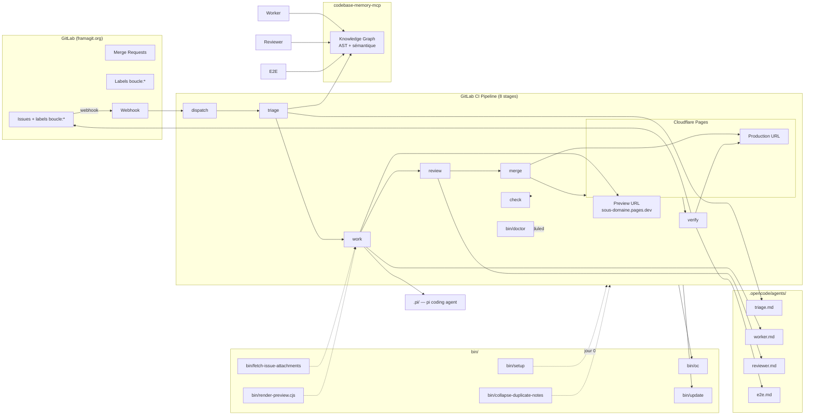
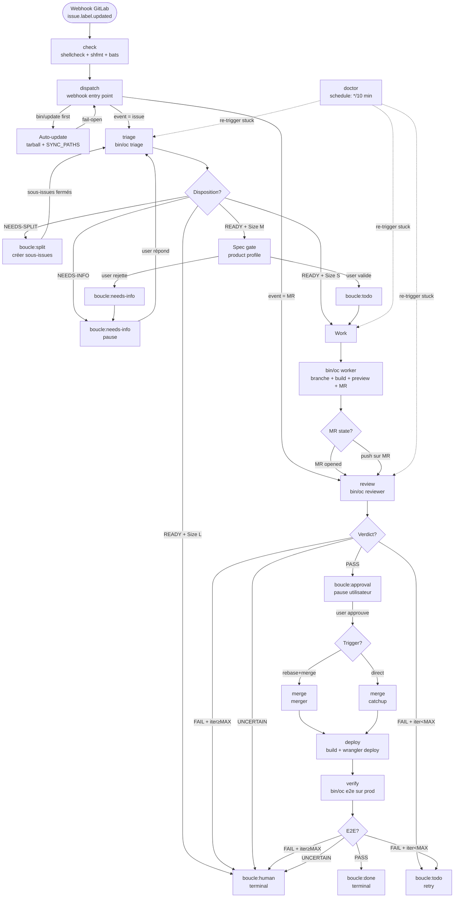
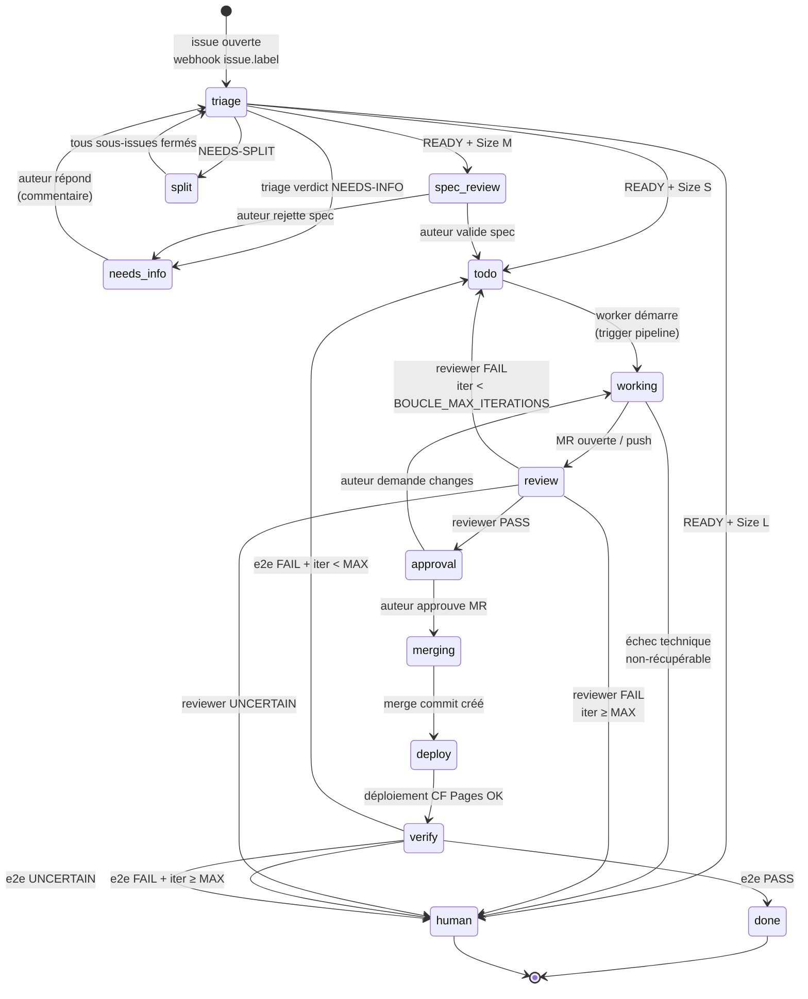
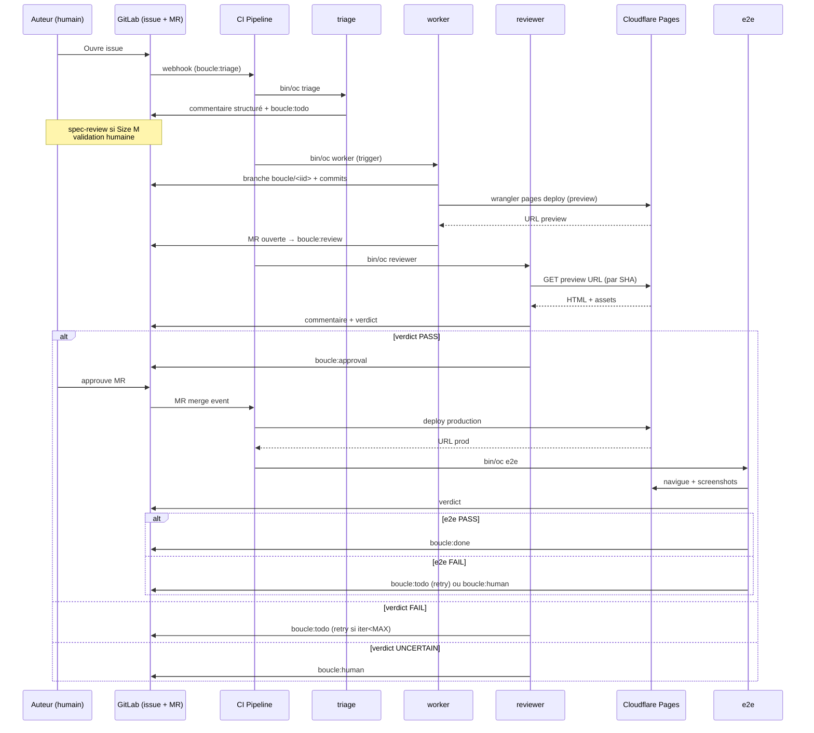

# ARCHITECTURE.md — Architecture de boucle

> **Maintenance** — Ce document est la référence architecturale de boucle.
> Toute modification du code, du pipeline CI, ou des agents doit mettre à jour
> ce document en conséquence. Voir [AGENTS.md](AGENTS.md) pour les conventions
> de contribution.

---

## 1. Vue d'ensemble

Boucle est une boucle de développement autonome : un issue GitLab déclenche un pipeline CI qui orchestre 4 agents IA (triage, worker, reviewer, e2e) pour analyser, implémenter, revoir, fusionner et déployer sur Cloudflare Pages. La machine à états est pilotée par labels GitLab (`boucle:*`).

**Principe fondamental** — la boucle est pilotée par **labels GitLab**, pas par un orchestrateur central. Chaque transition d'état est un job CI qui observe les labels, agit, puis ré-applique un nouveau label. Cela rend le système résilient aux pannes (un job échoué est simplement relancé), distribué (n'importe quel runner peut reprendre) et auditable (chaque transition est visible dans le timeline de l'issue).

**Garde-fous humains** — boucle n'agit jamais seule pour deux décisions :
1. **Validation du cahier des charges** (`boucle:spec-review`) — l'auteur de l'issue doit confirmer que la spec produite par le triage correspond à son besoin.
2. **Approbation de la Merge Request** (`boucle:approval`) — un humain doit cliquer "Merge" sur la MR.

Tout le reste — triage, implémentation, revue, déploiement, vérifications e2e — est automatique.

---

## 2. Architecture générale

---

## 3. Pipeline CI

Le pipeline CI est composé de **8 stages** qui s'enchaînent via déclencheurs GitLab (webhook, trigger API, schedule). Chaque stage est idempotent : un job ré-exécuté après échec reprend l'état courant des labels sans corrompre la machine à états.

**Notes sur le pipeline**
- `check` est exécuté sur les branches et les tags — c'est un quality gate (shellcheck, shfmt, bats) qui ne dépend pas de l'état de boucle.
- `dispatch` est le **seul** point d'entrée webhook. Il applique systématiquement `bin/update` en premier pour rester à jour.
- `merge` a deux sous-flows : **merger** (rebase interactif + merge après approbation) et **catchup** (merge direct quand la MR est déjà approved mais le pipeline merge a échoué).
- `doctor` est **schedulé** (cron `*/10 min`) et **observe** les issues bloquées (seuil `BOUCLE_STALENESS_THRESHOLD`) pour les re-déclencher.

---

## 4. Machine à états des labels

**Conventions**
- Les labels sont **toujours** au singulier dans la machine à états et au pluriel dans les commentaires (lisibilité).
- Un issue **ne doit jamais** avoir deux labels `boucle:*` actifs simultanément (le runner applique `replace_labels`).
- Les transitions vers `human` ou `done` sont **terminales** : aucun agent ne retire ces labels.
- Une ré-ouverture d'issue (reopen) remet l'état à `triage` après nettoyage des autres labels `boucle:*`.

---

## 5. Architecture des agents

### Tableau des agents

| Agent | Modèle | Steps | Rôle |
| --- | --- | --- | --- |
| **triage** | `ollama-cloud/minimax-m3` | 200 | Analyse l'issue, poste un commentaire structuré (TL;DR + Analyse + Critères d'acceptation + Classification S/M/L + Questions + Disposition `READY`/`NEEDS-INFO`/`NEEDS-SPLIT`) |
| **worker** | `ollama-cloud/minimax-m3` | 50 | Implémente sur une branche `boucle/<iid>`, build, déploie la preview Cloudflare, crée la MR |
| **reviewer** | `ollama-cloud/glm-5.2` | 35 | Revue adversaire contre URL preview, verdict `PASS`/`FAIL`/`UNCERTAIN` ancré par SHA de commit |
| **e2e** | `ollama-cloud/kimi-k2.7-code` | 20 | Vérifie sur URL de production, verdict `PASS`/`FAIL`/`UNCERTAIN` |

### Séquence d'interaction

**Notes sur les agents**
- Chaque agent est défini dans `.opencode/agents/<role>.md` et invoqué via `bin/oc <role>`.
- Le **harness** (`bin/oc`) wrappe `opencode run`, applique le mapping de modèle, gère le retry (3x backoff exponentiel), capture les logs et applique un **empty-output guard** (sortie vide → exit 3 → retry).
- Le **reviewer** et **e2e** sont **adversariaux** : ils doivent chercher activement des défauts, pas valider.
- Le **triage** ne doit **jamais** modifier le code — il produit uniquement un commentaire structuré sur l'issue.

---

## 6. Scripts bin/

| Script | Rôle |
| --- | --- |
| `bin/oc` | Harness entrypoint : wrap `opencode run`, role mapping (triage→m3, worker→m3, reviewer→glm-5.2, e2e→kimi-k2.7), retry 3x avec backoff exponentiel, **empty-output guard** (sortie vide → exit 3 → retry), capture des logs vers `.boucle/<issue>/`, métriques Prometheus, timeout configurable |
| `bin/setup` | Setup infrastructure jour 0 (**idempotent**) : crée le runner tag, les variables CI, les labels `boucle:*`, le board, la branche protégée `main`, ajoute le bot comme member, génère le trigger token, configure le webhook, crée le projet Cloudflare Pages |
| `bin/update` | Auto-update depuis upstream : fetch latest tag/commit, tarball download, extraction des `SYNC_PATHS`, **fail-open** (toute erreur → warning + exit 0), tracking via `.boucle-version`, modes `release` (latest tag) ou `dev` (latest commit on main), anti-feedback-loop guard (skip sur `push-source`) |
| `bin/doctor` | Vérification jour 0 et diagnostique : ~20 checks (labels présents, CI variables, branch protection, runner disponible, agents résolvables, CF Pages joignable, version `.boucle-version` à jour) |
| `bin/fetch-issue-attachments` | Télécharge les pièces jointes d'une issue vers `.boucle/<issue>/attachments/` avec quotas `BOUCLE_IMAGE_MAX_BYTES` et `BOUCLE_IMAGE_TOTAL_MAX_BYTES` |
| `bin/render-preview.cjs` | Render `preview.html` → `preview.png` via `@sparticuz/chromium` + `puppeteer-core` (Layer de preview visuelle attaché aux MRs) |
| `bin/collapse-duplicate-notes` | Collapser les commentaires dupliqués : si un agent poste v2, le CI remplace le premier (Note ID stable) |

---

## 7. Mécanisme d'auto-update

Boucle s'auto-met à jour depuis son propre upstream. Cela permet aux consommateurs de bénéficier des correctifs sans intervention manuelle.

**Configuration**
- `SYNC_PATHS` (constante dans `bin/update`) :
  - `bin`
  - `.pi`
  - `.gitlab-ci.yml`
  - `.opencode/opencode.json`
  - `.opencode/agents`
- `.boucle-version` (fichier à la racine du consommateur) : SHA court du dernier sync.

**Modes**
- `release` (défaut) : télécharge le dernier **tag** GitHub/GitLab. Stable, sans surprise.
- `dev` : télécharge le dernier **commit sur main**. Pour testeurs, peut casser.

**Garde-fous**
- **Fail-open** : toute erreur réseau, HTTP, ou d'extraction est convertie en warning + exit 0. Le pipeline continue avec l'ancienne version. Une boucle qui ne se met plus à jour est moins grave qu'une boucle qui plante les déploiements.
- **Anti-feedback-loop** : sur les pipelines où la source du push est le job `update` lui-même (`$CI_PIPELINE_SOURCE == "push"`), `bin/update` est skippé. Sinon, le push de `.boucle-version` redéclencherait immédiatement un autre update.
- **Premier run** : si `.boucle-version` n'existe pas, `bin/update` le crée avec le SHA actuel, commit, et push. Cela évite qu'un consommateur neuf déclenche un diff parasite au premier pipeline.

**Workflow**
1. `dispatch` démarre → `bin/update` s'exécute en premier.
2. Compare le tag/commit upstream avec `.boucle-version` local.
3. Si différent, télécharge le tarball, extrait `SYNC_PATHS`, écrit `.boucle-version`, commit, push.
4. Le push déclenche un nouveau `dispatch` (mais skip update grâce au feedback-loop guard).

---

## 8. Points d'extension

Boucle expose **5 seams** (coutures) — des points d'extension documentés et stables. Pour étendre boucle, vous modifiez l'un de ces seams :

### 1. Machine à états (labels)
Le contrat est : **un label `boucle:<state>` par issue, exactement un**. Pour ajouter un état, il faut :
1. Ajouter le label via `bin/setup` (idempotent — tolérance aux doublons).
2. Ajouter la transition dans le YAML CI (un job supplémentaire ou une branche dans un job existant).
3. Documenter la transition dans ce fichier (section 4).

### 2. Rôles des agents
Chaque agent est un fichier `.opencode/agents/<role>.md` invoqué par `bin/oc <role>`. Pour ajouter un rôle (ex. `security-reviewer`) :
1. Créer `.opencode/agents/security-reviewer.md` avec frontmatter `{model, steps}`.
2. Ajouter le mapping modèle dans `bin/oc`.
3. Ajouter un stage CI qui l'invoque après un label déclencheur.

### 3. Harness (bin/oc)
Le harness est volontairement mince : il wrap `opencode run`. Pour ajouter une fonctionnalité (ex. cache de modèles, télémétrie custom), patcher `bin/oc` en gardant l'API stable : `bin/oc <role> <issue-iid>`.

### 4. Forge (GitLab API)
Tous les appels GitLab passent par `glab` (CLI officiel). Pour supporter une autre forge (GitHub, Gitea), remplacer l'implémentation derrière les helpers dans `bin/oc` sans toucher aux agents.

### 5. Work state (.boucle/<issue>/state.md)
Chaque issue a un fichier d'état dans `.boucle/<issue>/state.md`, **seedé depuis le triage**. Les agents y lisent/écrivent leur progression, leurs hypothèses, leurs découvertes. Pour ajouter un champ (ex. `## Stratégie de tests`), documenter le schéma dans ce fichier (section 5) et mettre à jour le prompt du triage.

---

## 9. Variables CI

Toutes les variables de configuration de boucle sont préfixées `BOUCLE_`. Aucune autre variable ne doit être lue par `bin/oc`.

| Variable | Description | Défaut |
| --- | --- | --- |
| `BOUCLE_ENABLED` | Active/désactive la boucle entière. Mettre `false` pour geler le pipeline sans désactiver le projet. | **requis**, `true` recommandé |
| `BOUCLE_TOKEN` | Personal Access Token du bot (issues, MRs, comments). | masked+protected, **requis** |
| `BOUCLE_TRIGGER_TOKEN` | Token de trigger pipeline pour les jobs enfants. | masked+protected, **requis** |
| `BOUCLE_FORGE_HOST` | Hôte GitLab. | `framagit.org` |
| `BOUCLE_BUILD_CMD` | Commande de build. | `npm ci && npm run build` |
| `BOUCLE_BUILD_OUTPUT` | Dossier de sortie produit par `BUILD_CMD`. | `public` |
| `BOUCLE_DEPLOY_CMD` | Commande de déploiement wrangler, doit contenir `$$BRANCH` (échappé pour YAML CI). | template |
| `BOUCLE_DEPLOY_PROJECT` | Nom du projet Cloudflare Pages. | — |
| `BOUCLE_DEPLOY_URL_REGEX` | Regex pour extraire l'URL preview du stdout de wrangler. | `https://[a-z0-9.-]+\.pages\.dev` |
| `BOUCLE_PRODUCTION_URL` | URL de production (fallback pour e2e). | — |
| `BOUCLE_IMAGE_MAX_BYTES` | Taille max par pièce jointe. | `10485760` (10 MiB) |
| `BOUCLE_IMAGE_TOTAL_MAX_BYTES` | Taille max totale des pièces jointes d'une issue. | `52428800` (50 MiB) |
| `BOUCLE_MAX_PARALLEL_ISSUES` | Cap de concurrence (issues traités en parallèle). | `0` (illimité) |
| `BOUCLE_MAX_ITERATIONS` | Nombre max de re-runs worker (puis escalade `boucle:human`). | `3` |
| `BOUCLE_STALENESS_THRESHOLD` | Seuil en secondes avant qu'une issue soit considérée bloquée par `doctor`. | `300` |
| `BOUCLE_PREVIEW_DISABLE` | Désactive la génération de la preview PNG (`bin/render-preview`). | `false` |
| `BOUCLE_SPEC_PROFILE` | Profil du spec gate (détermine quand la validation humaine est requise). | `product` (gate pour Size M) |
| `BOUCLE_UPDATE_MODE` | Mode d'auto-update depuis upstream. | `release` |
| `BOUCLE_BOT_ID` | ID GitLab du compte bot (pour distinguer les commentaires bot des humains). | — |
| `BOUCLE_RUNNER_TAG` | Tag du runner GitLab qui exécute les jobs boucle. | — |
| `PI_AUTH` | Authentification pour l'agent pi (coding agent secondaire). | file-type → `auth.json` |

**Notes sur les variables**
- `BOUCLE_TOKEN` et `BOUCLE_TRIGGER_TOKEN` doivent **toujours** être en `masked+protected`. Aucun job boucle ne doit jamais logger leur valeur.
- `BOUCLE_DEPLOY_CMD` doit **toujours** contenir `$$BRANCH` (le double `$` est l'échappement YAML CI GitLab).
- `BOUCLE_MAX_ITERATIONS` à `0` signifie **pas de retry** (premier échec → humain).
- `BOUCLE_STALENESS_THRESHOLD` doit être **strictement supérieur** au timeout du job le plus long (~120s pour le worker).

---

## Voir aussi

- [AGENTS.md](AGENTS.md) — Guide des agents, leçons apprises, anti-patternes
- [CONTEXT.md](CONTEXT.md) — Contexte du projet, stack technique, contraintes
- [README.md](README.md) — Vue d'ensemble, démarrage, usage
- [DESIGN.md](DESIGN.md) — Charte visuelle du site consommateur
- [LOOP.md](LOOP.md) — Configuration par consommateur
- [.opencode/UPSTREAM-FIX-WORKFLOW.md](.opencode/UPSTREAM-FIX-WORKFLOW.md) — Workflow de fix upstream
