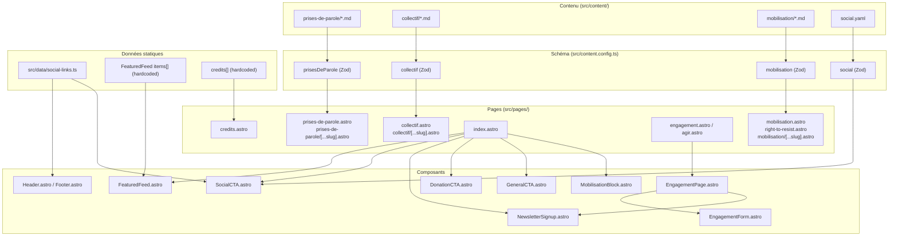

# ARCHITECTURE.md — Urgence Palestine

> Architecture technique complète du site `urgence-palestine.fr`.
> Document maintenu par la boucle autonome (voir [AGENTS.md](AGENTS.md)).

## Sommaire

1. [Architecture générale et choix techniques](#1-architecture-générale-et-choix-techniques)
2. [Structure des collections de contenu et schémas Zod](#2-structure-des-collections-de-contenu-et-schémas-zod)
3. [Composants Astro et leurs responsabilités](#3-composants-astro-et-leurs-responsabilités)
4. [Flux de données entre collections, composants et pages](#4-flux-de-données-entre-collections-composants-et-pages)
5. [Dépendances externes et leur rôle](#5-dépendances-externes-et-leur-rôle)
6. [Patterns réutilisables identifiés](#6-patterns-réutilisables-identifiés)

---

## 1. Architecture générale et choix techniques

### Stack

| Couche | Technologie | Rôle |
|--------|-------------|------|
| Framework | **Astro 5.6+** (`astro.config.mjs`) | Génération de site statique (SSG), routage fichier, content collections |
| Styling | **Tailwind CSS 3.4** (`tailwind.config.mjs`) via `@astrojs/tailwind` | Utilities + preflight ; tokens maison en CSS custom properties |
| CMS | **Sveltia CMS** (`sveltia-cms.config.yml`) | Back-office Git-based pour éditer le contenu Markdown |
| Typage | **TypeScript 5.9** + `@astrojs/check` | Vérification de types des `.astro` et `.ts` |
| Migration | `turndown` (devDep) | HTML → Markdown pour le script `scripts/migrate.mjs` |

### Mode de rendu

Le site est **100% statique (SSG)**. Aucun adaptateur SSR n'est configuré dans `astro.config.mjs`. Toutes les pages sont pré-rendues au build dans `public/` (`outDir: 'public'`). Le répertoire `static/` sert de `publicDir` (assets statiques copiés tels quels).

### Configuration Astro (`astro.config.mjs`)

```js
export default defineConfig({
    outDir: 'public',
    publicDir: 'static',
    redirects: {
        '/mobilisation': '/right-to-resist',
    },
    i18n: {
        defaultLocale: 'fr',
        locales: ['fr'],
        routing: { prefixDefaultLocale: false },
    },
    integrations: [tailwind()],
});
```

- **`outDir: 'public'`** — Le build écrit directement dans `public/`, qui est aussi servi en production.
- **`publicDir: 'static'`** — Les assets statiques (logos, fonts, symboles, images de communiqués) vivent dans `static/` et sont copiés vers `public/` au build.
- **`redirects`** — Une redirection statique `/mobilisation` → `/right-to-resist` (les URLs par entrée `/mobilisation/<slug>/` sont inchangées).
- **`i18n`** — Localisation `fr` uniquement, sans préfixe d'URL.
- **`integrations`** — Tailwind uniquement, aucun autre plugin.

### Structure des répertoires

```
.
├── astro.config.mjs          # Config Astro
├── tailwind.config.mjs       # Config Tailwind (palette + fonts)
├── sveltia-cms.config.yml    # Config Sveltia CMS (collections + singleton)
├── package.json              # Dépendances et scripts
├── static/                   # Assets statiques (publicDir)
│   ├── admin/index.html      # Page d'admin Sveltia CMS
│   ├── fonts/                # Webfonts self-hosted (woff2, ttf)
│   ├── logos/                # Variantes du logo UP
│   ├── media/                # Médias uploadés via Sveltia
│   ├── symbols/              # Illustrations CC-BY (keffieh, olivier, etc.)
│   ├── communiques/          # Images des prises de parole
│   └── mobilisation/         # Images des campagnes et événements
├── src/
│   ├── content.config.ts     # Définition des collections (Zod)
│   ├── content/              # Fichiers Markdown des collections
│   │   ├── prises-de-parole/ # 34+ fichiers .md
│   │   ├── collectif/        # 27 fichiers .md (sections locales)
│   │   ├── mobilisation/     # 5 fichiers .md (campagnes + événements)
│   │   └── social.yaml       # Singleton des réseaux sociaux
│   ├── components/           # 12 composants .astro
│   ├── layouts/
│   │   └── Layout.astro      # Layout racine (head, header, footer, reveal JS)
│   ├── pages/                # Routage fichier Astro
│   │   ├── index.astro       # Page d'accueil
│   │   ├── agir.astro        # Alias /agir → EngagementPage
│   │   ├── engagement.astro  # /engagement → EngagementPage
│   │   ├── collectif.astro   # Index des sections locales
│   │   ├── collectif/[...slug].astro   # Détail section locale
│   │   ├── mobilisation.astro         # Index mobilisation (legacy)
│   │   ├── mobilisation/[...slug].astro # Détail mobilisation
│   │   ├── right-to-resist.astro      # Index mobilisation (nouveau)
│   │   ├── prises-de-parole.astro     # Index prises de parole
│   │   ├── prises-de-parole/[...slug].astro # Détail prise de parole
│   │   └── credits.astro    # Crédits des illustrations
│   ├── data/
│   │   └── social-links.ts  # Source de vérité des liens réseaux sociaux
│   └── styles/
│       ├── tokens.css       # Design tokens (couleurs, type, spacing, motion)
│       ├── global.css       # @font-face, reset, typographie globale
│       ├── sections.css     # Styles des sections de page (hero, cards, etc.)
│       └── CTA.md           # Spécification visuelle des CTA
├── scripts/
│   ├── migrate.mjs          # Migration WordPress → Markdown
│   └── verify-migration.mjs # Vérification post-migration
└── bin/                     # Scripts CI de la boucle autonome
```

### Scripts npm (`package.json`)

| Script | Commande | Rôle |
|--------|----------|------|
| `dev` | `astro dev` | Serveur de développement |
| `build` | `astro build` | Build statique → `public/` |
| `preview` | `astro preview` | Prévisualisation du build |
| `migrate` | `node scripts/migrate.mjs` | Migration WordPress → Markdown |
| `verify:migration` | `node scripts/verify-migration.mjs` | Vérification de la migration |
| `test` | `make test` | Tests (Makefile) |

---

## 2. Structure des collections de contenu et schémas Zod

Les collections sont définies dans `src/content.config.ts` et reflètent la configuration Sveltia CMS dans `sveltia-cms.config.yml`. Quatre collections sont exportées :

```ts
export const collections = {
    prisesDeParole,
    collectif,
    mobilisation,
    social,
};
```

### 2.1 `prisesDeParole` — Communiqués, analyses et appels

**Dossier** : `src/content/prises-de-parole/` (34+ fichiers `.md`)
**Loader** : `glob({ pattern: "**/*.md", base: "./src/content/prises-de-parole" })`

#### Schéma Zod

```ts
const priseCategory = z.enum(["communique", "analyse", "appel-a-mobilisation"]);

const prisesDeParole = defineCollection({
    loader: glob({ pattern: "**/*.md", base: "./src/content/prises-de-parole" }),
    schema: z.object({
        title: requiredString,                    // z.string().min(1)
        date: z.coerce.date(),                    // ISO-8601, requis
        description: optionalString,              // z.string().optional()
        category: priseCategory.default("communique"),
    }),
});
```

#### Stratégie de slug

Les fichiers sont nommés `YYYY-MM-DD-<slug>.md`. L'`id` Astro (nom de fichier sans `.md`) inclut donc le préfixe date. Les pages d'index et de détail stripent ce préfixe :

```ts
// Index et détail :
entry.id.replace(/^\d{4}-\d{2}-\d{2}-/, "")
```

Cela produit des URLs `/prises-de-parole/<slug>/` identiques aux slugs WordPress d'origine.

#### Taxonomie éditoriale

| Valeur `category` | Badge affiché | Couleur du badge |
|---|---|---|
| `communique` (défaut) | « Communiqué » | `.entry-card__badge--communique` |
| `analyse` | « Analyse » | `.entry-card__badge--analyse` |
| `appel-a-mobilisation` | « Appel » | `.entry-card__badge--appel` |

La catégorie est optionnelle avec défaut `communique` pour la rétro-compatibilité des entrées pré-taxonomie.

#### Exemple de frontmatter

```yaml
---
title: "Cessez-le-feu à Gaza"
category: communique
date: 2025-01-16
description: "Une victoire pour le peuple palestinien..."
---
```

Le corps Markdown contient des images inline pointant vers `/communiques/<slug>/...` (assets rehébergés dans `static/`).

### 2.2 `collectif` — Sections locales et mobilisation étudiante

**Dossier** : `src/content/collectif/` (27 fichiers `.md`)
**Loader** : `glob({ pattern: "**/*.md", base: "./src/content/collectif" })`

#### Schéma Zod

```ts
const entryKind = z.enum(["section-locale", "mobilisation-etudiante"]);

const collectif = defineCollection({
    loader: glob({ pattern: "**/*.md", base: "./src/content/collectif" }),
    schema: z.object({
        city: requiredString,                     // Identifiant stable (slug source)
        title: optionalString,
        contact_email: z.string().email().optional(),
        description: optionalString,
        image: optionalImagePath,                 // z.string().regex(/^\//).optional()
        instagram: optionalUrl,                   // z.string().url().optional()
        telegram: optionalUrl,
        twitter: optionalUrl,
        facebook: optionalUrl,
        website: optionalUrl,
        kind: entryKind.default("section-locale"),
        date: optionalDate,                       // z.coerce.date().optional()
    }),
});
```

#### Discriminateur `kind`

- **`section-locale`** (défaut) — Fiche d'une antenne locale par ville. L'`id` est le slug de la ville (ex: `paris`, `marseille`, `lyon`).
- **`mobilisation-etudiante`** — Hub de mobilisation étudiante. La page de détail affiche « Mobilisation étudiante » au lieu de « Section locale » et propose des CTA différents (annuaire des campus, formulaire « Je m'engage »).

La page d'index `/collectif` sépare les deux types en deux onglets/tabs :

```ts
const sections = entries.filter(e => (e.data.kind ?? "section-locale") === "section-locale")
    .sort((a, b) => a.data.city.localeCompare(b.data.city, "fr"));
const mobilisation = entries.filter(e => e.data.kind === "mobilisation-etudiante")
    .sort((a, b) => a.data.city.localeCompare(b.data.city, "fr"));
```

#### Stratégie de slug

Pas de préfixe date. L'`id` Astro est directement le nom du fichier (ex: `paris.md` → `id: "paris"`). Les URLs sont `/collectif/<slug>/`.

#### Exemple de frontmatter

```yaml
---
title: "Collectif Urgence Palestine — Paris"
city: "Paris"
description: "Section parisienne du collectif : réunions hebdomadaires..."
---
```

### 2.3 `mobilisation` — Campagnes et événements

**Dossier** : `src/content/mobilisation/` (5 fichiers `.md`)
**Loader** : `glob({ pattern: "**/*.md", base: "./src/content/mobilisation" })`

#### Schéma Zod

```ts
const mobilisationCategory = z.enum(["kit-militant", "boycott", "prisonniers"]);

const mobilisation = defineCollection({
    loader: glob({ pattern: "**/*.md", base: "./src/content/mobilisation" }),
    schema: z.object({
        title: requiredString,
        date: z.coerce.date(),
        location: requiredString,                 // Lieu physique ou "En ligne — national"
        description: optionalString,
        featured_image: optionalString,            // Chemin local sous /mobilisation/
        category: z.enum(["evenement", "kit-militant", "boycott", "prisonniers"])
            .default("evenement"),
    }),
});
```

#### Deux formes d'entrées

1. **Événements ponctuels** (`category: "evenement"`, défaut) — Rassemblements, marches, actions datées. `date` et `location` sont requis.
2. **Pages de campagne** (`category: "kit-militant" | "boycott" | "prisonniers"`) — Landing pages migrées du site WordPress legacy. Contiennent visuels, tracts téléchargeables, arguments.

#### Stratégie de slug

Fichiers nommés `YYYY-MM-<slug>.md`. Le préfixe `YYYY-MM-` est strippé :

```ts
entry.id.replace(/^\d{4}-\d{2}-/, "")
```

URLs : `/mobilisation/<slug>/` (inchangées entre l'ancien et le nouveau routeur).

#### Exemple de frontmatter

```yaml
---
title: "Boycott — page de campagne"
date: 2025-03-25
location: "En ligne — national"
description: "Page de campagne Boycott..."
featured_image: "/mobilisation/boycott/2025-visuel-boycott.png"
category: boycott
---
```

### 2.4 `social` — Singleton des réseaux sociaux

**Fichier** : `src/content/social.yaml`
**Loader** : `glob({ pattern: "social.yaml", base: "./src/content" })`

#### Schéma Zod

```ts
const social = defineCollection({
    loader: glob({ pattern: "social.yaml", base: "./src/content" }),
    schema: z.object({
        instagram: optionalUrl,
        tiktok: optionalUrl,
        telegram: optionalUrl,
        facebook: optionalUrl,
        twitter: optionalUrl,
    }),
});
```

#### Rôle

Source de vérité éditable depuis l'admin Sveltia (singleton « Réseaux sociaux »). Consommée par `SocialCTA.astro` et `SocialSidebar.astro` au build. Tous les champs sont optionnels pour permettre une configuration vide sans casser le build.

#### Contenu actuel (`src/content/social.yaml`)

```yaml
instagram: https://instagram.com/urgencepalestine
tiktok: https://tiktok.com/@urgencepalestine
telegram: https://t.me/urgencepalestine
facebook: https://facebook.com/urgencepalestine
twitter: https://twitter.com/urgencepalestine
```

### Helpers Zod réutilisables

Définis en haut de `src/content.config.ts` :

| Helper | Définition | Usage |
|--------|------------|------|
| `requiredString` | `z.string().min(1)` | `title`, `city`, `location` |
| `optionalString` | `z.string().optional()` | `description`, `title` (collectif) |
| `optionalDate` | `z.coerce.date().optional()` | `date` (collectif) |
| `optionalUrl` | `z.string().url().optional()` | URLs réseaux sociaux, website |
| `optionalImagePath` | `z.string().regex(/^\//).optional()` | `image` (collectif) |
| `entryKind` | `z.enum(["section-locale", "mobilisation-etudiante"])` | `kind` (collectif) |
| `priseCategory` | `z.enum(["communique", "analyse", "appel-a-mobilisation"])` | `category` (prisesDeParole) |
| `mobilisationCategory` | `z.enum(["kit-militant", "boycott", "prisonniers"])` | `category` (mobilisation) |

### Synchronisation Sveltia CMS ↔ Zod

Le fichier `sveltia-cms.config.yml` déclare les mêmes collections avec les mêmes champs. Les commentaires dans les deux fichiers rappellent de les maintenir en sync. La collection `social` est un **singleton** Sveltia (pas dans un bloc `collections:`), tandis qu'elle est une collection `glob` côté Astro.

---

## 3. Composants Astro et leurs responsabilités

### 3.1 `Layout.astro` — Layout racine

**Fichier** : `src/layouts/Layout.astro`

| Aspect | Détail |
|--------|--------|
| Props | `title?: string`, `description?: string` (avec defaults) |
| Rôle | Enveloppe chaque page : `<head>` (meta, fonts preload, favicon), `<Header>`, `<slot>`, `<Footer>` |
| Styles importés | `../styles/global.css`, `../styles/sections.css` |
| JS inline | `initReveal()` — IntersectionObserver pour scroll-reveal staggered |

#### Script `initReveal()`

```js
function initReveal() {
    if (window.matchMedia("(prefers-reduced-motion: reduce)").matches) return;
    const targets = document.querySelectorAll(".reveal, .reveal-stagger");
    // ...
    const observer = new IntersectionObserver((entries) => {
        entries.forEach((entry) => {
            if (entry.isIntersecting) {
                reveal(entry.target);
                observer.unobserve(entry.target);
            }
        });
    }, { threshold: 0.15, rootMargin: "0px 0px -40px 0px" });
    targets.forEach((el) => observer.observe(el));
}
```

Ajoute `.is-revealed` aux éléments `.reveal` et aux enfants de `.reveal-stagger` avec un délai cascade via `--reveal-index`. Utilise uniquement `transform` + `opacity` (propriétés composites). Désactivé sous `prefers-reduced-motion: reduce`.

### 3.2 `Header.astro` — En-tête sticky

**Fichier** : `src/components/Header.astro`

| Aspect | Détail |
|--------|--------|
| Imports | `socialLinks` depuis `src/data/social-links.ts` |
| Rôle | Barre de navigation sticky avec wordmark, 4 liens de nav, 2 CTA (don, boutique), icônes réseaux sociaux |
| Nav | `Prises de parole` → `/prises-de-parole`, `Collectif` → `/collectif`, `Faites un don` → `/don`, `Right to Resist` → `/right-to-resist` (featured) |
| CTA | `Faire un don` (variant primary), `Boutique solidaire` (variant ghost, externe HelloAsso) |
| Logos | Deux `` (carré + rectangle) ; CSS masque l'inactif selon l'état scroll |

### 3.3 `Footer.astro` — Pied de page (version active)

**Fichier** : `src/components/Footer.astro`

| Aspect | Détail |
|--------|--------|
| Imports | `socialLinks` |
| Rôle | Brand block, liens utiles, réseaux sociaux, email de contact obfusqué |
| Obfuscation email | Fragments `["contact", "urgence-palestine"]` + `["fr"]` stockés en `data-*`, réassemblés en JS au runtime. Le `mailto:` est construit lettre par lettre pour éviter le scraping. |
| Fallback noscript | `<noscript>` affiche un lien `/contact` |

### 3.4 `SiteFooter.astro` — Pied de page (variante)

**Fichier** : `src/components/SiteFooter.astro`

| Aspect | Détail |
|--------|--------|
| Imports | `socialLinks` |
| Rôle | Variante du footer avec stripe du drapeau palestinien, mentions légales, copyright |
| Différence avec Footer.astro | Inclut une `flag-stripe` décorative, pas d'obfuscation email, liens vers `/mentions-legales` et `/contact` |

### 3.5 `DonationCTA.astro` — Bloc don

**Fichier** : `src/components/DonationCTA.astro`

| Aspect | Détail |
|--------|--------|
| Props | Aucune |
| Rôle | Bloc don haute impact sur la homepage. Lien externe vers Donorbox (`https://donorbox.org/soutenir-up`) |
| Visuel | Fond noir (`--color-flag-black`), texte blanc, gradient subtil vert→transparent, bouton rouge avec `--shadow-hard` au hover |

### 3.6 `GeneralCTA.astro` — CTA visuel deux bandes

**Fichier** : `src/components/GeneralCTA.astro`

| Aspect | Détail |
|--------|--------|
| Props | `title: string`, `ctaLabel: string`, `tone?: "green-then-red"`, `variant?: "default" \| "angled-split"` |
| Rôle | CTA non-cliquable, harness visuel pour migrations futures. Deux bandes : titre vert + label rouge. |
| Variantes | `default` (pleine largeur) ou `angled-split` (délègue à `AngledSplitCTA.astro`) |
| JS | Aucun — pur Astro, zéro client JS |

### 3.7 `AngledSplitCTA.astro` — CTA en bandes inclinées

**Fichier** : `src/components/AngledSplitCTA.astro`

| Aspect | Détail |
|--------|--------|
| Props | `title: string`, `ctaLabel: string`, `headingId?: string` |
| Rôle | Variante de GeneralCTA : bande verte horizontale (titre) + bande rouge inclinée 2° (label). Le texte rouge suit la pente (`skewY`). |
| Animation | `@keyframes angled-split-rise` — slide-up + fade-in séquentiel. Compositor-only, gated `prefers-reduced-motion`. |

### 3.8 `MobilisationBlock.astro` — Bloc mobilisation photo + overlay

**Fichier** : `src/components/MobilisationBlock.astro`

| Aspect | Détail |
|--------|--------|
| Props | `backgroundImage?: string`, `isPlaceholder?: boolean`, `overlayTone?: "red" \| "green" \| "white" \| "black"` |
| Rôle | Section mobilisation de la homepage. Photo en `background-image`, overlay solide (token flag), titre sur l'overlay, body + CTA en-dessous sur surface propre. |
| Règles | Aucun `` sous le contenu. Overlay en `position: absolute` entre photo et texte. `data-placeholder="true"` tant que la photo est un SVG temporaire. |
| Defaults | `backgroundImage = "/mobilisation/_placeholder-manifestation.svg"`, `isPlaceholder = true`, `overlayTone = "red"` |

### 3.9 `FeaturedFeed.astro` — Rail « À la une »

**Fichier** : `src/components/FeaturedFeed.astro`

| Aspect | Détail |
|--------|--------|
| Props | Aucune |
| Rôle | Rail de 6 items éditorialement sélectionnés sur la homepage. Liens vers `/prises-de-parole/<slug>/`. |
| Données | Liste statique `items: FeedItem[]` (hardcoded, pas de collection). Chaque item a `title`, `slug`, `image`, `date`, `category`, `ratio`. |
| Type `FeedItem` | `{ title, slug, image, date, category: "communique" \| "analyse" \| "appel-a-mobilisation", ratio: "1-1" \| "4-5" \| "4-3" }` |
| Accessibilité | Chaque carte est un seul lien (`<a>`) avec `aria-label` complet. L'overlay titre/date est `aria-hidden`. |
| JS | IntersectionObserver pour reveal des cards au scroll. |

### 3.10 `EngagementForm.astro` — Formulaire d'engagement

**Fichier** : `src/components/EngagementForm.astro`

| Aspect | Détail |
|--------|--------|
| Props | `formId?: string` (défaut `"engagement-form"`) |
| Rôle | Formulaire 4 champs (nom, email, ville, message) avec validation client-side. Simule un POST (pas de backend) et remplace le formulaire par une carte de confirmation. |
| Validation | `required` + `minlength` HTML + script client. Email en `type="email"`. |
| Accessibilité | `role="alert"` + `aria-live="assertive"` pour erreurs. `role="status"` + `aria-live="polite"` pour succès. |
| Multi-instance | Script scope par `[data-engagement-form]` pour supporter plusieurs formulaires sur la même page. |

### 3.11 `EngagementPage.astro` — Page d'engagement partagée

**Fichier** : `src/components/EngagementPage.astro`

| Aspect | Détail |
|--------|--------|
| Props | `formId: string`, `pageSymbol?: string` |
| Rôle | Corps partagé des routes `/engagement` et `/agir`. Hero + 3 bénéfices numérotés + `EngagementForm` + `NewsletterSignup`. |
| Imports | `Layout.astro`, `EngagementForm.astro`, `NewsletterSignup.astro` |
| Symbole décoratif | `` optionnel à côté du CTA. |

### 3.12 `NewsletterSignup.astro` — Inscription newsletter

**Fichier** : `src/components/NewsletterSignup.astro`

| Aspect | Détail |
|--------|--------|
| Props | `id?: string`, `variant?: "inline" \| "block"`, `heading?`, `description?`, `buttonLabel?` |
| Rôle | Formulaire newsletter avec consentement RGPD (checkbox requis), email, bouton. Carte de succès + message d'erreur. |
| Variantes | `block` (carte homepage, bordure 2px, fond blanc) ou `inline` (compact, pour page engagement) |
| Accessibilité | `fieldset`/`legend` pour le consentement, `aria-describedby` pour le hint, `role="status"` pour succès, `role="alert"` pour erreur. |

### 3.13 `SocialCTA.astro` — Bloc réseaux sociaux

**Fichier** : `src/components/SocialCTA.astro`

| Aspect | Détail |
|--------|--------|
| Props | `id?: string`, `heading?: string`, `description?: string` |
| Rôle | Gros boutons réseaux sociaux (Instagram, TikTok, Telegram, Facebook) avec icônes SVG + labels. Fond rouge, hover → ink + `--shadow-hard`. |
| Imports | `socialLinks` depuis `src/data/social-links.ts` |

---

## 4. Flux de données entre collections, composants et pages

### 4.1 Vue d'ensemble



### 4.2 Flux détaillé par collection

#### `prisesDeParole`

1. **Source** : fichiers `.md` dans `src/content/prises-de-parole/` avec frontmatter (title, date, description, category) + corps Markdown.
2. **Validation** : `content.config.ts` valide le frontmatter via Zod au build.
3. **Index** (`prises-de-parole.astro`) :
   - `getCollection("prisesDeParole")` récupère toutes les entrées.
   - Tri antichronologique par `date`.
   - Groupery par `category` en 3 sections H2 (communiqués, analyses, appels).
   - Extraction de la première image inline du corps Markdown via regex : `entry.body.match(/!\[.*?\]\((\/[^)\s]+)\)/)`.
   - Badge coloré par catégorie (`.entry-card__badge--communique`, etc.).
   - Slug URL : `entry.id.replace(/^\d{4}-\d{2}-\d{2}-/, "")`.
4. **Détail** (`[...slug].astro`) :
   - `getStaticPaths()` génère une route par entrée.
   - `render(entry)` produit le composant `<Content />` pour le corps Markdown.
   - Affiche titre, date formatée (`Intl.DateTimeFormat("fr-FR")`), description, corps, et un footer CTA (newsletter + retour à l'index).

#### `collectif`

1. **Source** : fichiers `.md` dans `src/content/collectif/` avec frontmatter (city, title, contact_email, description, image, instagram, telegram, twitter, facebook, website, kind).
2. **Index** (`collectif.astro`) :
   - `getCollection("collectif")` récupère toutes les entrées.
   - Séparation par `kind` : `section-locale` vs `mobilisation-etudiante`.
   - Tri alphabétique par `city` (`localeCompare("fr")`).
   - Pré-rendu des corps Markdown pour les entrées mobilisation étudiante (`render(entry)`).
   - CTA externes : Google Form « Créer un collectif », Google Form « Je m'engage », Linktree mobilisation étudiante.
3. **Détail** (`[...slug].astro`) :
   - `getStaticPaths()` — `params.slug = entry.id` (pas de strip de préfixe).
   - Construction d'un tableau `channels[]` à partir des champs de contact (email, instagram, telegram, twitter, facebook, website).
   - Affichage conditionnel : image hero pour les sections locales, pas pour la mobilisation étudiante. CTA différents selon `kind`.

#### `mobilisation`

1. **Source** : fichiers `.md` dans `src/content/mobilisation/` avec frontmatter (title, date, location, description, featured_image, category).
2. **Index legacy** (`mobilisation.astro`) :
   - `getCollection("mobilisation")` trié par date antichronologique.
   - Groupery par `category` : `kit-militant`, `boycott`, `prisonniers`, `evenements` (défaut).
   - Slug URL : `entry.id.replace(/^\d{4}-\d{2}-/, "")`.
3. **Index nouveau** (`right-to-resist.astro`) :
   - Même collection, même tri.
   - En-tête brutaliste (fond sombre + drapeau palestinien).
   - Section « featured » : 1 carte par catégorie de campagne (kit-militant, boycott, prisonniers), sélectionnée comme l'entrée la plus récente de la catégorie.
   - Liste complète en-dessous.
4. **Détail** (`[...slug].astro`) :
   - `getStaticPaths()` — slug strippé du préfixe `YYYY-MM-`.
   - Affiche tag de catégorie, titre, date + lieu, description, image à la une, corps Markdown.
   - Footer CTA avec tagline contextuelle par catégorie.

#### `social`

1. **Source** : `src/content/social.yaml` (singleton Sveltia).
2. **Consommation** : `SocialCTA.astro` et `SocialSidebar.astro` lisent la collection au build.
3. **Note** : Le composant `Header.astro` et `Footer.astro` utilisent `src/data/social-links.ts` (source TypeScript hardcoded), pas la collection `social`. Les deux sources doivent être maintenues en sync manuellement.

### 4.3 Flux des données statiques

#### `src/data/social-links.ts`

```ts
export type SocialLink = { label: string; href: string; icon: string };
export const socialLinks: SocialLink[] = [
    { label: "Instagram", href: "https://instagram.com/urgencepalestine", icon: "M12 2.2c..." },
    { label: "TikTok", href: "https://tiktok.com/@urgencepalestine", icon: "M14.5 2h-3..." },
    { label: "Telegram", href: "https://t.me/urgencepalestine", icon: "M21.5 4.3..." },
    { label: "Facebook", href: "https://facebook.com/urgencepalestine", icon: "M13.5 22v..." },
];
```

Source de vérité TypeScript pour les icônes SVG (path data) et URLs. Importée par `Header.astro`, `Footer.astro`, `SiteFooter.astro`, `SocialCTA.astro`. Ne contient pas X/Twitter (celui-ci vient de `social.yaml` via la collection `social`).

#### `FeaturedFeed` — items hardcoded

Le composant `FeaturedFeed.astro` contient un tableau statique de 6 `FeedItem` sélectionnés éditorialement. Pas de collection Astro : les images pointent vers `/communiques/<slug>/...` dans `static/`.

#### `credits.astro` — tableau hardcoded

La page `/credits` contient un tableau `Credit[]` de 9+ entrées listant chaque illustration CC-BY avec son artiste, source, licence et usage.

---

## 5. Dépendances externes et leur rôle

### 5.1 Dépendances production (`dependencies`)

| Package | Version | Rôle |
|---------|---------|------|
| `astro` | `^5.6.1` | Framework core : routage, content collections, build SSG |
| `@astrojs/tailwind` | `^6.0.2` | Intégration Tailwind dans Astro (injecte le stylesheet, configure le content scanning) |
| `tailwindcss` | `^3.4.19` | Framework CSS utility-first (preflight + utilities) |

### 5.2 Dépendances développement (`devDependencies`)

| Package | Version | Rôle |
|---------|---------|------|
| `@astrojs/check` | `^0.9.10` | Vérification de types des fichiers `.astro` (diagnostics TypeScript) |
| `turndown` | `^7.2.0` | Convertisseur HTML → Markdown, utilisé par `scripts/migrate.mjs` pour migrer le contenu WordPress |
| `typescript` | `^5.9.3` | Compilateur TypeScript pour la vérification de types |

### 5.3 Services externes intégrés

| Service | URL | Rôle | Intégration |
|---------|-----|------|-------------|
| **Donorbox** | `https://donorbox.org/soutenir-up` | Plateforme de dons | Lien externe dans `DonationCTA.astro` et Header CTA |
| **HelloAsso** | `https://www.helloasso.com/associations/jeune-palestine` | Boutique solidaire / billetterie | Lien externe dans Header CTA |
| **Google Forms** | URL Form « Créer un collectif » | Formulaire de création de section locale | Lien externe dans `collectif.astro` et `collectif/[...slug].astro` |
| **Google Forms** | URL Form « Je m'engage » | Formulaire d'engagement étudiant | Lien externe dans `collectif.astro` et `collectif/[...slug].astro` |
| **Linktree** | `https://linktr.ee/etudiant.es` | Annuaire mobilisation étudiante | Lien externe dans `collectif.astro` et `collectif/[...slug].astro` |
| **Sveltia CMS** | `/admin/` | Back-office Git-based | `static/admin/index.html` + `sveltia-cms.config.yml` (symlink) |

### 5.4 Fonts self-hosted

Les polices sont servies depuis `static/fonts/` et déclarées dans `src/styles/global.css` :

| Font | Fichiers | Usage |
|------|----------|-------|
| **The Bold Font** (Sven Pels) | `the-bold-font.woff2`, `the-bold-font.ttf` | Display, headings (`--font-heading`) |
| **Poppins** | `poppins-400.woff2`, `poppins-500.woff2`, `poppins-600.woff2`, `poppins-700.woff2` | Body text (`--font-body`) |

Fallbacks déclarés dans `tailwind.config.mjs` et `tokens.css` :
- Display : `"The Bold Font"`, `Boldonse`, `Anton`, `Oswald`, `"Arial Black"`, `Impact`, `sans-serif`
- Body : `Poppins`, `Inter`, `-apple-system`, `BlinkMacSystemFont`, `"Segoe UI"`, `Roboto`, `"Helvetica Neue"`, `Arial`, `sans-serif`

---

## 6. Patterns réutilisables identifiés

### 6.1 Pattern `getStaticPaths` + slug stripping

Toutes les pages dynamiques `[...slug].astro` suivent le même pattern :

```ts
export const getStaticPaths = (async () => {
    const entries = await getCollection("<collectionName>");
    return entries.map((entry) => ({
        params: { slug: entry.id.replace(/^<date-prefix-regex>/, "") },
        props: { entry },
    }));
}) satisfies GetStaticPaths;

const { entry } = Astro.props;
const { Content } = await render(entry);
```

La regex de stripping varie :
- `prisesDeParole` : `/^\d{4}-\d{2}-\d{2}-/` (YYYY-MM-DD-)
- `mobilisation` : `/^\d{4}-\d{2}-/` (YYYY-MM-)
- `collectif` : pas de stripping (l'`id` est directement le slug)

### 6.2 Pattern de tri antichronologique

Toutes les pages d'index trient par date décroissante :

```ts
const entries = (await getCollection("<name>"))
    .sort((a, b) => b.data.date.getTime() - a.data.date.getTime());
```

### 6.3 Pattern de formatage de date français

Chaque page d'index et de détail instancie le même formateur :

```ts
const dateFormatter = new Intl.DateTimeFormat("fr-FR", {
    day: "numeric",
    month: "long",
    year: "numeric",
});
```

### 6.4 Pattern de grouping par catégorie

Les pages d'index groupent les entrées par catégorie avec un objet `Record<Category, Meta>` puis filtrent :

```ts
// Pattern dans mobilisation.astro et right-to-resist.astro
const groupMeta: Record<GroupKey, { label: string; tagline: string }> = { ... };
const grouped: Record<GroupKey, typeof entries> = { ... };
for (const entry of entries) {
    const key = /* map category to GroupKey */;
    grouped[key].push(entry);
}
// Rendu : itérer sur les clés, skip si vide
```

```ts
// Pattern dans prises-de-parole.astro
const categoryGroups = categoryOrder
    .map((cat) => ({
        category: cat,
        label: categoryLabel[cat],
        items: entries.filter((e) => (e.data.category ?? "communique") === cat),
    }))
    .filter((g) => g.items.length > 0);
```

### 6.5 Pattern de carte de détail avec breadcrumb + footer CTA

Les trois pages de détail (`prises-de-parole/[...slug].astro`, `collectif/[...slug].astro`, `mobilisation/[...slug].astro`) partagent la même structure :

```astro
<Layout title={pageTitle} description={pageDescription}>
    <main class="entry">
        <nav class="entry__breadcrumb">
            <a href="/<collection>/">← Retour à l'index</a>
        </nav>
        <article class="entry__article">
            <header class="entry__header">
                <h1 class="entry__title">{d.title}</h1>
                <p class="entry__meta">...</p>
            </header>
            <div class="entry__body">
                <Content />
            </div>
        </article>
        <aside class="entry__footer">
            <h2>...</h2>
            <div class="entry__footer-actions">
                <a class="btn btn--primary">...</a>
                <a class="btn btn--ghost">...</a>
            </div>
        </aside>
    </main>
</Layout>
```

### 6.6 Pattern de boutons `.btn` + variants

Classes utilitaires réutilisées partout :

| Classe | Visuel |
|--------|--------|
| `.btn` | Base : `min-height: 44px`, `font-heading`, `text-transform: uppercase`, `--radius-sharp` |
| `.btn--primary` | Fond `--color-flag-red`, texte blanc, hover → `--color-flag-red-deep` + `--shadow-hard` |
| `.btn--ghost` | Fond `--color-ink`, texte blanc, hover → inversion |

### 6.7 Pattern de scroll-reveal

Deux mécanismes coexistent :

1. **Global** (`Layout.astro` → `initReveal()`) — IntersectionObserver sur `.reveal` et `.reveal-stagger`. Ajoute `.is-revealed` + `--reveal-index` pour le cascade.
2. **Local** (`FeaturedFeed.astro`) — IntersectionObserver sur `.featured-feed__item[data-reveal]`.

Les deux respectent `prefers-reduced-motion: reduce` (retour immédiat, pas d'animation).

### 6.8 Pattern de design tokens à trois couches

1. **`tokens.css`** — Couleurs OKLCH, typographie fluide (`clamp()`), spacing 8pt, motion tokens, rayons, ombres. Source de vérité.
2. **`tailwind.config.mjs`** — Miroir des tokens en hex (Tailwind ne supporte pas OKLCH nativement en v3) pour les utilities.
3. **CSS custom properties** — Consommées dans les `<style>` scoped des composants via `var(--color-*)`, `var(--space-*)`, etc.

### 6.9 Pattern d'obfuscation anti-scraping

`Footer.astro` sépare l'email en fragments et le réassemble en JS :

```ts
const userParts = ["contact", "urgence-palestine"];
const domainParts = ["fr"];
// data-email-user-parts={JSON.stringify(userParts)}
// data-email-domain-parts={JSON.stringify(domainParts)}
```

Le `mailto:` est construit lettre par lettre :

```ts
const scheme = ["m", "a", "i", "l", "t", "o", ":"].join("");
```

### 6.10 Pattern de consentement RGPD

`NewsletterSignup.astro` encapsule le consentement dans un `<fieldset>`/`<legend>` avec checkbox requis :

```astro
<fieldset class="newsletter__consent">
    <legend class="visually-hidden">Consentement RGPD</legend>
    <label>
        <input type="checkbox" name="consent" required />
        <span>Je consens à être recontacté·e...</span>
    </label>
</fieldset>
```

### 6.11 Pattern de page alias

`/agir` et `/engagement` partagent le même corps via `EngagementPage.astro` :

```astro
<!-- src/pages/agir.astro -->
<EngagementPage formId="agir" pageSymbol="victory_hand.png" />

<!-- src/pages/engagement.astro -->
<EngagementPage formId="engagement" pageSymbol="olive_branch_-_ccnisa.png" />
```

Seuls le `formId` (pour l'unicité des IDs DOM) et le symbole décoratif diffèrent.

### 6.12 Pattern de drapeau palestinien décoratif

Le drapeau est rendu en CSS pur (4 bandes) et réutilisé dans plusieurs composants :

```html
<div class="flag-stripe" role="img" aria-label="Drapeau palestinien : noir, blanc, vert, rouge">
    <span class="flag-stripe__band flag-stripe__band--black"></span>
    <span class="flag-stripe__band flag-stripe__band--white"></span>
    <span class="flag-stripe__band flag-stripe__band--green"></span>
    <span class="flag-stripe__band flag-stripe__band--red"></span>
</div>
```

Présent dans `index.astro` (homepage), `SiteFooter.astro` (footer), et `right-to-resist.astro` (en-tête campagne).

---

## Documentation self-maintenance

Ce document est maintenu par la boucle autonome Boucle. Le triage identifie les docs impactés, le worker les met à jour dans le même MR que le code, le reviewer vérifie la conformité et l'exhaustivité, l'e2e vérifie que les docs correspondent à la production.

Voir [AGENTS.md](AGENTS.md) pour le processus complet et les conventions.
