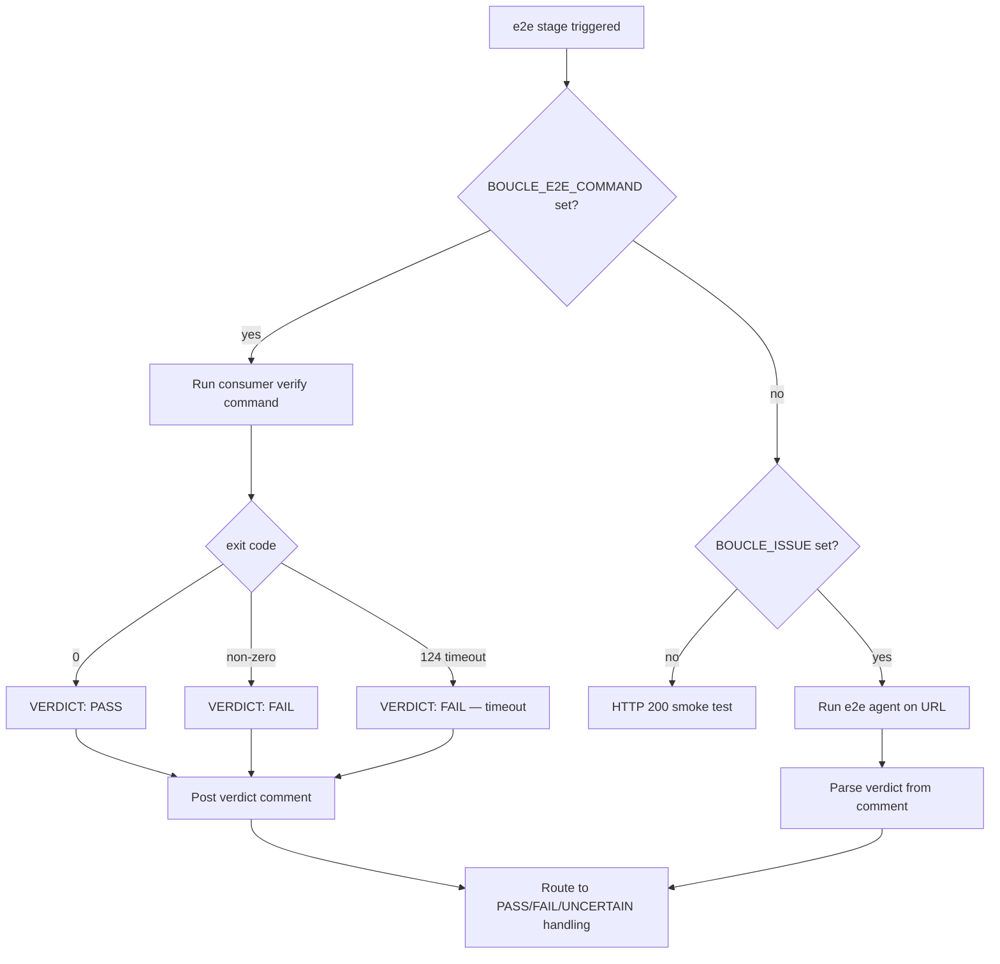
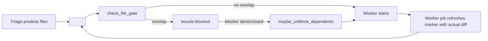

# LOOP — Boucle product reference

Configuration reference for the boucle autonomous dev loop: CI/CD
variables, deploy modes, review modes, gates, caps, doctor, notifications,
retry strategy, provider probe, prompt budget. This is the **product
documentation** — the same for every consumer, synced from the engine repo
via `bin/update` (SYNC_PATHS). A consumer configures its instance by setting
`BOUCLE_*` variables in the forge CI/CD UI; this file is the reference that
tells the operator what each variable does.

Read this file before touching the loop — it documents every option the
engine acts on.

## Purpose

Autonomous dev loop: turn a forge issue into a deployed product, with the
human in the loop at decision points (spec validation, MR approval).

## Cadence

- **Trigger:** webhook (primary); jobs chain to the next role via the trigger
  token.

## Human gates

- **Spec validation** — decided by the triage agent, which emits
  `Validation: author-required | autonomous` in its comment.
  `BOUCLE_SPEC_PROFILE` (default `strict`) is handed to the agent as its
  default policy; it is no longer applied to the agent's size judgment after
  the fact. Approval is the **issue author's**, by one of three signals (any
  one approves; all are restricted to the author):
  1. **Emoji reaction** (👍 ❤️ 🎉 🚀) on the triage spec comment — primary
     on GitLab, where `emoji` webhooks fire reliably. On GitHub, reactions
     on issue comments produce no webhook, so this signal is only detected
     by the doctor's periodic poll.
  2. **`boucle:approved` label** added to the issue — primary on GitHub,
     where `issues: labeled` fires a webhook that dispatch routes to the
     worker. Requires the author to have label-write access (mono-user and
     allow-listed users do; external contributors may not).
  3. **Magic word `approved`** as the first line of a reply on the issue
     (case-insensitive, standalone) — GitHub fallback, uses the
     `issue_comment: created` webhook. Any other reply is an amendment that
     re-triggers triage, never an approval.
  A 👍 from anyone else does not advance the loop, and they are told so.
  The doctor's orphan-recovery path applies the same restriction, or the
  gate would be bypassable by waiting for the next sweep. Both fail open on
  an unresolvable author: an API hiccup must not stall the loop. The label
  is consumed (stripped) by the next state transition (`set_boucle_label`
  strips all `boucle:*` labels).
- **MR approval** — always human-gated.
- **Amend-in-flight** — a human comment on an issue at `boucle:working`
  is a mid-implementation course correction. The dispatch re-triggers the
  worker (a secondary worker CI job) with the full issue note thread —
  including the new comment — injected via `BOUCLE_ISSUE_NOTES`, plus the
  prior `state.md` / `iterations.md`. The in-flight worker's commits are
  preserved on the branch; the amend-worker rebases onto them. The
  in-flight worker detects the queued amend (the label flipped from
  `boucle:working` to `boucle:todo`) and skips its terminal transition to
  `boucle:review` so it does not clobber the queued amend-worker. This
  reuses the existing secondary-worker pattern (the same one MR comments
  use at `boucle:review`); it adds no new security surface (same
  issue-author / maintainer amendment mechanism as `boucle:spec-review`
  and `boucle:human`). Concurrency is serialized by
  `resource_group: boucle-issue-$BOUCLE_ISSUE`. See issue #2.

## Do-Not-Disturb (DND)

DND is **opt-in** and OFF by default — an autonomous run must be
explicit, never time-based by default. When `BOUCLE_DND_ENABLED=true`,
the spec gate is auto-validated during the quiet window (default
22:00–07:00, configurable via
`BOUCLE_DND_START`/`BOUCLE_DND_END`/`BOUCLE_DND_TZ`). The loop runs
autonomously up to the MR without contacting the human. The skip is
transparent: triage posts an explanatory comment (active window + how
to disable) and applies the `boucle:dnd` flag label so the board shows
WHY the gate was skipped. MR approval stays human-gated.

For **per-issue** autonomy without DND, add the `boucle:autonomous`
label to the issue — the spec gate is skipped for that issue only.

## Caps

- **Iteration cap:** 3 worker runs per issue.
- **Budget cap:** not set at MVP — token-cost logging deferred to post-MVP.

## Escalation

Escalate to a human when:

- iteration cap hit,
- acceptance criteria unclear,
- size:L,
- destructive change proposed.

## Out of bounds

- `.boucle/` state files must not be deleted by agents.

## Deploy targets & review modes

Boucle supports two deploy modes and two review modes, orthogonal and composable.

### Deploy modes (`BOUCLE_DEPLOY_MODE`)

| Mode | Behavior |
|------|----------|
| `self` (default) | Boucle runs `BOUCLE_DEPLOY_CMD` to deploy a preview (worker) and production (post-merge). URL is derived from deploy output via `BOUCLE_DEPLOY_URL_REGEX`, then falls back to `https://${BOUCLE_DEPLOY_PROJECT}.pages.dev`. |
| `external` | Boucle does NOT deploy. Post-merge waits for the consumer's own CI/CD on the merged commit (via `forge_commit_check_suites`), then hands `BOUCLE_LIVE_URL` to e2e. `BOUCLE_LIVE_URL` is **required**. |

### GitLab Pages declarative mode (`BOUCLE_DEPLOY_PROVIDER=gitlab-pages`)

Opt-in token-less deploy path: set `BOUCLE_DEPLOY_PROVIDER=gitlab-pages` and
leave `BOUCLE_DEPLOY_CMD` **empty** (a project variable with an empty value
overrides the YAML default). The forge's own `pages` job builds
`$BOUCLE_BUILD_OUTPUT` and serves it at `$CI_PAGES_URL` — no deploy command.

The site URL **is displayed** in the MR description (`Site (GitLab Pages):
$CI_PAGES_URL`) so the MR does not look like a broken duplicate — even though
the mechanics differ from Cloudflare Pages (no per-branch previews: branch
previews would need GitLab **parallel deployments** (`pages.path_prefix`,
GitLab ≥ 17.9), a **Premium** feature that CE instances ignore *silently* —
a prefixed job publishes at the ROOT and clobbers production; verified
empirically on framagit 2026-08).

The loop adapts automatically to an empty `BOUCLE_DEPLOY_CMD`:

- **Worker** — skips the preview deploy (no `FAIL: no preview URL`); when
  `BOUCLE_REVIEW_MODE=preview` (the default), screenshot mode is
  **auto-activated** — the worker builds the site, serves it locally
  (`python3 -m http.server`), captures screenshots of impacted pages, and
  uploads them as MR attachments. The MR description carries
  `Site (GitLab Pages): $CI_PAGES_URL` plus the embedded screenshots.
  When `BOUCLE_REVIEW_MODE=diff`, the MR description carries the site URL
  with `reviewed via diff` and no screenshots are captured.
- **Reviewer** — in screenshot mode (auto or explicit), grades the
  screenshots via `bin/describe-images --criteria` (vision model answers
  each acceptance criterion MET/NOT MET/UNCLEAR). In `diff` mode, falls
  back to code review of the MR diff + check suites.
- **Deploy job** — skips cleanly (`deploy: BOUCLE_DEPLOY_CMD is empty`).
- **Post-merge/e2e** — resolves the live URL to `$CI_PAGES_URL` instead of
  the `pages.dev` fallback (which would point at a nonexistent Cloudflare
  project).

An empty `BOUCLE_DEPLOY_CMD` must NEVER fail a job — it is a valid,
complete loop, not a misconfiguration.

### GitHub Pages declarative mode (`BOUCLE_DEPLOY_PROVIDER=github-pages`)

Token-less deploy path for GitHub consumers: set `BOUCLE_DEPLOY_PROVIDER=github-pages`
and leave `BOUCLE_DEPLOY_CMD` **empty** (an empty repo variable overrides the
workflow default). The worker pushes `$BOUCLE_BUILD_OUTPUT` to the `gh-pages`
branch using the bot PAT (`BOUCLE_TOKEN`, which already has `contents: write` —
**no `CLOUDFLARE_API_TOKEN` needed**), and the post-merge deploy re-pushes the
merged build. The site is served at `https://<owner>.github.io/<repo>/`
(see `boucle_github_pages_url`).

The loop adapts automatically:

- **Worker** — when `BOUCLE_REVIEW_MODE=preview` (the default), screenshot
  mode is **auto-activated**: the worker builds the site, serves it locally,
  captures screenshots of impacted pages, and uploads them as MR attachments.
  Production (`gh-pages`) is **NOT overwritten during review** — the
  post-merge deploy pushes the merged build. When `BOUCLE_REVIEW_MODE=diff`,
  the worker pushes the build to `gh-pages` and the MR description carries
  `Site (github-pages): <url> — reviewed via diff`.
- **Reviewer** — in screenshot mode (auto or explicit), grades the
  screenshots via `bin/describe-images --criteria`. In `diff` mode, falls
  back to code review of the MR diff + check suites.
- **Deploy job** — re-pushes the merged build to `gh-pages` (keeps
  production in sync) and chains e2e with `BOUCLE_LIVE_URL` set to the
  canonical site URL.
- **Post-merge/e2e** — resolves the live URL to `boucle_github_pages_url`
  instead of the `pages.dev` fallback.

The consumer's GitHub Pages must be configured to serve from the `gh-pages`
branch (Settings → Pages → Source: Deploy from a branch → `gh-pages` / root).


### Review modes (`BOUCLE_REVIEW_MODE`)

| Mode | Behavior |
|------|----------|
| `preview` (default) | Worker deploys preview, reviewer tests against `BOUCLE_PREVIEW_URL` extracted from MR description via `BOUCLE_DEPLOY_URL_REGEX`. SHA-anchored freshness assertion. **Auto-fallback:** when the deploy provider has no per-branch preview (`github-pages`, `gitlab-pages`), screenshot mode is auto-activated — the worker captures screenshots locally (no production clobber) and the reviewer grades from those screenshots. A screenshot failure degrades to diff review. |
| `diff` | Worker skips preview deploy. Reviewer runs code-review mode: fetches PR diff via `forge_mr_diff`, waits for PR check suites via `forge_mr_check_suites` (bounded by `BOUCLE_REVIEW_CHECKS_WAIT`, default 900s), plus instructed-content fidelity checks. Verdict stays SHA-anchored. Raster images **added or modified by the PR itself** (`.png .jpg .jpeg .gif .webp .avif .bmp`, SVG excluded — text/XML) are extracted from the MR head (`git show "$MR_HEAD:<path>"`) into `.boucle-state/$ISSUE/repo-images/` and described by the vision model like any attachment, so the text-only reviewer never needs to Read a binary image (boucle.dev PR #94: a reviewer Read `public/og-image.png` and the run 400'd). Caps: 8 images, 8 MB each; skips are logged. Fail-open: any git error yields an empty set — the review proceeds. |
| `screenshot` | Worker builds the site, serves it locally (`python3 -m http.server` — zero dependencies), captures screenshots of impacted pages via a browser (reusing `bin/render-preview` with HTTP URL support), uploads them as MR attachments. Reviewer receives the screenshots as text descriptions via `bin/describe-images --criteria` — the vision model answers each acceptance criterion (MET/NOT MET/UNCLEAR) from `state.md`, and the reviewer grades against those text descriptions. No deploy command, no token, no CDN propagation wait. Ideal for GitLab CE (no per-branch Pages) or any token-less setup where visual review still matters. Fail-open: a screenshot failure degrades to diff review, never blocks the loop. |

### Per-provider URL regex defaults

| Provider | `BOUCLE_DEPLOY_URL_REGEX` default |
|----------|-----------------------------------|
| Cloudflare Pages | `https://[a-z0-9.-]+\.pages\.dev` |
| GitHub Pages | `https://[a-z0-9-]+\.github\.io(?:/[\w-]+)?` |
| GitLab Pages | Prefer `$CI_PAGES_URL` (predefined); fallback regex: `https://[a-z0-9-]+\.[a-z0-9-]+\.gitlab\.io(?:/[\w-]+)*` |

GitLab Pages unique-domain mode uses random 6-char IDs — use `BOUCLE_LIVE_URL` or `$CI_PAGES_URL` instead of regex.

## Non-static-site consumers

Boucle's defaults are biased toward static sites (`npm run build` → `public/` →
`wrangler pages deploy`). A repo that is NOT a static website — a Docker-compose
backend, an Ansible playbook repo, a CLI tool — MUST configure the escape
hatches below or the loop will try to deploy a nonexistent site. The modes are
orthogonal and composable (see [Deploy targets & review modes](#deploy-targets--review-modes)).

For any non-static-site repo, set:

- `BOUCLE_DEPLOY_MODE=external` — boucle MUST NOT deploy; the consumer's own CI
  deploys (or nothing deploys at all).
- `BOUCLE_REVIEW_MODE=diff` — there is no preview URL per MR, so the reviewer
  MUST review the MR diff + check suites instead of a deployed preview.
- `BOUCLE_BUILD_CMD` — the consumer's build/verify command, or empty when the
  consumer's CI builds.

### Command-mode e2e (`BOUCLE_E2E_COMMAND`)

By default e2e probes a live URL (URL-mode). A non-static-site repo has no
meaningful URL to probe, so boucle supports **command-mode e2e**: the consumer
supplies a verify command and boucle runs it instead of probing a URL.

| Variable | Default | Purpose |
|----------|---------|---------|
| `BOUCLE_E2E_COMMAND` | *(empty)* | Consumer-supplied verify command. **Empty** = URL-mode (agent probes `BOUCLE_LIVE_URL`). **Non-empty** = run the command; exit `0` = PASS, non-zero = FAIL. Use `true` for a no-op that always passes. |
| `BOUCLE_E2E_COMMAND_TIMEOUT` | `3600` | Max seconds the verify command may run. Exceeding it kills the command and FAILs (exit `124`). |
| `BOUCLE_E2E_COMMAND_EVIDENCE_PARSER` | *(empty)* | Optional command that takes the verify log as `$1` and emits a markdown evidence block for the verdict comment. Empty = no evidence block. |

The e2e decision flow:



The e2e agent role is defined in [AGENTS.md](AGENTS.md) §Agent roles. The
verdict MUST stay SHA-anchored in both modes.

### Recipe 1: Docker-compose backend service

A backend API (e.g. LiteLLM + OpenWebUI + Postgres) deployed via SSH to a remote
host.

- `BOUCLE_DEPLOY_MODE=external` — the consumer's own CI deploys via SSH.
- `BOUCLE_REVIEW_MODE=diff` — no preview URL per MR.
- `BOUCLE_BUILD_CMD="pytest -m unit"` — or empty; the consumer's CI builds.
- `BOUCLE_E2E_COMMAND="bash scripts/e2e-verify.sh"` — consumer-supplied verify:
  build + unit tests.
- `BOUCLE_LIVE_URL=https://api.example.com` — optional, for URL-mode e2e
  fallback; NOT needed when `BOUCLE_E2E_COMMAND` is set.

### Recipe 2: Ansible / infrastructure-as-code repo

An Ansible playbook repo that deploys to localhost, with no live URL.

- `BOUCLE_DEPLOY_MODE=external`
- `BOUCLE_REVIEW_MODE=diff`
- `BOUCLE_BUILD_CMD="ansible-playbook --check --diff playbook.yml"` — syntax
  check as the "build".
- `BOUCLE_E2E_COMMAND="true"` — no-op, always PASS, for repos with no e2e
  verification.
- No `BOUCLE_LIVE_URL` — command-mode e2e does not require it.

### Recipe 3: CLI tool / library

A Python library or CLI tool with a test suite.

- `BOUCLE_DEPLOY_MODE=external` — or skip deploy entirely.
- `BOUCLE_REVIEW_MODE=diff`
- `BOUCLE_BUILD_CMD="make build"` — or `pip install -e .`.
- `BOUCLE_E2E_COMMAND="make test"` — or `pytest`.
- No `BOUCLE_LIVE_URL`.

## CI/CD variables

Complete reference of all boucle CI/CD variables (set as repo secrets/variables). Defaults shown; override per-consumer. `bin/setup` seeds defaults where possible (e.g. `BOUCLE_DND_TZ` from the installing machine's timezone, fallback model variables).

| Variable | Default | Purpose |
|----------|---------|---------|
| `BOUCLE_ENABLED` | `true` | Master switch: `true` or `false` (pause boucle). |
| `BOUCLE_FORGE` | *(auto-detected)* | Active forge: `gitlab` or `github`. Auto-detected from the origin git remote (github.com → github, gitlab.com → gitlab, self-hosted via hostname heuristic or API probe). Override with a subcommand (`setup gitlab` / `setup github`), `--forge`, or `BOUCLE_FORGE`. |
| `BOUCLE_MONO_USER` | *(empty)* | `true` when one account owns both the issues and the loop (the default when no `--bot-id` is given). Swaps the actor-based anti-loop guard for the `<!-- boucle:agent -->` marker, drops the `boucle::status::*` gross label and both assignee side effects. `false` is treated as unset. Degrades notifications — see README. |
| `BOUCLE_SPEC_PROFILE` | `strict` | Default spec-validation policy **handed to the triage agent**, which decides and emits `Validation:`. `strict` (default, always require the author), `product` (require the author when the issue leaves real latitude), `off` (never). Applied as a size×profile mapping only as a fallback, when a triage comment carries no `Validation:` field; unknown → `strict`. |
| `BOUCLE_DND_ENABLED` | `false` | Do-Not-Disturb master switch: `true` (opt-in) or `false` (default). |
| `BOUCLE_DND_START` / `BOUCLE_DND_END` | `22:00` / `07:00` | Quiet-hours window: HH:MM 24h start/end. |
| `BOUCLE_DND_TZ` | `UTC` | Quiet-hours timezone (IANA name, e.g. `Europe/Paris`); seeded by `bin/setup` from the machine's timezone. |
| `BOUCLE_DND_EXCLUDE_DAYS` | *(empty)* | Comma-separated weekday names never in DND (e.g. `Fri,Sat`). |
| `BOUCLE_EXPERIMENT` | `off` | Skill-effectiveness randomisation. `on` assigns each issue to `full` / `lessons` / `none` by a hash of its id, so `bin/skills-stats --experiment` can be read causally. **Opt-in**: two arms out of three ship a deliberately degraded prompt and cost real iterations. Off = every issue gets the full prompt (current behaviour), and the arm is still recorded. |
| `BOUCLE_METRICS_ENABLED` | `true` | Publish one measurement row per issue to the metrics branch at the terminal transition. **On by default, opt-out**: only `false` / `0` / `no` / `off` (any case) disable it; any other value leaves it on, so a well-meant `=1` cannot silently switch it off. Disabling is logged, never silent. Scope is the branch write alone — `health.jsonl` keeps being written locally either way, because `bin/health` and the escalation diagnostic depend on it. |
| `BOUCLE_METRICS_BRANCH` | `boucle/metrics` | Orphan branch holding the append-only measurement log. Shares no history with the consumer's code. |
| `BOUCLE_METRICS_FILE` | `metrics.jsonl` | File on that branch, one JSON object per issue. |
| `BOUCLE_METRICS_RAW_DIR` | `raw` | Directory on that branch holding `<issue>.jsonl` — the raw per-run health lines the summary row is computed from, pushed as they are written so they outlive the ephemeral job that produced them. |
| `BOUCLE_METRICS_SYNC` | `true` | Push each health line to the branch as it is appended. Opt-out, same falsy spellings as `BOUCLE_METRICS_ENABLED`. Turning it off costs a network round-trip per agent run and gives up the summary row for any issue whose terminal label is applied by a different job than the one that did the work — which is most of them. |
| `BOUCLE_DEPLOY_MODE` | `self` | Deploy mode: `self` (boucle runs `BOUCLE_DEPLOY_CMD`) or `external` (consumer's own CI/CD deploys). |
| `BOUCLE_REVIEW_MODE` | `preview` | Review mode: `preview` (tests deployed preview), `diff` (reviews PR diff + check suites), or `screenshot` (builds locally, captures screenshots of impacted pages, reviewer grades via vision-model descriptions guided by acceptance criteria). **Auto-fallback:** `preview` mode auto-activates `screenshot` when the deploy provider has no per-branch preview (`github-pages`, `gitlab-pages`) — the worker captures screenshots locally instead of overwriting production, and the reviewer grades from those screenshots. A screenshot failure degrades to `diff` review. |
| `BOUCLE_DEPLOY_PROVIDER` | *(empty)* | Deploy provider profile: `gitlab-pages` (declarative, token-less — leave `BOUCLE_DEPLOY_CMD` empty, live URL = `$CI_PAGES_URL`) or `github-pages` (declarative, token-less — worker pushes `$BOUCLE_BUILD_OUTPUT` to `gh-pages`, live URL = `https://<owner>.github.io/<repo>/`). Empty = deploy via `BOUCLE_DEPLOY_CMD`. |
| `BOUCLE_DEPLOY_CMD` | `npx wrangler pages deploy ...` | Deploy command (self mode). |
| `BOUCLE_DEPLOY_URL_REGEX` | `https://[a-z0-9.-]+\.pages\.dev` | Regex to extract URL from deploy output. |
| `BOUCLE_DEPLOY_PROJECT` | `""` | Cloudflare Pages project name (self mode). |
| `BOUCLE_LIVE_URL` | `""` | Production/live URL (overrides regex/pages.dev fallback; **required** in external mode). |
| `BOUCLE_PRODUCTION_URL` | `""` | Production URL fallback for e2e. |
| `BOUCLE_E2E_COMMAND` | *(empty)* | Consumer-supplied verify command. Empty = URL-mode (agent probes `BOUCLE_LIVE_URL`). Non-empty = run the command; exit `0` = PASS, non-zero = FAIL. Use `true` for a no-op that always passes. See §Non-static-site consumers. |
| `BOUCLE_E2E_COMMAND_TIMEOUT` | `3600` | Max seconds the verify command may run. Exceeding it kills the command and FAILs (exit `124`). |
| `BOUCLE_E2E_COMMAND_EVIDENCE_PARSER` | *(empty)* | Optional command that takes the verify log as `$1` and emits a markdown evidence block for the verdict comment. Empty = no evidence block. |
| `BOUCLE_PREVIEW_MARKER_PATH` | `__boucle_commit__.txt` | SHA marker probe path (relative to URL root). |
| `BOUCLE_PREVIEW_PROPAGATION_WAIT` | `60` | Seconds to wait for preview CDN propagation. |
| `BOUCLE_PREVIEW_DISABLE` | `false` | Skip Chromium visual preview in triage: `true` or `false`. |
| `BOUCLE_PREVIEW_VIEWPORTS` | `390x844,1440x900` | Viewports rendered for the triage mockup, comma-separated `WxH`. One screenshot per entry, labelled by device class in the triage comment. Total bytes respect `BOUCLE_IMAGE_TOTAL_MAX_BYTES`; a malformed entry is skipped, and one failing viewport never loses the others. |
| `BOUCLE_PREVIEW_SETTLE_MS` | `1200` | Milliseconds to wait after `networkidle` before capturing a screenshot, so CSS/JS entrance animations (fade-in, slide-up) finish before the capture. Covers typical 300–800 ms entrance animations with headroom. Set `0` to disable the settle (capture immediately after network idle). |
| `BOUCLE_EXTERNAL_DEPLOY_WAIT` | `600` | Max seconds to wait for consumer's own CI on merged commit. |
| `BOUCLE_FILE_GATE` | `true` | Enable the file-impact gate. MR 1: declared marker + `check_file_gate` defers a worker whose issue claims files already claimed by an in-flight issue. MR 2 (deferred): adds a `git merge-tree` safety-net gate. `false` = disabled (fail-open, legacy behavior). |
| `BOUCLE_REVIEW_CHECKS_WAIT` | `900` | Max seconds to wait for PR check suites in diff mode. |
| `BOUCLE_BUILD_CMD` | `npm ci && npm run build` | Build command. |
| `BOUCLE_BUILD_OUTPUT` | `public` | Build output directory. |
| `BOUCLE_BUILD_FEEDBACK` | *(empty)* | Build error tail from the previous failed `BOUCLE_BUILD_CMD` run, injected into the next worker iteration's prompt. Auto-managed — do not set manually. |
| *(no variable)* | *untagged* | GitLab runner routing. Jobs run untagged on shared runners by default. Pinning to a dedicated runner is a `default: tags:` block in the **root shim**, written by `bin/setup --runner-tag <tag>` — not a CI variable, because GitLab expands `tags: [$VAR]` with an empty `VAR` into `tags: [""]`, which matches no runner and strands the job. See README "Advanced — dedicated runners". |
| `BOUCLE_RUNS_ON` | `ubuntu-latest` | Runs-on expression (GitHub). JSON array of labels for a self-hosted runner, e.g. `["self-hosted", "linux", "x64"]`. |
| `BOUCLE_MAX_PARALLEL_ISSUES` | `5` | Max concurrent boucle:working issues (`0` = unlimited). |
| `BOUCLE_MAX_ITERATIONS` | `5` | Max worker re-runs per issue before escalation. |
| `BOUCLE_STALENESS_THRESHOLD` | `2400` | Seconds before a stuck issue is re-triggered (must exceed max job timeout, 30 min). |
| `BOUCLE_SCHEDULES_ENABLED` | `false` | Opt-in: create issues from `.boucle/schedules/*.md` when their cron is due. |
| `BOUCLE_BOARD_ENABLED` | `true` | Maintain a pinned status-board issue answering "what is waiting on me?". |
| `BOUCLE_DOCTOR_ADAPTIVE` | `true` | Skip the full sweep when the board has not moved since the last check. |
| `BOUCLE_DOCTOR_BACKSTOP` | `21600` | Seconds after which a full sweep runs regardless of the fingerprint (6 h). |
| `BOUCLE_STALENESS_IDLE_FACTOR` | `3` | Multiplier applied to `BOUCLE_STALENESS_THRESHOLD` when nothing is in flight. |
| `BOUCLE_UPDATE_MODE` | `release` | Update mode: `release` (pinned engine release) or `dev` (tracking branch). |
| `BOUCLE_LLM_BASE_URL` | — | LLM API endpoint (any OpenAI-compatible). |
| `BOUCLE_LLM_API_KEY` | — | LLM API key (masked secret). |
| `BOUCLE_VISION_ROUTING` | `enabled` | Vision model routing: `enabled` or `disabled`. |
| `BOUCLE_VISION_MODEL` | `minimax-m3` | Vision model for image-enabled roles. |
| `BOUCLE_VISION_ROLES` | `triage,worker,reviewer` | Roles eligible for vision model routing (comma-separated). |
| `BOUCLE_FALLBACK_PROVIDER` | *(empty)* | Fallback provider profile name; empty = disabled. Requires `BOUCLE_FALLBACK_BASE_URL` + `BOUCLE_FALLBACK_API_KEY` (masked). Retries on exit-4 (provider down / quota exhausted) before escalating. |
| `BOUCLE_FALLBACK_BASE_URL` | *(empty)* | Fallback provider endpoint (OpenAI-compatible). |
| `BOUCLE_FALLBACK_API_KEY` | *(empty)* | Fallback provider key (masked secret). |
| `BOUCLE_FALLBACK_MODEL_TRIAGE` | `glm-5.2` | Per-role fallback model overrides. |
| `BOUCLE_FALLBACK_MODEL_WORKER` | `deepseek-v4-flash` | |
| `BOUCLE_FALLBACK_MODEL_REVIEWER` | `glm-5.2` | |
| `BOUCLE_FALLBACK_MODEL_E2E` | `deepseek-v4-flash` | |
| `BOUCLE_PROVIDER_PROFILE` | `boucle` | jcode provider profile name. |
| `BOUCLE_IMAGE_MAX_BYTES` | `10485760` | Max bytes per attachment (10 MiB). |
| `BOUCLE_IMAGE_TOTAL_MAX_BYTES` | `52428800` | Max total bytes per issue (50 MiB). |
| `BOUCLE_PRICING_JSON` | *(empty)* | Per-model price map, USD per 1M tokens: `{"model":{"in":0.10,"out":0.30}}`. Empty = tokens are reported, dollars are not. |
| `BOUCLE_STATE_NOTE_ENABLED` | `true` | Persist per-issue loop state in a collapsed marker note on the issue. |
| `BOUCLE_STATE_NOTE_CHARS` | `12000` | Cap on the state note; over it, the oldest state is elided and the tail kept. |
| `BOUCLE_RETRY_STRATEGY` | `adaptive` | Worktree handling on a worker re-run: `adaptive` (reset only after a contamination failure), `preserve` (always keep prior commits), `reset` (always start clean). |
| `BOUCLE_QUOTA_PROBE` | `true` | Ask the provider whether it can answer before spinning up an agent run. |
| `BOUCLE_QUOTA_PROBE_TTL` | `300` | Seconds a probe result is reused, so parallel jobs probe once. |
| `BOUCLE_NOTIFY_URL` | *(empty)* | Send-only webhook for human gates and escalations. Empty = disabled. Set as a **masked** variable. |
| `BOUCLE_NOTIFY_FORMAT` | `slack` | Payload envelope: `slack` (also Discord via a `/slack` endpoint), `ntfy`, `telegram`, `raw`. |
| `BOUCLE_NOTIFY_EVENTS` | `spec-review,approval,human,blocked` | Which transitions fire a notification. |
| `BOUCLE_MAX_NOTE_CHARS` | `1500` | Per-note cap when a note thread is injected into a prompt. Every note survives — only its tail is elided. `0` disables trimming (escape hatch). |
| `BOUCLE_MAX_PROMPT_CHARS` | `0` | Thread-level ceiling on the **assembled** prompt. `0` = disabled. See §Prompt budget. |
| `BOUCLE_PROMPT_WARN_CHARS` | `0` | Log a warning above this assembled size without altering the prompt. `0` = never warn. |
| `BOUCLE_ALLOWED_USERS` | *(installer)* | Issue allow-list: comma-separated usernames whose issues boucle accepts. Seeded by bin/setup with the installer's username. Unset/empty = allow list disabled (legacy fail-open). Case-insensitive. |

### Issue allow list

Boucle is a safety net: it only accepts issues whose resolved human author is in
`BOUCLE_ALLOWED_USERS` (comma-separated usernames, case-insensitive match). This
keeps the loop from working on issues filed by anyone with write access to the
repo.

- **Default = the installer.** `bin/setup` seeds the variable with the username
  of the user who runs it. Extend it by adding usernames separated by commas
  (e.g. `alice,bob`) — re-run `bin/setup --allowed-users alice,bob` or set the
  variable directly in the forge UI.
- **Rejection is loud.** An issue from a non-listed author gets a `:lock:` note
  and a visibly failed dispatch pipeline (anti-accumulation) — no label is set,
  so the loop never picks it up.
- **Split sub-issues resolve to the parent's author**, not the bot — the bot is
  never in the allow list, so a split never deadlocks.
- **Fail-open if unset.** An absent or empty variable disables the gate
  entirely (legacy behavior).

### Bot token (GitHub)

On GitHub the bot **is** the account that owns the `BOUCLE_TOKEN` PAT. Create it at
[https://github.com/settings/tokens/new](https://github.com/settings/tokens/new)
with **`repo` + `workflow`** scopes (optionally `admin:org` for
branch-protection checks) — see
[Scopes for OAuth apps](https://docs.github.com/apps/oauth-apps/building-oauth-apps/scopes-for-oauth-apps).
Select a sensible expiration (fine-grained or classic PATs both work; classic
with the two scopes is the simplest).

`bin/setup github` resolves the PAT's account, seeds
`BOUCLE_BOT_USERNAME` with it and stores the PAT as `BOUCLE_TOKEN` (secret). A
**missing, invalid, or expired PAT fails setup with an explicit message** —
the loop never runs half-configured. Renew the PAT and re-run `bin/setup`
(idempotent) when the stored token expires.

### Mono-user mode (`BOUCLE_MONO_USER`)

Mono-user is the **default** when no `--bot-id` is given — one account owns
both the issues and the loop. This is the common case on GitHub, where
nothing provisions a bot account for you.

**Why the mode has to exist.** boucle normally recognises its own writes by
the actor: dispatch discards any webhook whose author is the bot. Point that
at your own account and the guard discards *your* actions too — opening an
issue, replying on `boucle:needs-info`, approving a spec. The loop goes
quiet, with no error anywhere. Mono-user swaps the actor check for an
invisible `<!-- boucle:agent -->` marker that boucle appends to every comment
it posts, so it recognises its own writes without asking who acted.
`bin/doctor` fails loudly if you land in the broken configuration by
accident.

**Note injection is tagged by the same marker.** Every note injected into an
agent prompt (issue notes and MR feedback) MUST be tagged
`[<author> — human]` or `[<author> — boucle]` by CI, computed from the
`<!-- boucle:agent -->` stamp — never from the posting account, which in
mono-user mode is shared (lesson #111). Agents classify note authorship by
the tag: `— human` notes AMEND the spec and win over the frozen criteria,
`— boucle` notes are loop context only.

**The MR-approval gate: emoji reaction.** In mono-user mode
the PR author IS the bot account, so forge-native self-approval is unreliable
(GitHub blocks author self-review; GitLab is inconsistent). The MR gate
therefore uses the same mechanism as the spec gate: the reviewer posts a
short `👍 **this comment** to approve and merge` note **on the PR**
(`forge_mr_note`, carrying a `<!-- boucle:approval-request v=1 -->` marker),
and the human reacts with 👍 (or any canonical approval emoji) on that note.
The doctor polls the note's reactions via `forge_note_reactions` and
triggers the merger only when a non-bot user reacted. The old behavior
treated the reviewer's VERDICT: PASS bot comment as the approval signal
and merged with no human action — that was a regression (boucle.dev #40,
2026-08-18) and is removed. `forge_mr_approve_instruction` returns the emoji
instruction for mono-user on **all** forges; bot mode keeps the native
Approve / approving-review instruction. See
[LESSONS.yml](LESSONS.yml) lesson #85.

**The cost: notifications degrade.** The forge signals "it's your turn" by
*changing* an issue's assignee — but the issue is already yours, so nothing
is emitted. And every action the loop takes runs under your token, so forges
do not notify you about your own activity by default. Enable own-activity
notifications (GitHub: Settings → Notifications → Include your own updates;
GitLab: Preferences → Notifications → Receive notifications about your own
activity) or you will hear nothing. Both are account-wide, so expect noise
from the loop's routine comments. GitHub's per-organization email routing
and inbox `reason:` filters help contain it; repository Watch levels keep
unrelated repos quiet. None of this is as clean as a dedicated identity —
prefer a bot or service account when you can, and treat mono-user as the
fallback.

## Scheduled maintenance issues

Boucle has exactly one entry point: a human creates an issue. Its scheduled
job is inward-facing — the doctor heals state, it never produces work. So
recurring maintenance (dependency bumps, accessibility audits, dead-link
sweeps) is work the loop suits but could never start on its own.

Opt in with `BOUCLE_SCHEDULES_ENABLED=true` and drop templates in
`.boucle/schedules/*.md` — an issue body with YAML frontmatter
(`cron`, `title`, `labels`, `enabled`). When the cron is due, boucle creates
the issue with `boucle:triage` and the normal loop owns it from there;
nothing about it is special-cased downstream. See
[docs/schedules-example.md](docs/schedules-example.md).

- **Granularity is hourly.** The doctor sweeps every few minutes, so the
  minute field is parsed and ignored. Times are UTC.
- **Never a second issue while a previous one is open**, and a missed window
  fires once rather than once per sweep. Deduplication reads the last firing
  from the forge (a marker in the issue body), not from a runner cache — so
  a fresh runner cannot re-fire a template it already fired.
- **A cron cannot starve human work**: scheduled issues count against
  `BOUCLE_MAX_PARALLEL_ISSUES` like any other.
- **A malformed template is skipped with a warning**, never fatal, and never
  blocks the other templates.

## Status board

Boucle's state is fully legible — it lives in labels — but only if you know
which labels to filter on and you go looking. With five issues in flight
plus blocked and dependent ones, nothing answered *what is waiting on me?*

The doctor maintains one issue, `➰ boucle — status board` (label
`boucle:board`), with four sections: **Waiting on you**, **In flight**,
**Blocked**, **Waiting on a dependency**.

- It is **a forge issue**, not a web app. The forge is the UI — that is the
  whole thesis (`CONTEXT.md` §7).
- It is **edited in place** and never commented on. `CONTEXT.md` §8 already
  warns that no-op writes pollute the event history; a board that comments
  would be worse. An unchanged body produces **zero** API writes.
- It is **never dispatched**. Creating it fires an issue webhook like any
  other, so the dispatcher exits early on `boucle:board` — otherwise the
  loop would start working on itself.
- Deleting it by hand simply makes the next sweep recreate it.

The board is refreshed on **every state transition** (hooked into
`set_boucle_label`, gated on a real label change so a no-op does not trigger
a write) and on **every doctor sweep** (backstop). The transition-driven
refresh is webhook-reliable; the doctor sweep catches any refresh that failed
silently. An unchanged body produces zero writes in both paths.

## Configuration audit

`bin/doctor --audit` is read-only and forge-independent: it checks that the
**configuration** is coherent, which is the class of problem otherwise
discovered mid-loop, one failed run at a time.

```
$ bin/doctor --audit
  ✗ BLOCKER  BOUCLE_DEPLOY_MODE=external without BOUCLE_LIVE_URL
             → external mode never deploys, so e2e has no target. Set BOUCLE_LIVE_URL at …

Readiness: 54/100  (1 blocker(s), 0 degraded, 2 advisory)
```

| Severity | Meaning | Weight |
|---|---|---:|
| **blocker** | The loop cannot complete | −40 |
| **degraded** | Works, silently wrong (an inert fallback, a re-trigger that fires mid-job) | −15 |
| **advisory** | Worth knowing (a UTC quiet window, a missing design charter) | −3 |

Blockers dominate on purpose: a repository that cannot complete a loop must
not score well because everything else is tidy. A blocker exits non-zero, so
the audit works as a CI check.

`bin/setup` prints it on completion — you learn what is missing before the
first issue, not during it. It never fails the install: a blocker there is a
variable you set in the forge UI afterwards.

## Doctor cadence

The doctor ran on a fixed schedule and always performed the full sweep — on
an idle repository, a runner provisioned to confirm nothing changed.

It now fingerprints the board first (every boucle-labelled open issue and
when it last moved) and skips the sweep when nothing has shifted. A backstop
forces a full sweep every `BOUCLE_DOCTOR_BACKSTOP` regardless, so a stale
fingerprint cannot strand the board. When nothing is in flight, the
staleness threshold is relaxed by `BOUCLE_STALENESS_IDLE_FACTOR`; the busy
value is unchanged and still exceeds the max job timeout.

**Two deliberate degradations**, both toward doing more work rather than
less:

- A listing that fails produces an empty fingerprint and a full sweep. The
  doctor exists to unstick things; a probe that cannot see the board must
  never be the reason it stops.
- The snapshot lives in the state cache, which survives on a shell-executor
  runner. On an **ephemeral runner (GitHub-hosted) it is never found**, so
  every run is a full sweep — the old behaviour exactly. No regression, and
  no saving either.

### Manual-merge reconciliation (GitHub auto-close race)

GitHub auto-closes an issue via the commit message `(#iid)` ~2s after a
merge, BEFORE the `pull_request closed+merged=true` webhook arrives. The
loop reconciles a manual merge in three layers:

1. **Dispatch** — the `merge` action is exempted from the closed-issue
   guard (which otherwise skips all MR webhooks on a closed issue, lesson
   #44). The merge webhook chains to catchup even when the issue is already
   closed.
2. **Catchup** — no blanket closed-issue guard; label-based routing handles
   terminal states (exit 0) and non-terminal states (proceed). Sets
   `boucle:merging` and chains to post-merge → e2e (lesson #102: e2e runs
   on every merge). `boucle:merging` is a skip-state for idempotence on
   duplicate webhook delivery.
3. **Doctor backstop** — scans closed issues with ANY non-terminal
   `boucle:*` label. Recovery depends on MR state: merged MR → chain to
   post-merge (e2e), open zombie MR → close + `boucle:done`, no MR →
   `boucle:done`. Catches lost webhooks and races the immediate path misses.

## Skills

Boucle ships ~62 skills in `.jcode/skills/`. Two mechanisms make them real
rather than decorative.

**A generated catalogue.** `bin/skills-index` builds the list injected into
the triage, worker and reviewer prompts from each skill's frontmatter. It
publishes **every** skill — 41 of 62 used to be named in no prompt at all,
so they shipped in every clone, were re-synced on every engine update, and
could never fire. There is deliberately **no ranking**: the full catalogue
costs ~9% of an assembled prompt, and selecting a subset by keyword would
buy that back at the price of a miss rate — and a miss means the agent never
learns the skill exists, which is the bug being fixed.

The catalogue is a **display, never a filter**. Nothing moves, hides or
restricts `.jcode/skills/`; every skill stays loadable at any point in a
run, including mid-task. It **augments** the curated lists in the agent
files rather than replacing them, because those carry per-skill operating
instructions a generated index cannot reproduce.

Entries are keyed by **directory name**, which is what loads. A skill whose
frontmatter `name:` disagrees with its directory would silently fail to load
under the name it advertises — `bin/doctor --audit` reports any mismatch.

**Usage evidence.** Every agent run extracts the skills actually loaded from
the transcript, reports them on the `[boucle:metrics]` channel and
accumulates them in `.boucle/<issue>/skills-used.json`. A name is only
recorded if it matches a skill on disk, so prose mentions do not count as
loads.

This is **measurement only** — nothing fails or blocks on skill usage. And a
transcript that cannot be read is recorded as `observable=no`, never as "no
skills used": a missing measurement is not a finding of absence, and that
distinction is what would make a gate built on this data safe.

**Effectiveness measurement.** Knowing which skills loaded says nothing about
whether loading them helped. The skills a run loaded, the arm it was assigned
and whether its environment blocked it are therefore recorded **on the run
record itself** in `health.jsonl`, which makes that file the join between what
a run was given and how it went; one row per issue is published to the metrics
branch at the terminal transition. Read it with `bin/skills-stats`. See
[Skill-effectiveness measurement](#skill-effectiveness-measurement) below and
[docs/skills-audit.md](docs/skills-audit.md).

## Lessons — two files, one name

Boucle reads lessons from **two** files and **merges** them into every
triage, worker and reviewer prompt. The scope is carried by the location,
not by the filename:

| Path | Scope | Owner | Written by |
| --- | --- | --- | --- |
| `LESSONS.yml` (repo root) | **This repository's own lessons** | The consumer repo | The worker, in the MR |
| `.boucle/LESSONS.yml` | The engine's universal lessons | `bin/update` / the submodule | Upstream MR only |

**They are merged, never overridden.** The engine block is injected first,
the repository's second, and the prompt states that **an engine lesson wins
on conflict**. The previous behaviour was first-match-wins: a consumer that
wrote a single lesson of its own silently lost every engine lesson. In the
engine repo both paths resolve to one file, and it is injected once.

**The root file is no longer a symlink.** It used to be symlinked into
`.boucle/`, which is why no agent could ever record a lesson: the write
landed in the submodule, `git add` staged nothing but a dirty pointer, and
`bin/check-boucle-sync` rejected it. `bin/update` removes that symlink on the
next run. Nothing is seeded in its place — an absent file is the honest state
until a first lesson is recorded, and `bin/check-lessons` rejects an empty
one. `.jcode/agents/`, `.jcode/skills/` and `bin/` stay symlinked; they are
engine-owned.

**What belongs where.** Boucle keeps class-not-instance for everything it
persists, in both files:

| Kind of knowledge | Home |
| --- | --- |
| Config value (build command, deploy mode) | CI variable / root CI shim |
| Project context (stack, conventions) | `AGENTS.md`, `CONTEXT.md`, `DESIGN.md` |
| Class of mistake, universal | `.boucle/LESSONS.yml`, via an upstream MR |
| Class of mistake, this repo only | `LESSONS.yml` at the repo root |
| A one-off instance | Nowhere — git history |

Validate a repository file against the engine's:

```bash
bin/check-lessons LESSONS.yml --against .boucle/LESSONS.yml
```

`--against` flags an entry that merely restates an engine lesson (>0.6
keyword overlap). Both files reach every prompt, so a restatement is paid for
twice. In that mode the AGENTS.md guard is skipped: it protects an engine
document the consumer does not own.

## Refinement — when a lesson is proposed

Boucle used to distil a lesson **only at escalation**, so everything it had
ever learned came from runs that failed — a pool measured as producing
artifacts worse than no artifact at all
([docs/skills-audit.md](docs/skills-audit.md) §1). Two triggers now exist:

| Trigger | Who | When |
| --- | --- | --- |
| Escalation | Reviewer → worker | The final iteration, before `boucle:human`. Unchanged |
| **Recovery** | Worker | **Iteration ≥ 2** — a previous attempt did not land and this one is fixing it |

A **first-pass success proposes nothing**: it did the obvious thing and it
worked, and asking for a lesson there would fill the file with restatements
of the charter. The trajectory worth distilling is the recovered one, where
the delta between what failed and what worked is visible in `iterations.md`
and in `state.md`'s *Tried and rejected*.

A lesson proposed at iteration 2 may still be premature — that fix might fail
too. **The MR gate carries that risk**: if the iteration fails, its code never
merges and neither does the lesson. The reviewer validates entries against
the four-point admission test and may require removal.

## Cost accounting

Every agent invocation appends one entry to `.boucle-state/<issue>/cost.json`
(role, iteration, model, provider, tokens, cost) and emits a
`[boucle:metrics]` line. The accumulator survives across iterations like
`iterations.md`, so a re-run adds to the total instead of overwriting it.
The MR description carries a `### Cost` breakdown grouped by role.

Two deliberate refusals:

- **No dollars without `BOUCLE_PRICING_JSON`.** Prices drift and boucle is
  provider-agnostic; hardcoding them in the engine would produce confident
  wrong numbers. Unset, you get token counts.
- **No fabricated token counts.** Providers report usage inconsistently and
  some not at all. A missing count records `n/a` and the run continues.

A run that fell back is attributed to the **fallback** model, not the
primary — otherwise the breakdown blames the wrong provider. When only some
runs are priced, the total is flagged as a lower bound.

This is the prerequisite for a real budget cap (§Caps below still reads
"not set at MVP"): measure first, cap second.

## Loop-health measurement

Every agent run appends one JSONL line to `.boucle-state/<issue>/health.jsonl`
(role, iteration, exit_code, prompt_chars, tokens, cost, model, provider,
skills, arm, setup_fail, **swarm_spawns**), and every stage outcome appends
another (worker: committed/no-changes/build-fail; **reviewer/e2e:
PASS/FAIL/UNCERTAIN**; merger: merged/conflict). The reviewer and e2e rows
were documented but never written until now, which is why the escalation
diagnostic's reviewer-FAIL count always read 0.

`swarm_spawns` counts sub-agent spawns found in the transcript. Measurement
only, and deliberately an undercount: a line carrying two spawns counts once,
and only explicit call shapes match. Unlike a skill name — validated against
`.jcode/skills/<name>` on disk — `swarm` has no backstop, so a loose pattern
would count the prompt's own instructions as spawns.
The file survives across iterations like `cost.json` and feeds two consumers:

- `bin/health <issue>` — a read-only per-issue health summary (iterations,
  outcomes by role, cost total, last verdict, failure class if escalated).
- **Structured escalation diagnostics** — when the loop escalates to
  `boucle:human`, the generic "human intervention needed" comment is
  replaced by `boucle_escalation_diagnostic`, which classifies the failure
  (provider/quota, build-failure, step-budget-exhaustion, rebase-conflict,
  not-mergeable, unknown) from the health record and posts a structured
  diagnostic: failure class + **failing side** + evidence + recommended
  next action.

  The **side** says whether the *harness* stopped the run or the *model*
  failed the task, because the two call for opposite actions — raise a cap
  or fix the engine, versus re-spec or split the issue. A cap that fires
  terminated the run prematurely; it did not establish that the task was
  beyond the agent, so `step-budget-exhaustion` is **harness**-side, as are
  `provider/quota`, `rebase-conflict` and `not-mergeable`. `build-failure`
  is **model**-side. An unclassified trigger stays `unknown` — guessing a
  side would be worse than not labelling one.

This is the "look at the data" principle applied to the loop itself, and
the prerequisite for the upstream engine-defect flywheel (#54).

## Skill-effectiveness measurement

Boucle injects a 62-skill catalogue into every domain prompt and tells each
agent four times that loading skills is "not optional", without ever measuring
whether loading one changed anything. This is what answers that.

**Graded outcomes, not a verdict.** A pass/fail flag carries almost no
information per issue, and no consumer has the issue volume to detect a
3–6 point effect on a binary. Each issue is summarised by how much work it
cost instead: worker iterations, human comments on the issue (`human_spec` —
a triage-quality signal), human comments on the MR plus mid-work amends
(`human_delivery` — a worker-quality signal, and the one skills act on), and
`setup_fail` runs.

**`setup_fail` is the leading indicator.** It counts runs the *environment*
blocked before the agent reached the task — a missing dependency, an absent
binary, an unresolvable path, a permission error. It is orthogonal to the
`build-fail` outcome, not a competitor: a run can be both, and `build-fail`
stays authoritative for "the code did not build". It matters because this is
the failure class skills demonstrably fix — the study behind
[docs/skills-audit.md](docs/skills-audit.md) measures it dropping 5.3% → 0.2%,
an effect ~25× the aggregate one, so it is where a real effect becomes
visible first on a realistic issue volume.

**Iterations are censored.** An escalated issue did not take N iterations, it
took *at least* N. Rows carry `iterations_censored`, and `bin/skills-stats`
never averages escalated and completed issues together.

**The observed split is confounded, by construction.** The agent chooses when
to load a skill, and it chooses on the issues it judges hard — which take more
iterations whatever the prompt says. Correlating "skills loaded" against
"iterations taken" therefore reports skills making things *worse* even when
they help. `bin/skills-stats` prints that caveat next to the numbers rather
than trusting the reader to remember it.

**The arm is what breaks the confound.** With `BOUCLE_EXPERIMENT=on`, each
issue is assigned `full` (catalogue + lessons), `lessons` (lessons only) or
`none` (neither) by a hash of its id — so the assignment is stable across
every role and iteration of that issue, and independent of how hard the agent
judged it. **Off by default**: two arms out of three ship a deliberately
degraded prompt, which costs real iterations, so it is the consumer's call.

**Publishing is optional, and on by default.** `BOUCLE_METRICS_ENABLED=false`
(or `0` / `no` / `off`) switches off the branch write; the flag is opt-out, so
any unrecognised value leaves it on rather than silently disabling it, and a
disabled publish says so on the `[boucle:metrics]` channel instead of returning
quietly. It gates the branch write **only** — `health.jsonl` keeps being written
locally either way, because `bin/health` and the escalation diagnostic are
decision support rather than analytics and must not degrade when a consumer
opts out of measurement.

**The durable sink is a branch.** `health.jsonl` lives in `.boucle-state/`
(gitignored, destroyed with the container) and in `BOUCLE_STATE_CACHE` (never
survives an ephemeral runner) — it is the working table, not the archive. One
row per issue is appended to `metrics.jsonl` on an **orphan** `boucle/metrics`
branch when the issue reaches `boucle:done` or `boucle:human`. Orphan so the
measurement log never enters the consumer's history or triggers their CI, and
fail-open throughout: a metrics write must never be what stops an issue
reaching done.

**An empty skills list is not a finding on its own.** Each run also records
`skills_evidence`, which says what the empty list is evidence *of*:
`parsed` (names read), `not-invoked` (the transcript shows no `skill_manage`
activity — a real zero), `unparsed` (it *does* show activity and the extractor
read nothing — the sensor is broken, and every skill figure from that run is
wrong rather than empty), or `no-transcript`. The per-issue row carries
`runs_skills_unparsed`; an all-zero skills column with a non-zero count there
is a broken extractor, not a fact about agents. `unparsed` also raises a
`[boucle] WARN` in the job log, because that state must never pass quietly.

**An empty verdict is recorded as `no-verdict`, never as `UNCERTAIN`.** A
posted `VERDICT: UNCERTAIN` is a judgement and escalates to a human at once;
an empty verdict is a run that produced nothing and re-triggers the reviewer
up to `BOUCLE_MAX_ITERATIONS`. Recording both under one name sends the
diagnosis after the wrong bug.

**The raw log is pushed as it is written, not read back at the end.** Every
boucle job runs on a fresh ephemeral runner, and the job that applies the
terminal label is almost never the job that did the work — a doctor sweep
recovering a closed issue, a post-merge e2e. Summarising `health.jsonl` at
that moment meant summarising a file that had never existed in that
container, so the publish reported *"no health data for issue #N — nothing to
publish"* on issues that had just completed a full loop: an operation that
succeeded while its effect was null, which is precisely the failure mode this
measurement exists to detect. Each health append is therefore pushed to
`raw/<issue>.jsonl` on the same branch (deduplicated line-wise, so the
repeated pushes do not grow quadratically), and the summary row hydrates from
there when the local file is absent.

Both the append and the read go through the **working repository's own
remote**, using git plumbing (`hash-object` / `update-index` / `write-tree` /
`commit-tree` / `push`) against a private `GIT_INDEX_FILE`. HEAD, the index
and the working tree are never touched. The reason is credentials: a
`git init` in a temp directory inherits none of the checkout's configuration,
so on a CI runner — where the token lives in the working repo's
`http.<host>.extraheader` — a scratch clone's push is unauthenticated and
fails. It failed silently for one full loop before the sync was made to
report it.

The summary row itself now also carries `prompt_chars_max` (the largest
assembled prompt seen on the issue — the input to any future context
ceiling), `swarm_spawns`, and the reviewer/e2e `verdicts`, which are what
tell a recovered trajectory apart from a first-pass success. The raw log
carries them per run; the row is what a dashboard reads without parsing
every line.

```bash
bin/skills-stats                # observed split (confounded, always available)
bin/skills-stats --experiment   # arm split (causal; needs BOUCLE_EXPERIMENT runs)
bin/skills-stats --per-skill    # one row per skill
bin/skills-stats --json         # raw aggregate for a dashboard
```

## Per-issue state

Boucle's per-issue memory — the iteration log, the worker's `Approach` and
`Tried and rejected`, and the failure classification `last-outcome` — used to
live only in `BOUCLE_STATE_CACHE` on the runner. That cache survives on a
shell-executor runner and **never** survives on an ephemeral one, so on
GitHub-hosted runners the worker re-discovered the codebase every iteration,
repeated approaches it had already rejected, and the retry classifier below
always saw "no previous outcome".

The state now lives on the **forge**, in a collapsed marker note
(`<!-- boucle:state v=1 -->`) on the issue — the same idiom boucle already
uses for verdicts and the status board. One line on the issue page unless you
open it.

**One authority: the note.** The cache is still written (it is the fast path)
but it is only *read* when the note is absent, so the two cannot diverge in a
way that matters. Restore never clobbers a file that already exists locally.

Two things are deliberately **not** stored there:

- **Goal and acceptance criteria** — `worker.sh` re-derives them from the
  triage comment, which is on the same issue. Persisting them would put the
  issue's content back on the issue.
- **`cost.json` / `skills-used.json`** — metrics, not decision state. The
  next iteration does not read them; they belong in the job artifacts.

The note is **excluded from the notes injected into agent prompts**. Without
that it would be re-billed as prompt input on every run, growing with every
iteration it records.

## Retry strategy

Boucle already gets most of a Ralph-style recovery cycle for free: every
iteration is a fresh CI job and a fresh agent process, so no conversation
survives, and `iterations.md` carries the failure trace forward. The one
piece that was missing is the worktree reset.

| Previous iteration ended with | `adaptive` does | Why |
|---|---|---|
| A reviewer FAIL (code was shipped) | **Preserve** and rebase | The fix is incremental; discarding valid work burns iterations re-doing it |
| No code changes / step budget exhausted | **Reset** to the default branch | The safety-net commit makes the half-written tree durable, so N+1 would spend its budget working out what N was in the middle of |

`preserve` reproduces the old behaviour, `reset` always starts clean, and an
unknown value falls back to `preserve` — which never destroys work.

**A reset never loses work silently.** The discarded head is tagged
`boucle/<issue>/discarded-<timestamp>`, the tag is pushed so the commits
survive the branch force-push, and the tag is named in an issue comment.
`state.md` and `iterations.md` survive untouched — they are restored from
the state cache after checkout. Only the *code* is discarded; the notes on
why the previous attempt failed are exactly what the fresh run needs.

## Interactive takeover (`boucle takeover`)

When the loop escalates (`boucle:human`), the human can either start fresh
(`boucle restart <iid>` — a new worker run from `state.md`) or **resume the
worker's jcode session interactively** with full prior history — steering the
agent from where it stopped instead of re-explaining the problem.

This is the "human interactive takeover" primitive (#54 item 2). It is
**opt-in and forge-native** (CONTEXT.md §7): no server, no tunnel, no new
frontend. The session files travel via the existing CI artifact upload.

### How it works

1. **`bin/jc` captures the session** (worker role only). After the jcode run,
   it finds the newest session in `~/.jcode/sessions/` whose `working_dir`
   matches `BOUCLE_WORKSPACE`, copies `session.json` + `session.journal.jsonl`
   to `.boucle-state/<issue>/session/`, and writes the session ID to
   `.boucle-state/<issue>/session-id`. Post-hoc discovery (not `--ndjson`,
   which would break the log-scraping parsers).
2. **CI uploads the session** as part of the existing agent-transcript artifact
   (#33) — `.boucle-state/**/session/` is in the upload globs on both forges.
3. **The escalation diagnostic appends takeover instructions** automatically
   when a session is available (`boucle_escalation_diagnostic` in
   `lib/boucle.sh`) — the exact `jcode --resume <id>` command + how to restore
   the session locally. Rides on every escalation; no extra note per run.
4. **`boucle takeover <iid>`** prints the same instructions from the CLI.

### The human's flow

```sh
# 1. Download the worker artifact from the CI run, extract to repo root.
# 2. Restore the session into your local jcode:
mkdir -p ~/.jcode/sessions
cp .boucle-state/<iid>/session/session.json      ~/.jcode/sessions/<sid>.json
cp .boucle-state/<iid>/session/session.journal.jsonl ~/.jcode/sessions/<sid>.journal.jsonl
# 3. Resume (TUI — interactive, full prior history replayed to the model):
jcode --resume <sid>
#    Or headless (one new instruction, then exit):
#    jcode run --resume <sid> "<your instruction>"
# 4. Commit, push, then hand back:
boucle resume <iid>   # loop runs reviewer on your code
```

### Invariants

- **Worker role only.** Triage/reviewer/e2e sessions are not takeover-worthy.
- **Fail-open.** A missing/unreadable session (ephemeral runner, cleaned
  `~/.jcode`) produces no instructions; `boucle restart` is the durable
  fallback. The takeover path is a convenience, never a dependency.
- **No label writes, no state-machine change.** `boucle takeover` is read-only;
  the human still uses `boucle pause`/`resume`/`restart` for state transitions.
- **History is replayed by jcode, not assembled by boucle.** jcode loads the
  session's `messages[]` + journal on resume; boucle does not re-inject
  `state.md`/`iterations.md` into the resumed session (those stay the durable
  fallback for `boucle restart`).

## Interactive commands (`/boucle`)

The `/boucle` command is a **forge-native observability surface**: a human
types `/boucle <verb>` as an issue comment, and a separate fast CI job fetches
data and posts a stamped reply comment. It is read-only at MVP — **no agent
invocation, no label writes, no security surface**. It closes the gap labels
cannot carry: the content of an agent run (`agent-output.log`) and the detail
of loop health (`bin/health`), in the same channel the loop already posts in
(CONTEXT.md §7).

### Command surface

Two equivalent trigger forms, one parser, case-insensitive, anchored at the
first non-empty line of the comment body:

```
^/boucle <verb> <args>        OR        ^@<BOUCLE_BOT_USERNAME> <verb> <args>
```

`BOUCLE_BOT_USERNAME` is resolved by the fallback in AGENTS.md lesson #50
(default `up-bot`). **Issue scope only at MVP** — MR comments are disabled.

| Verb | Action | Backing |
|---|---|---|
| `/boucle log [role]` | Fetch the `agent-output.log` artifact of the most recent run of `<role>` (default: the role in flight, else the last completed); post the tail (≤ comment-size limit) as a stamped comment. | GitLab: `GET /projects/:id/jobs/:job_id/artifacts/*artifact_path`. GitHub: list artifacts → `GET .../artifacts/{id}/zip` (post-completion only). |
| `/boucle status` | Post a projection of `bin/health <issue>` (iterations, outcomes by role, cost total, last verdict SHA, role in flight). | `bin/health` (§Loop-health measurement). |
| `/boucle help` | Post the verb list + the non-redundancy rationale. | Static text. |

Unknown first token → **no action**: post a one-line "unknown verb, try
`/boucle help`" reply. The MVP does NOT fall through to `jc`.

### Authorization

- **`log` / `status` / `help`**: actor ∈ {issue author, parent-issue human
  author via `resolve_reporter_id` (one generation, AGENTS.md lesson #17)}.
  These are observability of data the actor could already see in the CI UI —
  no new trust boundary crossed. System notes filtered (lesson #34).
- **Closed-issue guard** (lesson #44): do not run commands on a closed issue
  (except `help`, which is pure text).
- **Fail-open on API error**: the data is observable in the CI UI — no new
  trust boundary.

### Jobs

Each verb runs as a **separate fast job**, not inline in the dispatch job. The
dispatch job holds `resource_group: boucle-dispatch` (a static name serializing
all dispatches globally); an inline artifact fetch + comment post would hold
that lock for seconds and queue every other webhook behind it (AGENTS.md lesson
#101). Each verb gets its own job with
`resource_group: boucle-cmd-$BOUCLE_ISSUE`, triggered via
`chain_to_role "$IID" "<verb>"` (the existing chaining primitive). The dispatch
job parses + authorizes + chains, then exits in milliseconds.

| Job | `BOUCLE_ROLE` | Script | Backing |
|---|---|---|---|
| `cmd-log` | `cmd-log` | `lib/boucle-ci/cmd-log.sh` | `forge_job_artifact` (bin/forge/{gitlab,github}.sh) |
| `cmd-status` | `cmd-status` | `lib/boucle-ci/cmd-status.sh` | `bin/health <issue>` |
| `cmd-help` | `cmd-help` | `lib/boucle-ci/cmd-help.sh` | static text |

### CI variables

No `BOUCLE_COMMAND_*` variable is needed at MVP — there is no agent invocation
and no secret exfiltration surface (no `bash`, no `write`, no agent at all).
The future `BOUCLE_COMMAND_ENABLED` master switch becomes necessary in **phase
2** when the `jc` verb (full-capability "manual worker") lands.

| Variable | Default | Purpose |
|---|---|---|
| `BOUCLE_COMMAND_ENABLED` | *(phase 2)* | Master switch for the `/boucle` command surface. Not needed at MVP (no agent invocation). Becomes mandatory in phase 2 when `jc` lands. |

### Deferral rationale

- **`/boucle jc <instruction>`** — deferred to phase 2 as a full-capability
  "manual worker" (maintainer-only, produces a commit/MR). A read-only Q&A
  agent was cut: too weak to produce work, too complex to secure just to
  answer questions the worker already answers.
- **`/boucle tail [role]`** — phase 2, **GitLab-only**. GitLab exposes
  `GET /jobs/:id/trace` (growing live log, fetch-and-diff + edit note).
  **GitHub Actions has no streaming log API** — impossible via API; the
  running job would have to self-report. The post-completion `log` verb works
  on both forges; the asymmetry only affects the future live-tail.
- **`/boucle cancel`** — phase 2, via native forge API
  (`POST /pipelines/:pid/cancel` / `POST /actions/runs/:id/cancel`). Does not
  touch the state machine. High blast radius (lessons #22/#51) — design
  carefully.

## Provider probe

Boucle used to discover an exhausted quota the expensive way: provision the
runner, clone the repo, build the prompt, run the agent, burn the retry
budget, *then* fall back. With `BOUCLE_MAX_PARALLEL_ISSUES=5` that waste is
multiplied by five before anyone notices.

The probe asks first — one cheap request to `<base_url>/models`:

| Response | Meaning | Action |
|---|---|---|
| `2xx` | ok | Run normally |
| `429`, `402` | quota exhausted | Switch to the fallback **before** the run, consuming no retry budget |
| `5xx` | provider down | Same |
| `401`, `403` | auth problem | Same, and the status is named in the escalation |
| unreachable | unknown | **Run anyway** |

When neither provider can answer, boucle does not start the agent: it exits
with the established provider-down code (4), CI posts a diagnostic and
escalates. Burning a runner to produce nothing is the worst outcome.

**This does not replace the reactive path.** A quota can be exhausted
mid-run, and only the in-flight fallback catches that. The probe removes the
waste in the case that was knowable in advance.

**Fail-open by construction.** An unreachable or unparseable probe runs the
agent anyway — a runner with flaky egress must not stop the loop. The probe
is an optimisation; it must never become a new failure mode.

## Notifications

The loop is asynchronous by design — you are not meant to watch it. But the
forge's own emails arrive with the same weight as any other repository
activity, so the two moments that actually need you (spec gate, MR gate)
look identical to a label tweak.

Set `BOUCLE_NOTIFY_URL` and boucle POSTs to it on four transitions:
`spec-review`, `approval`, `human`, `blocked`. Narrow the list with
`BOUCLE_NOTIFY_EVENTS`. Routine transitions (`working`, `review`, `todo`,
`done`, `merging`) never fire — a channel that pings on every state change
gets muted within a day, which is worse than silence.

**Send-only, on purpose.** `CONTEXT.md` §7 forbids a new frontend, a server,
or a machine to keep running. boucle POSTs; nothing listens. To reply, you
comment on the issue or the MR — the loop already reads those.

| Format | Endpoint | Body |
|---|---|---|
| `slack` (default) | Slack incoming webhook, or a Discord webhook with `/slack` appended | `{"text": "…"}` |
| `telegram` | `https://api.telegram.org/bot<TOKEN>/sendMessage?chat_id=<ID>` | `{"text": "…"}` |
| `ntfy` | `https://ntfy.sh/<topic>` | plain text |
| `raw` | anything | `{"event","issue","title","url","waiting_for"}` |

Two guarantees:

- **Fail-open.** A webhook that times out, 404s or 500s logs a warning and
  the job continues. A dead webhook must never block the loop.
- **Silent during DND.** Notifications are suppressed inside the quiet
  window — not being contacted is the entire point of it.

Notifications fire on the **transition**, never on the state: the doctor
sweep re-applies labels that are already set, and notifying on presence
would re-fire on every sweep.

## Anti-anchored re-review

On iteration N the reviewer reads its **own** iteration N-1 verdict. That
invites two opposite failures:

- **ratification** — the previous reasoning gets re-endorsed, and a
  regression introduced *by* the fix slips through unexamined;
- **tunnel vision** — only the previously failed criteria get re-checked.

So a prior verdict reaches the reviewer reduced to its `VERDICT:` line and
its unmet `- [ ]` criteria, **with the rationale stripped**: what must still
pass, not why it failed.

**This is not configurable.** Both alternatives are worse, and offering them
would only offer a way to degrade the loop — keeping the rationale
re-anchors the reviewer on its own earlier reasoning, and withholding the
criterion entirely lets the verdict flip-flop across iterations, so the
worker chases a moving target and burns the iteration cap.

Two things are never filtered:

- **Human comments.** They amend the spec and outrank the frozen criteria in
  `state.md`. Withholding one is a spec regression, not a saving.
- **Bot notes that are not verdicts** (CI status notes). They carry loop
  context, not review reasoning.

The **worker** always receives full verdict reasoning — it has to act on a
FAIL, so it needs the why. Only the reviewer's own view is reduced.

## File-impact gate

Parallel workers (`BOUCLE_MAX_PARALLEL_ISSUES` > 1) on separate branches
(`boucle/<iid>-<slug>`) can edit the same files and conflict at rebase/merge time. The
file-impact gate defers a worker before it starts when its issue claims files
already claimed by an in-flight issue.



### How it works

- **Triage** embeds a `<!-- boucle:files v=1 paths=path1,path2 -->` marker
  in its spec comment (the `## Metadata` section), predicting the
  files the issue will touch (source, styles, charter docs). The file claim
  lives in the spec the human reviews, not a separate note. Absent marker =
  no claim → fail-open (the gate passes).
- **`check_file_gate`** (3rd gate, after `check_dependencies_and_gate` and
  `check_sibling_gate`) compares the issue's marker against in-flight issues'
  markers (open issues labeled `boucle:working`/`review`/`approval`/`merging`).
  Non-empty intersection → `boucle:blocked` + explanatory note; the worker is
  NOT triggered.
- **Worker job** refreshes the claim in a separate machine note with the
  actual branch diff (`git diff --name-only origin/<default>...HEAD`) after
  each run. It targets the newest marker note that is NOT the triage spec
  comment (updating the spec comment would destroy the human-visible spec),
  posting a new note on the first refresh. The gate picks the newest marker
  note, so the refresh supersedes the triage prediction. The refresh is
  skipped when the branch has no commits ahead (e.g. after an adaptive
  reset), preserving the last non-empty claim mid-flight.
- **`maybe_unblock_dependents`** (catchup + e2e) unblocks a file-blocked issue
  directly when the named blocker reaches `done`/`closed`.

### Invariants

- Only active issues hold claims; blocked issues claim nothing → no deadlock.
- Self-exclusion on re-triggers.
- Fail-open on missing marker / forge API error.
- The sibling gate stays (belt-and-suspenders); the file gate is finer-grained
  (siblings on different files run in parallel).

### Configuration

`BOUCLE_FILE_GATE` (default `true`) enables the gate. `false` = disabled
(legacy behavior). The gate is fail-open by construction: an issue that does
not declare files is unaffected.

### MR 2 (deferred): `git merge-tree` safety net

A second gate at worker startup (iter 2+) runs `git merge-tree --write-tree
--name-only` against each in-flight `origin/boucle/*` branch to catch
prediction drift (a file the marker missed that actually conflicts). Deferred
until MR 1's residual conflict rate justifies it; the existing conflict-retry
budget (`BOUCLE_CONFLICT_RETRIES`) backstops drift until then.

## Recurring-theme detection

Boucle recognises when an issue is part of a **recurring class of bugs**.
This is a **non-blocking context link**, not a gate: it enriches the worker
with prior-issue context so it can diagonalize toward the **root cause**
rather than bandaging another instance.

- **Triage** scans recently **closed** issues for similar ones. If found,
  it embeds a `<!-- boucle:recurring v=1 refs=N,M -->` marker (optional
  `## Recurring theme` section). Absent marker = not recurring.
- **CI** applies the `boucle:recurring` label — a **context tag** that
  survives state transitions (`set_boucle_label` preserves it).
- **Worker** receives the prior issues' summaries and diagonalizes toward
  the root cause.

Invariants: non-blocking (never gates/defers), survives transitions,
fail-open (absent marker is harmless).

## Base-control CI (pre-existing failure detection)

In `diff` review mode, a red check suite on the MR head may be
**pre-existing** on the merge base — the default branch is already red.
Boucle pins the merge base (`MR_BASE`) and computes the **intersection**
of failing check names between head and base. Those are pre-existing.

- **reviewer.sh** calls `forge_commit_check_suites "$MR_BASE"` and
  intersects failing check names. Exported as `BOUCLE_PREEXISTING_FAILURES`.
- **bin/jc** injects a `Pre-existing CI failures` block into the reviewer
  prompt. The reviewer MUST NOT FAIL on pre-existing failures; notes them
  in the verdict so the human knows the default branch is red.

Invariants: fail-open (unreadable base -> empty set), diff mode only.

## Agent transcript

Every agent job uploads `agent-output.log` as a CI artifact (`when: always`
on GitLab, `if: always()` on GitHub, 7-day retention). A failed run is
exactly the one whose transcript matters, so it is uploaded on failure too.

Every escalation comment — "produced no code changes", "not mergeable",
"human intervention needed" — carries a link to the job that produced it.
Follow the link, open the artifacts, read the transcript.

The log is **scrubbed before it leaves the runner**: `bin/jc` redacts the
values of `BOUCLE_LLM_API_KEY`, `BOUCLE_FALLBACK_API_KEY`, `BOUCLE_TOKEN`,
`BOUCLE_BOT_TOKEN` and the Cloudflare token, plus generic token shapes
(`ghp_…`, `glpat-…`, `sk-…`, `Bearer …`). Redaction is literal, not
regex-based, so a key containing regex metacharacters is still caught. It
runs before every exit path, including the failure ones.

## Prompt budget

`BOUCLE_MAX_NOTE_CHARS` bounds the **worst note**; it does not bound the
**assembled prompt**. A note thread grows monotonically (triage analysis,
per-criterion reviewer verdicts, CI status notes, human comments), so forty
notes at 1500 chars is 60k chars that pass through untouched. Context rot
does not raise an error — the agent silently misses a file, which surfaces
one stage later as a reviewer FAIL and burns an iteration.

**Measure before you cap.** Every agent invocation logs an assembled size on
stderr:

```
[boucle:prompt] total role=worker iteration=2 total_chars=48213 est_tokens=12053 body_chars=1840 notes_chars_raw=51002 feedback_chars_raw=9310 ceiling=0
```

Set `BOUCLE_PROMPT_WARN_CHARS` first to see how close your repository runs,
then set `BOUCLE_MAX_PROMPT_CHARS` from observed values. Choosing a ceiling
blind truncates legitimate context.

When the ceiling is exceeded, boucle tightens **bot-authored notes only**,
along the ladder 750 → 300 → 120 chars, stopping at the first rung that
fits. Two invariants hold at every setting:

- **Human comments are never trimmed.** They amend the spec and take
  precedence over the frozen acceptance criteria in `state.md`; a truncated
  human amendment is a spec regression, not a saving.
- **No note is ever dropped.** Only tails are elided — the early
  preservation instructions must keep standing alongside later amendments.

If the floor is reached and the prompt still exceeds the ceiling, boucle
logs a warning and proceeds. It will not close the gap by dropping notes.

## Bug policy

See `.jcode/UPSTREAM-FIX-WORKFLOW.md` — fix upstream in boucle first, then
update the consumer, then remediate existing data. Never patch a consumer to
work around a boucle defect.
