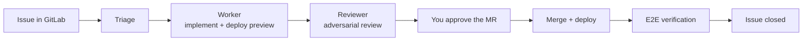

# boucle — zero-code loop engineering

> Loop engineering for builders. No laptop left half-open overnight. No Mac
> Mini purchase required.

boucle turns a ticket in your forge into a **tested, deployed feature** — end
to end, without you running agents on your own machine. You express a need,
boucle does the rest: analysis, implementation, review, merge, deploy,
verification.

The best part? boucle doesn't add a new interface. It reuses the one you
already use every day: **your forge**.

## Why boucle?

- **End to end.** From an idea in a ticket to a tested, deployed feature —
  no glue code, no babysitting.
- **Fast and cheap.** Small purpose-built agents running on your existing CI
  runner, with your own LLM credentials. No dedicated hardware, no
  always-on laptop.
- **Your forge is the interface.** Create an issue, label it, approve the
  spec and the MR — everything happens in GitLab, where you already work.
- **Batteries included.** boucle ships with a library of **skills** that give
  its agents real expertise out of the box — design, SEO, cloud, and more.
- **Built on jcode.** The engine runs on [jcode](https://github.com/1jehuang/jcode),
  a standalone **Rust** binary: fast startup, small memory footprint,
  zero runtime dependencies.

## How it works



Four specialized agents — **triage**, **worker**, **reviewer**, **e2e** —
orchestrate the whole flow. Humans only do what only humans can: validate the
spec and approve the MR.

## Quick start

**Prerequisites:** a GitLab repository with Cloudflare Pages configured as the
deployment target, and a GitLab Personal Access Token for the bot.

Pick whichever path fits you.

### Option 1 — copy/paste prompt (easiest)

No terminal needed. Ask your coding agent (Claude Code, Cursor, …) to install
boucle by pasting this prompt (fill the two placeholders first):

> Install boucle on this repository. Execute these steps and report back
> what you did:
>
> 1. `git submodule add https://github.com/ankaboot-source/boucle .boucle`
> 2. Run setup in non-interactive mode:
>    `BOUCLE_PROJECT=<your-project-id-or-path> BOUCLE_HOST=<your-gitlab-host> .boucle/bin/setup --non-interactive`
> 3. Do NOT include an API key anywhere. The API key must never appear in
>    this conversation. If setup tells you the key is missing, that's
>    expected — it is configured manually in the GitLab UI afterwards.
> 4. `git add .gitmodules .boucle .gitlab-ci.yml && git commit -m "chore: install boucle engine"`
> 5. Show me the URL `bin/setup` printed for configuring the masked API key,
>    and any next steps it listed.

### Option 2 — command line

```bash
# 1. Add boucle as a submodule in your repo
git submodule add https://github.com/ankaboot-source/boucle .boucle

# 2. Configure everything (idempotent — safe to re-run)
cd .boucle && BOUCLE_PROJECT=<project-id-or-path> BOUCLE_HOST=<your-gitlab-host> bin/setup --non-interactive
```

`bin/setup` configures GitLab (CI variables, labels, board, branch
protection, webhook), writes a thin `.gitlab-ci.yml` shim, and appends
`.boucle/` to your `.gitignore`. Your existing pipeline is never overwritten.

### After install

1. Add `BOUCLE_LLM_API_KEY` as a **masked** CI/CD variable (project →
   Settings → CI/CD → Variables). It is never handled by setup so it never
   crosses a conversation, a log, or a shell history.
2. Make sure a runner with the tag from `.gitlab-ci.yml` (default `data`) is
   available for the project.
3. Create a GitLab issue with the `boucle:triage` label — or assign an
   existing issue to the boucle bot.
4. Run the `doctor` CI job: it checks every prerequisite and must print
   "OK" everywhere.

From there, the pipeline takes over. You only answer the human prompts:
spec validation and MR approval.

## Configuration

The two CI variables above are the only ones you must set to get started.
Every other option — models per agent, spec gate, update mode, vision
routing — is documented in [LOOP.md](LOOP.md).

## Roadmap

- [ ] **GitHub support** — run boucle on GitHub issues and Actions
- [ ] **servo rendering** — migrate preview rendering from Puppeteer to
      [servo](https://github.com/servo/servo) (Rust-native, no Chromium)

## License

boucle is free and open-source software licensed under the
[GNU Affero General Public License v3.0](https://www.gnu.org/licenses/agpl-3.0.html).

## Docs

- [ARCHITECTURE.md](ARCHITECTURE.md) — system architecture, pipeline, state machine
- [AGENTS.md](AGENTS.md) — agent guide, lessons learned, anti-patterns
- [CONTEXT.md](CONTEXT.md) — project context, tech stack, constraints
- [DESIGN.md](DESIGN.md) — consumer site visual charter
- [LOOP.md](LOOP.md) — per-consumer configuration
