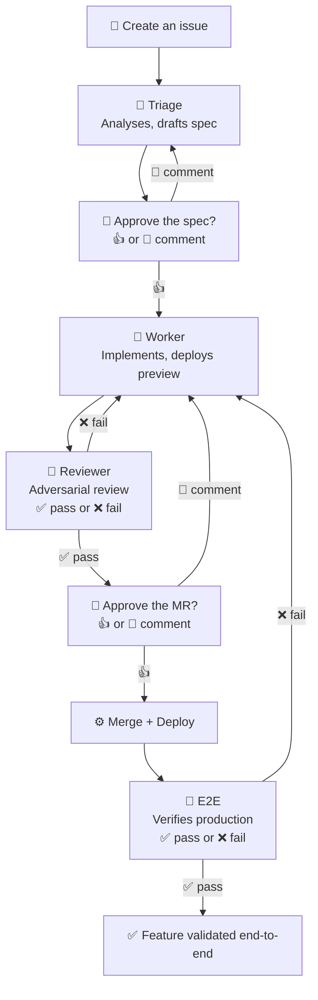

# ➰ boucle — zero-code autonomous product builder

> From a ticket in your forge to a feature in production — without running
> agents on your own machine. No laptop left half-open overnight. No Mac
> Mini purchase required.

boucle is zero-code **loop engineering**: you express a need in an issue,
and boucle handles the rest — analysis, implementation, review, merge,
deploy, verification. You stay in the forge you already use every day; you
never touch the engine itself.

## 📑 Table of contents

- [✨ Why boucle?](#why-boucle)
- [🚀 Quick start](#quick-start)
  - [Option 1 — copy/paste prompt](#option-1-copypaste-prompt-easiest)
  - [Option 2 — command line](#option-2-command-line)
  - [After install](#after-install)
- [⚙️ How it works](#️-how-it-works)
- [💰 Cost](#cost)
- [🛠️ Configuration](#️-configuration)
  - [The bot user](#the-bot-user)
  - [Running without a bot account (`--mono-user`)](#running-without-a-bot-account---mono-user)
  - [Advanced — dedicated runners](#advanced--dedicated-runners)
- [🗺️ Roadmap](#️-roadmap)
- [⚖️ License](#️-license)
- [📚 Docs](#docs)

## ✨ Why boucle?

**End to end, from idea to shipped.** A ticket becomes a feature deployed to
production — and you can **amend at any moment**: comment on the issue and
the loop picks your feedback up, re-plans, and adjusts. You validate the
**spec on mockups** before a line of code is written, and the **result on a
live preview** with screenshots — not prose.

**Fast and cheap — BYOK.** Lightweight, purpose-built agents run on your
forge's existing CI, with your own LLM credentials. No Mac Mini, no VPS, no
always-on laptop. boucle ships a feature for **9.9× less** than Claude Code
— see [Cost](#cost) for the per-role breakdown and capacity analysis.

**No new interface, no server.** No web app, no TUI, no SaaS. The whole loop
runs on your forge's (GitLab or GitHub) CI pipelines — your code, your data,
your tokens stay yours. Create an issue, label it, approve the spec, then
review and merge the PR/MR — everything happens where you already work.

**Built on fast, modern tools — batteries included.** [jcode](https://github.com/1jehuang/jcode), a standalone **Rust** binary (fast startup, zero runtime dependencies), a [codebase knowledge graph](https://github.com/DeusData/codebase-memory-mcp) that gives agents real structural understanding of your repository instead of blind grep, and a curated [skill library](.jcode/skills/) — including UI/UX, design, and frontend engineering — so the agents ship polished results, not just functional code.

**By a product builder, for product builders.** Built by an indie Product
Builder who got tired of babysitting agents overnight.

If you've lived these pain points too — a daemon that dies overnight, a
review that ships broken code, a spec that freezes the moment you approve
it — boucle was designed for you. The table below maps each one to how
boucle handles it, if you want to compare:

| Pain point | How boucle handles it |
| --- | --- |
| A daemon to babysit (dies silently, pollutes your disk with worktrees) | Runs on your forge's CI — nothing to install, nothing to restart |
| Deadlocks (a bot can't review, approve, or merge its own PRs) | Label-driven state machine with no self-approval path |
| Reviews that ship broken code (diff-scoped review passes) | Verifies *behavior*: a preview URL, screenshots, and a SHA-anchored post-deploy e2e gate |
| Frozen specs (human comments after review never reach the worker) | Feeds every human note back into the loop — amend at any moment |
| No budget control (token spend with no cap or visibility) | Step and iteration caps per role, plus a concurrency cap on parallel issues |

## 🚀 Quick start

**Prerequisites:** a Git repository hosted on **GitLab or GitHub**, with a
deployment target. The default target is Cloudflare Pages, but boucle is
deploy-agnostic: set `BOUCLE_DEPLOY_MODE=external` when your own CI/CD ships
the app (no deploy command needed, e2e still runs after merge), or bring any
hosting reachable by `BOUCLE_DEPLOY_CMD`/`BOUCLE_LIVE_URL` — see the
[Configuration](#configuration) table and [LOOP.md](LOOP.md). `bin/setup`
creates the bot (a project service account on GitLab, the PAT owner on
GitHub) as part of the install — see [The bot user](#the-bot-user) if you
prefer to wire in an existing account instead.

Pick whichever path fits you.

### Option 1 — copy/paste prompt (easiest)

No terminal needed. Ask your coding agent (Claude Code, Cursor, …) to install
boucle by pasting this prompt. **Nothing to replace**: the agent detects your
GitLab/GitHub host and project from the git remote, and it works even if you are
not already inside the target repository.

```text
Install boucle on this GitLab/GitHub repository. Execute these steps and report
back what you did:

1. If you are not already inside the target repository — the one whose
   origin remote points to your GitLab host — ask the user for its URL,
   clone it, and work from the clone.
2. git submodule add https://github.com/ankaboot-source/boucle .boucle
3. Run setup in non-interactive mode. It auto-detects the GitLab host and
   project from `git remote get-url origin`, so no value needs to be
   replaced: .boucle/bin/setup --non-interactive
4. Do NOT include an API key anywhere. The API key must never appear in
   this conversation. If setup tells you the key is missing, that's
   expected — it is configured manually in the GitLab UI afterwards.
5. git add .gitmodules .boucle .gitlab-ci.yml && git commit -m "chore: install boucle engine"
6. Show me the URL bin/setup printed for configuring the masked API key,
   and any next steps it listed.
```

### Option 2 — command line

```bash
# 1. Add boucle as a submodule in your repo
git submodule add https://github.com/ankaboot-source/boucle .boucle

# 2. Configure everything (idempotent — safe to re-run)
#
# GitLab (auto-detects host and project from the origin remote):
.boucle/bin/setup --non-interactive
#
# GitHub (mono-user — the common case, no separate bot account):
.boucle/bin/setup --non-interactive --forge github --mono-user --bot-token "$(gh auth token)"
#   The PAT needs `repo` + `workflow` scopes. `gh auth token` gives you one
#   if you are already logged in via `gh auth login`.
```

`bin/setup` configures the forge (GitLab CI/CD variables or GitHub Actions
variables/secrets, labels, branch protection, webhook), writes a thin
`.gitlab-ci.yml` or `.github/workflows/boucle.yml` shim, and appends
`.boucle/` to your `.gitignore`. Your existing pipeline is never overwritten.
Project, host and forge are read from the `origin` remote automatically. The bot is
created for you (pass `--bot-id` / `--bot-token` to use an existing account
instead); the only token you may still need to pass explicitly is the
Cloudflare one (`--cf-token`), which otherwise comes from the `BOUCLE_CF_TOKEN`
environment variable — and only if your deploy target is Cloudflare.

### After install

1. Add `BOUCLE_LLM_API_KEY` as a **masked** secret:
   - **GitLab:** project → Settings → CI/CD → Variables (masked).
   - **GitHub:** project → Settings → Secrets and variables → Actions → New secret.
   It is never handled by setup so it never crosses a conversation, a log,
   or a shell history.
2. **Runners: nothing to do.** boucle's jobs run untagged, so your forge's
   shared runners pick them up — GitLab.com and GitHub-hosted work out of the
   box, as do most self-managed instances that expose shared runners. Bring
   your own runner only if you want to; see
   [Advanced — dedicated runners](#advanced--dedicated-runners).
3. Create an issue with the `boucle:triage` label — or assign an existing
   issue to the boucle bot.

From there, the pipeline takes over. You only answer the human prompts:
spec validation and MR approval. The `doctor` job (a scheduled
self-healing sweep) runs automatically — there is nothing to run by hand.

## ⚙️ How it works



The loop runs asynchronously on CI. You intervene at two named gates —
spec approval and MR review — not in a live chat. A chat-based agent demands
your attention *now*; boucle inverts that: you take back control of the
timing.

**Do-Not-Disturb** (`BOUCLE_DND_*`, opt-in — disabled by default) auto-validates the spec gate during your
off-hours, so the loop never blocks on you overnight. You approve the spec
over morning coffee; by lunch the worker has implemented, the reviewer has
verified the preview, and the MR is waiting. A calmer workflow, driven by
your agenda — not the agent's.

At this intelligence tier, **how** you scaffold the agent matters more than
**which** model you pick. Raw intelligence has diminishing returns — from
DeepSeek V4 Flash ($0.03/task) to Opus 5 ($2.34/task), cost increases 78×
while intelligence increases 21%
([Artificial Analysis](https://artificialanalysis.ai), v4.1.1).

What closes the gap is structure: Anthropic's
["Building Effective Agents"](https://www.anthropic.com/research/building-effective-agents)
(Dec 2024) recommends "programmatic checks (gates) on any intermediate steps"
and notes that "code solutions are verifiable through automated tests."
[Terminal-Bench v2.1](https://artificialanalysis.ai/evaluations/terminalbench-v2-1)
and [SWE-bench Verified](https://www.swebench.com/) confirm this — the gate,
not the model, decides what passes.

boucle's four roles each carry a focused prompt and a curated skill library
(UI/UX, design, frontend, codebase graph) — a specialized agent with the
right skill outperforms a generalist with higher raw intelligence.

**The model decides what to *attempt*; the gates and skills decide what
*ships*.**

## 💰 Cost

The per-feature cost below serves two purposes: it tells you the **direct
cost** of shipping one feature, and — on a fixed-budget plan — it tells you
the **capacity**: how many features that budget sustains per month.

### Cost per feature

One feature flows through four roles: **triage** (analyze the issue, draft
the spec) → **worker** (implement, up to 3 iterations) → **reviewer** (verify
the preview, up to 3 iterations) → **e2e** (verify the live deployment). The
cost of one feature is the sum of all role invocations.

| | boucle | Claude Code |
| --- | ---: | ---: |
| **Cost per feature** | **$0.80** | **$15.00** |
| Intelligence (triage / worker) | 53 / 52 | 63 / 55 |
| **Cost per large feature** (intelligence-adjusted¹) | **$1.51** | **$15.00** |

The $/task figures are the **cost per Intelligence Index task** from
[Artificial Analysis](https://artificialanalysis.ai) (v4.1.1, max-effort
reasoning, retrieved 2026-08-09). ¹ Nominal Large feature: three failure
modes (feature KO, extra iterations, post-ship bugs) modeled per role and
weighted by feature size — boucle ships a large feature for **9.9× less**
than Claude Code. Full method, sensitivity, and break-even in
[docs/cost-benchmark.md](docs/cost-benchmark.md).

### Monthly capacity, multiplied

The plan is the base; the per-feature cost determines how many features it
sustains. boucle also runs issues **in parallel** (up to
`BOUCLE_MAX_PARALLEL_ISSUES`, default 5), so the monthly capacity is the plan
allowance divided by the per-feature cost — not serialized.

| Plan | Price | Config | $/feature | Features/month |
| --- | ---: | --- | ---: | ---: |
| Ollama Max | $100 | **default (GLM-5.2 + DeepSeek)** | $0.80 | **~125** |
| Ollama Max | $100 | full DeepSeek | $0.24 | ~416 |
| Ollama Max | $100 | Kimi K3 triage + DeepSeek | $1.22 | ~82 |
| Claude Code Max 20× | $200 | Opus 5 + Sonnet 5 | $15.00 | ~13 |

For **half the monthly fee**, boucle on Ollama Max ships **6–32× more
features** than Claude Code Max 20×. The capacity gap comes from the
per-feature cost gap (18.8×), not the plan price gap (2×) — and parallelism
multiplies it further.

### CI compute is the second meter

The figures above count **LLM tokens only**. boucle runs on your forge's CI,
so the runner is metered separately — and the two options bill in opposite
ways:

| Runner | CI cost | Trade-off |
| --- | --- | --- |
| **Shared** (default) | Metered. GitLab.com Free includes 400 compute-minutes/month, then $10 per 1 000; GitHub-hosted is free on public repos, metered on private ones. | Zero infrastructure, but a feature spends 30–60 min of runner wall-clock (LLM latency dominates) — so a free tier sustains roughly **7–13 features/month** before it bills. |
| **Dedicated** (opt-in) | Unmetered — you pay for the machine. | Requires a runner to register and keep alive; a shell executor also caches the toolchain between runs, so the loop is faster. See [Advanced — dedicated runners](#advanced--dedicated-runners). |

So the **token** capacity above (~125 features/month on the default config) is
only reachable end-to-end on an unmetered runner. On a free shared tier, CI
minutes bind first. Pick shared runners to start with nothing to maintain, and
move to a dedicated runner once the loop earns its keep.

## 🛠️ Configuration

Boucle reads its configuration from CI/CD variables (GitLab) or Actions
variables/secrets (GitHub). The only one you **must** set to get started is
`BOUCLE_LLM_API_KEY` (see [After install](#after-install)). The basics below
all have sane defaults — override them only when you need to:

| Variable | Default | What it controls |
| --- | --- | --- |
| `BOUCLE_ENABLED` | `true` | Master switch: `true` (default) or `false` to pause boucle. |
| `BOUCLE_LLM_API_KEY` | *(unset)* | LLM provider key. Set as a **masked** variable. |
| `BOUCLE_LLM_BASE_URL` | `https://ollama.com/v1` | LLM provider endpoint (any OpenAI-compatible API). |
| `BOUCLE_SPEC_PROFILE` | `product` | Spec gate strictness: `product` (default — gates Size M only), `strict` (gates all sizes), `off` (never gates); unknown → `product`. |
| `BOUCLE_DND_ENABLED` | `false` | Do-Not-Disturb master switch: `true` (opt-in) or `false` (default). |
| `BOUCLE_DND_START` / `BOUCLE_DND_END` / `BOUCLE_DND_TZ` | `22:00` / `07:00` / `UTC` | Quiet-hours window: HH:MM 24h start/end + IANA timezone (e.g. `Europe/Paris`). |
| `BOUCLE_DEPLOY_MODE` | `self` | Deploy handling: `self` (default — boucle runs `BOUCLE_DEPLOY_CMD`) or `external` (consumer's own CI/CD deploys; `BOUCLE_LIVE_URL` required). |
| `BOUCLE_REVIEW_MODE` | `preview` | Reviewer gate: `preview` (default — tests deployed preview) or `diff` (reviews PR diff + check suites). |
| `BOUCLE_LIVE_URL` | *(unset)* | Canonical e2e target URL — **required** in `external` mode; optional override in `self` mode. |
| `BOUCLE_NOTIFY_URL` | *(unset)* | Send-only webhook (Slack, Discord, ntfy, Telegram) pinged when the loop needs you — spec gate, MR gate, escalation. Silent during DND, fail-open. |

Deploy targets: Cloudflare Pages (default), GitHub Pages, GitLab Pages, or the
consumer's own pipeline (`external` mode). Per-provider
`BOUCLE_DEPLOY_CMD`/`BOUCLE_DEPLOY_URL_REGEX` recipes live in [LOOP.md](LOOP.md).
During install, `bin/setup` seeds the DND timezone (`BOUCLE_DND_TZ`) from the
machine's timezone, plus the fallback model variables (`BOUCLE_FALLBACK_*`) —
all overridable after install in the variables UI.

Variables are edited in GitLab under **Settings → CI/CD → Variables** (see the
[GitLab documentation on CI/CD variables](https://docs.gitlab.com/ci/variables/))
or in GitHub under **Settings → Secrets and variables → Actions** — see
[using variables in GitHub Actions](https://docs.github.com/en/actions/learn-github-actions/variables).

Every other option — `BOUCLE_RUNS_ON`, `BOUCLE_UPDATE_MODE`
(`release`|`dev`), iteration/concurrency caps (`BOUCLE_MAX_ITERATIONS`,
`BOUCLE_MAX_PARALLEL_ISSUES`), models per agent, vision routing, provider
fallback (`BOUCLE_FALLBACK_*`), deploy overrides, staleness, attachment caps —
is documented in [LOOP.md](LOOP.md).

### The bot user

boucle acts through a dedicated **bot account** — it comments on issues,
reassigns them, and merges approved MRs. **`bin/setup` creates it for you as
part of the install**: it is not a separate step.

- **GitLab** — setup provisions a **project service account** via the API
  (a project owner can do this without platform-admin rights, GitLab 16+)
  and requests a Personal Access Token (scope: `api`) for it. It then seeds
  the `BOUCLE_BOT_ID` / `BOUCLE_BOT_USERNAME` / `BOUCLE_TOKEN` CI/CD
  variables, and the loop reassigns issues to it automatically. Re-running
  setup reuses the existing account — it never creates a duplicate.
- **GitHub** — GitHub has no project service accounts: the bot is the account
  that owns the `--bot-token` PAT. setup resolves which account the PAT
  belongs to, seeds `BOUCLE_BOT_USERNAME` with that login (the loop detects
  the bot's own comments by it), and tells you if that account is not yet a
  collaborator of the repository so you can add it.
  Create the PAT at
  [github.com/settings/tokens/new](https://github.com/settings/tokens/new)
  with **`repo` + `workflow`** scopes (optionally `admin:org` for
  branch-protection checks) — see
  [Scopes for OAuth apps](https://docs.github.com/apps/oauth-apps/building-oauth-apps/scopes-for-oauth-apps).
  An **invalid or expired PAT fails setup** with an explicit message pointing
  here; renew it and re-run `bin/setup` (idempotent).

If the GitLab service-account API is unavailable on your instance (feature
flag off, or the endpoint 403s), setup falls back to the manual flow: create
the bot from your project's **Service accounts** page (GitLab → Project →
Settings → Service accounts, e.g. on framagit:
`https://<your-gitlab-host>/<group>/<project>/-/settings/service_accounts`).
That page lets a project owner provision a bot without platform admin. Then:

1. Create a Personal Access Token for the bot account (scope: `api`) — this
   is the `--bot-token` value.
2. Get its numeric user ID — this is the `--bot-id` value.
3. Re-run `bin/setup --bot-id <id> --bot-token <pat>` (or set the
   `BOUCLE_BOT_ID` / `BOUCLE_BOT_TOKEN` environment variables).

`bin/setup` then adds the bot to the project as a Developer, seeds the
`BOUCLE_BOT_ID` / `BOUCLE_BOT_USERNAME` / `BOUCLE_TOKEN` CI/CD variables, and
the loop reassigns issues to it automatically.

### Running without a bot account (`--mono-user`)

If you will not maintain a second account — the common case on GitHub, where
nothing provisions one for you — run `bin/setup --mono-user`. Your own PAT
drives the loop: one account carries the issues, the MRs, the approvals and
boucle's own actions.

**Why the mode has to exist.** boucle normally recognises its own writes by
the actor: dispatch discards any webhook whose author is the bot. Point that
at your own account and the guard discards *your* actions too — opening an
issue, replying on `boucle:needs-info`, approving a spec. The loop goes
quiet, with no error anywhere. `--mono-user` swaps the actor check for an
invisible `<!-- boucle:agent -->` marker that boucle appends to every comment
it posts, so it recognises its own writes without asking who acted.
`bin/doctor` fails loudly if you land in the broken configuration by
accident.

**The cost: notifications degrade.** This is accepted, not fixed.

- The forge signals "it's your turn" by *changing* an issue's assignee. The
  issue is already yours, so nothing is emitted.
- Every action the loop takes runs under your token, and forges do not
  notify you about your own activity by default.

So enable own-activity notifications once, or you will hear nothing:

| Forge | Setting |
| --- | --- |
| GitHub | Settings → Notifications → **Include your own updates** |
| GitLab | Preferences → Notifications → **Receive notifications about your own activity** |

Both are account-wide, so expect noise from the loop's routine comments.
GitHub's per-organization email routing and inbox `reason:` filters help
contain it; repository Watch levels keep unrelated repos quiet. None of this
is as clean as a dedicated identity — **prefer a bot or service account when
you can**, and treat mono-user as the fallback.

### Advanced — dedicated runners

By default boucle needs no runner of its own: every job runs **untagged**, so
the shared runners of GitLab.com, GitHub, or your self-managed instance pick
them up. Install is therefore zero-infrastructure.

Bring your own runner when you want **unmetered compute** (shared runners bill
by the minute — see [Cost](#cost)), a **faster loop** (a shell executor keeps
node, glab and jcode installed between runs), **more memory or a bigger disk**
than the hosted tier gives you, or **network access** to something private.

**GitLab.** Register a runner carrying a tag, then pin boucle to it:

```bash
.boucle/bin/setup --runner-tag boucle    # idempotent — safe to re-run
```

That writes a `default:` override into your root `.gitlab-ci.yml`:

```yaml
include:
  - remote: 'https://raw.githubusercontent.com/ankaboot-source/boucle/<ref>/.gitlab-ci.yml'

default:
  tags: [boucle]

variables:
  BOUCLE_FORGE_HOST: "gitlab.example.com"
```

GitLab merges included configuration key-by-key, so this changes **routing
only** — the engine's `image:` and `before_script:` are preserved. To go back
to shared runners, delete the `default:` block.

The loop-critical control-plane jobs (`dispatch`, `merger`, `post-merge`,
`catchup`, `doctor`, `check`) keep an explicit `tags: []` and stay on any
available runner, on purpose: an approved MR must never sit in a queue behind
a long-running worker on your single dedicated runner.

**GitHub.** Set the `BOUCLE_RUNS_ON` repository variable (Settings → Secrets
and variables → Actions). It defaults to `ubuntu-latest`; for a self-hosted
runner use a JSON array of labels:

```
BOUCLE_RUNS_ON = ["self-hosted", "linux", "x64"]
```

**Either forge.** Agent jobs run on the pre-baked
`docker.io/ankabootops/boucle-agents` image (node 22, glab, jcode,
codebase-memory-mcp), so docker executors skip the toolchain download. Shell
executors ignore `image:` and fall back to a `before_script` that installs
only what is missing — both executor types work unchanged.

## 🗺️ Roadmap

- [ ] **servo rendering** — migrate preview rendering from Puppeteer to
      [servo](https://github.com/servo/servo) (Rust-native, no Chromium)
- [ ] **cost estimate** — per-issue token-cost estimate and tracking

## ⚖️ License

boucle is free and open-source software licensed under the
[GNU Affero General Public License v3.0](https://www.gnu.org/licenses/agpl-3.0.html).

## 📚 Docs

- [AGENTS.md](AGENTS.md) — agent guide, lessons learned, anti-patterns
- [CONTEXT.md](CONTEXT.md) — project context, tech stack, constraints
- [LOOP.md](LOOP.md) — per-consumer configuration
