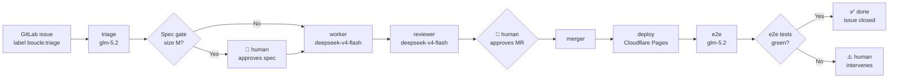

# boucle — Autonomous development loop

> **Maintenance** — This document is the entry point for boucle. Any change
> to usage, getting started, or configuration must update it. See
> [AGENTS.md](AGENTS.md) for contribution conventions.

## What is boucle?

Boucle turns a GitLab issue into a deployed Cloudflare Pages site, without
continuous human intervention (only spec validation and MR approval require
humans). Four AI agents — **triage**, **worker**, **reviewer**, **e2e** —
orchestrate the flow: analysis → implementation → adversarial review →
merge → deployment → end-to-end verification.



The state of every issue is driven exclusively by GitLab labels
(`boucle:triage`, `boucle:todo`, `boucle:working`, `boucle:review`,
`boucle:approval`, `boucle:merging`, `boucle:done`, `boucle:human`) — there is
no external database. See [ARCHITECTURE.md](ARCHITECTURE.md) for the full
state machine.

## Install design

Boucle installs in any GitLab repo **without polluting the repo root**:

- **Engine as a submodule** — consumers install boucle with one command. The
  engine lives at `.boucle/` in the consumer repo; nothing is copied into the
  repo root.
- **Thin CI shim** — the consumer's `.gitlab-ci.yml` is a ~10 line file that
  `include: remote`s the engine pipeline and overrides the runner tag and
  forge host. Existing consumer pipelines are never overwritten: `bin/setup`
  prints the include block to merge manually instead.
- **Per-issue state** — `.boucle/<issue>/` (gitignored) holds per-issue work
  state, attachments, previews. It stays out of the engine submodule so
  `git submodule update` can never clobber in-flight work.
- **BYOK** — each consumer brings their own LLM credentials. Two CI/CD
  variables are enough: `BOUCLE_LLM_BASE_URL` (any OpenAI-compatible
  endpoint, default `https://ollama.com/v1`) and `BOUCLE_LLM_API_KEY`
  (masked). Models per role come from `.jcode/agents/*.md` frontmatter and
  can be overridden with `BOUCLE_MODEL_<ROLE>` variables.

## Quick start

Prerequisites: a GitLab repository (or `gitlab.com`) with Cloudflare Pages
configured as the deployment target, and a Personal Access Token for the
boucle bot.

There are two install paths. Pick whichever fits your setup.

### Path A — from a terminal (advanced)

```bash
# 1. Add boucle as a submodule in the consumer repo
git submodule add https://github.com/ankaboot-source/boucle .boucle

# 2. Configure infrastructure (idempotent — safe to re-run)
cd .boucle && BOUCLE_PROJECT=<project-id-or-path> BOUCLE_HOST=<your-gitlab-host> bin/setup --non-interactive
```

`bin/setup` configures GitLab (CI variables, labels, board, branch
protection, webhook), writes a thin `.gitlab-ci.yml` shim that includes the
engine pipeline, and appends `.boucle/` to your `.gitignore`. Everything can
also be provided as environment variables for scripting (as above).

### Path B — copy/paste prompt (Claude Code, Cursor, …)

No terminal needed. Ask your coding agent to run the install for you by
pasting this prompt (fill the two placeholders first):

> Install boucle on this repository. Execute these steps and report back
> what you did:
>
> 1. `git submodule add https://github.com/ankaboot-source/boucle .boucle`
> 2. Run setup in non-interactive mode:
>    `BOUCLE_PROJECT=<your-project-id-or-path> BOUCLE_HOST=<your-gitlab-host> .boucle/bin/setup --non-interactive`
> 3. Do NOT include an API key anywhere. The API key must never appear in
>    this conversation. If setup tells you the key is missing, that's
>    expected — it is configured manually in the GitLab UI afterwards.
> 4. `git add .gitmodules .boucle .gitlab-ci.yml && git commit -m "chore: install boucle engine"`
> 5. Show me the URL `bin/setup` printed for configuring the masked API key,
>    and any next steps it listed.

**Why the key is added manually:** `bin/setup --non-interactive` configures
everything except `BOUCLE_LLM_API_KEY`. It prints the project's CI/CD
variables URL — open it, add the key as a **masked** variable, and you're
done. The key never crosses the agent conversation, logs, or shell history.

### After install

1. Add `BOUCLE_LLM_API_KEY` as a masked CI/CD variable (project → Settings →
   CI/CD → Variables), if setup didn't do it interactively.
2. Ensure a runner with the tag baked into `.gitlab-ci.yml` (default `data`)
   is available for the project.
3. Create a GitLab issue with the `boucle:triage` label
   OR assign an existing issue to the boucle bot.
4. `bin/doctor` (run in CI) verifies all prerequisites (must print "OK"
   everywhere).

Once these steps complete, the GitLab CI pipeline takes over automatically.
You only have to respond to human prompts (spec validation, MR approval).

## How it works

Here is the full sequence, from the initial trigger to issue closure:

```mermaid
sequenceDiagram
    autonumber
    participant U as User
    participant GL as GitLab
    participant CI as CI Pipeline
    participant T as triage
    participant W as worker
    participant R as reviewer
    participant M as merger
    participant CF as Cloudflare Pages
    participant E as e2e

    U->>GL: Create issue + label boucle:triage
    GL->>CI: Webhook triggers pipeline
    CI->>CI: dispatch routes the event
    CI->>T: Analyze the issue
    T-->>GL: Structured comment (TL;DR + steps)
    alt Spec gate (size M, product profile)
        U->>GL: Approves spec (emoji/reply)
    end
    CI->>W: Implement on branch boucle/<iid>
    W->>GL: Build + deploy preview + open MR
    CI->>R: Adversarial review against preview URL
    R-->>GL: Verdict PASS/FAIL
    U->>GL: Approves the MR
    CI->>M: Rebase + merge
    M->>GL: Merges into main
    CI->>CF: Production deployment
    CF-->>CI: Production URL
    CI->>E: Verify on production URL
    E-->>GL: e2e report
    alt e2e PASS
        GL->>GL: Issue closed, label boucle:done
    else e2e FAIL
        GL->>GL: Label boucle:human
    end
```

Key invariants you must respect:

- **Every agent is stateless and idempotent**. Re-running a job on the same
  state must never have side effects. You must always be able to re-run
  `bin/setup` or `bin/doctor` without breaking anything.
- **Agents post FIRST and refine AFTER**. A partial comment is always better
  than no comment at all — this is what lets the pipeline keep moving even
  if the agent runs out of steps.
- **File paths committed by the worker must always be escaped** — never
  interpolate `$file` raw into shell.
- **Documentation is self-maintained**. Boucle keeps its own charter docs
  (`ARCHITECTURE.md`, `AGENTS.md`, `CONTEXT.md`, `DESIGN.md`, `LOOP.md`) in
  sync with the code as part of each work cycle — the triage identifies
  impacted docs, the worker updates them in the same MR, the reviewer
  verifies doc conformance and completeness, and the e2e verifies docs
  match production reality.

## Configuration

Per-consumer configuration is documented exhaustively in
[LOOP.md](LOOP.md). Below are the **minimum CI variables** you must define:

| Variable | Description |
| --- | --- |
| `BOUCLE_ENABLED` | Enables or disables boucle (`true` / `false`). **Required.** |
| `BOUCLE_TOKEN` | Personal Access Token for the bot (scope `api`). **Required.** |
| `CLOUDFLARE_API_TOKEN` | Cloudflare token for deployment. **Required.** |
| `BOUCLE_LLM_API_KEY` | LLM API key for the coding agents (masked). **Required for BYOK.** |
| `BOUCLE_LLM_BASE_URL` | OpenAI-compatible endpoint (default `https://ollama.com/v1`). |
| `BOUCLE_SPEC_PROFILE` | Spec gate mode: `product` (gate M only), `strict` (gate every size), `off` (no gate). |
| `BOUCLE_UPDATE_MODE` | Auto-update mode: `release` (latest tag) or `dev` (latest commit on main). |

See [ARCHITECTURE.md](ARCHITECTURE.md) for the full list of CI variables,
their default values, and how they interact.

## Agents

Boucle orchestrates four specialized AI agents, each backed by a model
matched to its task:

| Agent | Model (default) | Role |
| --- | --- | --- |
| `triage` | `glm-5.2` | Analyzes the issue. Output: disposition `READY` / `NEEDS-INFO` / `NEEDS-SPLIT` + a structured comment (TL;DR + steps). |
| `worker` | `deepseek-v4-flash:0731` | Implements on branch `boucle/<iid>`, builds, deploys preview, opens the MR. |
| `reviewer` | `deepseek-v4-flash:0731` | Adversarial review against the preview URL (anti-sycophancy, fall-back SHA-unanchored parsing). |
| `e2e` | `glm-5.2` | End-to-end verification on the production URL. Decides PASS/FAIL. |

The coding agent `jcode` (under `.jcode/agents/*.md`) is used by all four
roles, driven by `bin/jc`. The `codebase-memory-mcp` knowledge graph feeds
triage and worker, but you **must strip it in CI** (the MCP handshake can
hang > 30s) — see [AGENTS.md](AGENTS.md) for the glob/grep/read fallback.

## Auto-update

Boucle self-updates from upstream
([github.com/ankaboot-source/boucle](https://github.com/ankaboot-source/boucle))
on every pipeline run.

- **Modes**: `release` (latest stable tag) or `dev` (latest commit on `main`).
  Select via `BOUCLE_UPDATE_MODE`.
- **Synchronized paths** (`SYNC_PATHS`):
  `bin .jcode .gitlab-ci.yml .jcode/agents .jcode/skills .jcode/UPSTREAM-FIX-WORKFLOW.md`.
  The rest of the consumer repository must never be touched by the sync.
- **Fail-open**: any network, download, or signature error must be converted
  into a **warning**, and the pipeline must continue with the current
  version. Auto-update must NEVER block a pipeline.
- **Version tracking**: a `.boucle-version` file at the root of the consumer,
  updated on every successful sync.
- **Anti-feedback-loop**: the sync must always skip pipelines triggered by
  push-source (to avoid the `update → commit → update` loop).

To pin a specific version, see
[.jcode/UPSTREAM-FIX-WORKFLOW.md](.jcode/UPSTREAM-FIX-WORKFLOW.md).

## Updating (submodule installs)

```bash
git submodule update --remote .boucle
git commit -am "chore: bump boucle engine"
```

## Uninstalling

```bash
git submodule deinit -f .boucle && git rm -f .boucle
git rm -f .gitlab-ci.yml
```

(Remove the `.boucle/` entry from `.gitignore` if you want.)

## See also

- [ARCHITECTURE.md](ARCHITECTURE.md) — System architecture, pipeline, Mermaid diagrams
- [AGENTS.md](AGENTS.md) — Agent guide, lessons learned, anti-patterns
- [CONTEXT.md](CONTEXT.md) — Project context, tech stack, constraints
- [DESIGN.md](DESIGN.md) — Consumer site visual charter
- [LOOP.md](LOOP.md) — Per-consumer configuration
- [LOOP-README.md](LOOP-README.md) — Short install blurb for consumer repos
- [.jcode/UPSTREAM-FIX-WORKFLOW.md](.jcode/UPSTREAM-FIX-WORKFLOW.md) — Upstream fix workflow
- `docs/template-readme.md` — short install blurb for consumer repos
