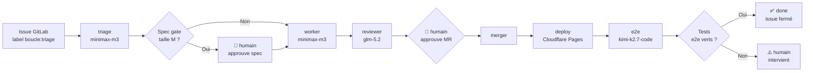

# boucle — Boucle de développement autonome

> **Maintenance** — Ce document est le point d'entrée de boucle. Toute
> modification de l'usage, du démarrage ou de la configuration doit le mettre à
> jour. Voir [AGENTS.md](AGENTS.md) pour les conventions de contribution.

## Qu'est-ce que boucle ?

boucle transforme un issue GitLab en site déployé sur Cloudflare Pages, sans
intervention humaine (sauf validation de spec en taille M et approbation de
MR). Quatre agents IA — **triage**, **worker**, **reviewer**, **e2e** —
orchestrent le flux : analyse → implémentation → revue adversaire → fusion →
déploiement → vérification de bout en bout.



L'état de chaque issue est piloté exclusivement par des labels GitLab
(`boucle:triage`, `boucle:todo`, `boucle:working`, `boucle:review`,
`boucle:approval`, `boucle:merging`, `boucle:done`, `boucle:human`) — pas de
base de données externe. Voir [ARCHITECTURE.md](ARCHITECTURE.md) pour le
détail de la machine à états.

## Démarrage rapide

Pré-requis : un dépôt GitLab (ou GitLab.com) avec Cloudflare Pages configuré
comme target de déploiement, et un Personal Access Token du bot boucle.

```bash
# 1. Cloner boucle comme submodule dans le repo consommateur
git submodule add https://github.com/ankaboot-source/boucle .boucle

# 2. Configurer l'infrastructure (idempotent — peut être rejoué sans danger)
BOUCLE_TOKEN=xxx CLOUDFLARE_API_TOKEN=yyy bin/setup

# 3. Vérifier l'installation (doit afficher "OK" partout)
bin/doctor

# 4. Créer un issue GitLab avec le label `boucle:triage`
#    OU assigner un issue existant au bot boucle
```

Une fois ces étapes franchies, le pipeline GitLab CI prend le relais
automatiquement. Vous n'avez plus qu'à répondre aux sollicitations humaines
(validation de spec, approbation de MR).

## Comment ça marche

Voici la séquence complète, du déclencheur initial à la fermeture de l'issue :

```mermaid
sequenceDiagram
    autonumber
    participant U as Utilisateur
    participant GL as GitLab
    participant CI as Pipeline CI
    participant T as triage
    participant W as worker
    participant R as reviewer
    participant M as merger
    participant CF as Cloudflare Pages
    participant E as e2e

    U->>GL: Crée issue + label boucle:triage
    GL->>CI: Webhook déclenche pipeline
    CI->>CI: dispatch route l'événement
    CI->>T: Analyser l'issue
    T-->>GL: Commentaire structuré (TL;DR + steps)
    alt Spec gate (taille M, profil product)
        U->>GL: Approuve spec (emoji/reply)
    end
    CI->>W: Implémenter sur branche boucle/<iid>
    W->>GL: Build + deploy preview + ouvre MR
    CI->>R: Revue adversaire contre URL preview
    R-->>GL: Verdict PASS/FAIL
    U->>GL: Approuve la MR
    CI->>M: Rebase + merge
    M->>GL: Fusionne vers main
    CI->>CF: Déploiement production
    CF-->>CI: URL production
    CI->>E: Vérifier sur URL production
    E-->>GL: Rapport e2e
    alt e2e PASS
        GL->>GL: Issue fermé, label boucle:done
    else e2e FAIL
        GL->>GL: Label boucle:human
    end
```

Quelques points clés :

- **Chaque agent est stateless et idempotent** : relancer un job sur le même
  état n'a pas d'effet de bord. Vous devez toujours pouvoir rejouer `bin/setup`
  ou `bin/doctor` sans casser quoi que ce soit.
- **Les agents postent D'ABORD et raffinent ENSUITE**. Un commentaire partiel
  vaut mieux que pas de commentaire du tout — c'est ce qui permet au pipeline
  de continuer même si l'agent épuise ses steps.
- **Les chemins de fichiers commités par le worker sont escaped** (jamais de
  `\$file` interpolé dans le shell).

## Configuration

La configuration par consommateur est documentée exhaustivement dans
[LOOP.md](LOOP.md). Voici les **variables CI minimales** à définir :

| Variable | Description |
| --- | --- |
| `BOUCLE_ENABLED` | Active ou désactive boucle (`true` / `false`). **Requis.** |
| `BOUCLE_TOKEN` | Personal Access Token du bot (scope `api`). **Requis.** |
| `CLOUDFLARE_API_TOKEN` | Token Cloudflare pour le déploiement. **Requis.** |
| `BOUCLE_SPEC_PROFILE` | Mode spec gate : `product` (gate M), `strict` (gate toutes tailles), `off` (pas de gate). |
| `BOUCLE_UPDATE_MODE` | Mode auto-update : `release` (latest tag) ou `dev` (latest commit main). |

Voir [ARCHITECTURE.md](ARCHITECTURE.md) pour la liste complète des variables
CI, leurs valeurs par défaut et leurs interactions.

## Agents

boucle orchestre quatre agents IA spécialisés, chacun avec un modèle adapté à
sa tâche :

| Agent | Modèle | Rôle |
| --- | --- | --- |
| `triage` | `minimax-m3` | Analyse l'issue. Sortie : disposition `READY` / `NEEDS-INFO` / `NEEDS-SPLIT` + commentaire structuré (TL;DR + steps). |
| `worker` | `minimax-m3` | Implémente sur branche `boucle/<iid>`, build, deploy preview, ouvre la MR. |
| `reviewer` | `glm-5.2` | Revue adversaire contre l'URL preview (anti-sycophancy, fall-back SHA-unanchored parsing). |
| `e2e` | `kimi-k2.7-code` | Vérification de bout en bout sur l'URL production. Décide PASS/FAIL. |

Le coding agent `pi` (sous `.pi/agents/*.md`) est utilisé par `worker` pour
l'écriture de code. Le knowledge graph `codebase-memory-mcp` alimente triage et
worker, mais **doit être strip en CI** (le handshake MCP peut hang > 30s) —
voir [AGENTS.md](AGENTS.md) pour le fallback glob/grep/read.

## Auto-update

boucle se met à jour automatiquement depuis l'upstream
([github.com/ankaboot-source/boucle](https://github.com/ankaboot-source/boucle))
à chaque exécution du pipeline.

- **Modes** : `release` (latest tag stable) ou `dev` (latest commit sur
  `main`). Sélection via `BOUCLE_UPDATE_MODE`.
- **Chemins synchronisés** (`SYNC_PATHS`) :
  `bin .pi .gitlab-ci.yml .opencode/opencode.json .opencode/agents`.
  Le reste du dépôt consommateur n'est jamais touché par la sync.
- **Fail-open** : toute erreur réseau, de téléchargement ou de signature est
  convertie en **warning**, et le pipeline continue avec la version actuelle.
  L'auto-update ne doit JAMAIS bloquer un pipeline.
- **Tracking de version** : fichier `.boucle-version` à la racine du
  consommateur, mis à jour à chaque sync réussie.
- **Anti feedback-loop** : la sync skip automatiquement les pipelines
  déclenchés par push-source (évite la boucle `update → commit → update`).

Pour forcer une version spécifique, voir
[.opencode/UPSTREAM-FIX-WORKFLOW.md](.opencode/UPSTREAM-FIX-WORKFLOW.md).

## Voir aussi

- [ARCHITECTURE.md](ARCHITECTURE.md) — Architecture système, pipeline, diagrammes Mermaid
- [AGENTS.md](AGENTS.md) — Guide des agents, leçons apprises, anti-patternes
- [CONTEXT.md](CONTEXT.md) — Contexte du projet, stack technique, contraintes
- [DESIGN.md](DESIGN.md) — Charte visuelle du site consommateur
- [LOOP.md](LOOP.md) — Configuration par consommateur
- [.opencode/UPSTREAM-FIX-WORKFLOW.md](.opencode/UPSTREAM-FIX-WORKFLOW.md) — Workflow de fix upstream
