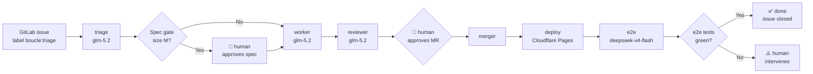

# boucle — Autonomous development loop

> **Maintenance** — This document is the entry point for boucle. Any change
> to usage, getting started, or configuration must update it. See
> [AGENTS.md](AGENTS.md) for contribution conventions.

## What is boucle?

Boucle turns a GitLab issue into a deployed Cloudflare Pages site, without
continuous human intervention (only spec validation and MR approval require
humans). Four AI agents — **triage**, **worker**, **reviewer**, **e2e** —
orchestrate the flow: analysis → implementation → adversarial review →
merge → deployment → end-to-end verification.



The state of every issue is driven exclusively by GitLab labels
(`boucle:triage`, `boucle:todo`, `boucle:working`, `boucle:review`,
`boucle:approval`, `boucle:merging`, `boucle:done`, `boucle:human`) — there is
no external database. See [ARCHITECTURE.md](ARCHITECTURE.md) for the full
state machine.

## Quick start

Prerequisites: a GitLab repository (or `gitlab.com`) with Cloudflare Pages
configured as the deployment target, and a Personal Access Token for the
boucle bot.

```bash
# 1. Add boucle as a submodule in the consumer repo
git submodule add https://github.com/ankaboot-source/boucle .boucle

# 2. Configure infrastructure (idempotent — safe to re-run)
BOUCLE_TOKEN=xxx CLOUDFLARE_API_TOKEN=yyy bin/setup

# 3. Verify the installation (must print "OK" everywhere)
bin/doctor

# 4. Create a GitLab issue with the `boucle:triage` label
#    OR assign an existing issue to the boucle bot
```

Once these steps complete, the GitLab CI pipeline takes over automatically.
You only have to respond to human prompts (spec validation, MR approval).

## How it works

Here is the full sequence, from the initial trigger to issue closure:

```mermaid
sequenceDiagram
    autonumber
    participant U as User
    participant GL as GitLab
    participant CI as CI Pipeline
    participant T as triage
    participant W as worker
    participant R as reviewer
    participant M as merger
    participant CF as Cloudflare Pages
    participant E as e2e

    U->>GL: Create issue + label boucle:triage
    GL->>CI: Webhook triggers pipeline
    CI->>CI: dispatch routes the event
    CI->>T: Analyze the issue
    T-->>GL: Structured comment (TL;DR + steps)
    alt Spec gate (size M, product profile)
        U->>GL: Approves spec (emoji/reply)
    end
    CI->>W: Implement on branch boucle/<iid>
    W->>GL: Build + deploy preview + open MR
    CI->>R: Adversarial review against preview URL
    R-->>GL: Verdict PASS/FAIL
    U->>GL: Approves the MR
    CI->>M: Rebase + merge
    M->>GL: Merges into main
    CI->>CF: Production deployment
    CF-->>CI: Production URL
    CI->>E: Verify on production URL
    E-->>GL: e2e report
    alt e2e PASS
        GL->>GL: Issue closed, label boucle:done
    else e2e FAIL
        GL->>GL: Label boucle:human
    end
```

Key invariants you must respect:

- **Every agent is stateless and idempotent**. Re-running a job on the same
  state must never have side effects. You must always be able to re-run
  `bin/setup` or `bin/doctor` without breaking anything.
- **Agents post FIRST and refine AFTER**. A partial comment is always better
  than no comment at all — this is what lets the pipeline keep moving even
  if the agent runs out of steps.
- **File paths committed by the worker must always be escaped** — never
  interpolate `$file` raw into shell.
- **Documentation is self-maintained**. Boucle keeps its own charter docs
  (`ARCHITECTURE.md`, `AGENTS.md`, `CONTEXT.md`, `DESIGN.md`, `LOOP.md`) in
  sync with the code as part of each work cycle — the triage identifies
  impacted docs, the worker updates them in the same MR, the reviewer
  verifies doc conformance and completeness, and the e2e verifies docs
  match production reality.

## Configuration

Per-consumer configuration is documented exhaustively in
[LOOP.md](LOOP.md). Below are the **minimum CI variables** you must define:

| Variable | Description |
| --- | --- |
| `BOUCLE_ENABLED` | Enables or disables boucle (`true` / `false`). **Required.** |
| `BOUCLE_TOKEN` | Personal Access Token for the bot (scope `api`). **Required.** |
| `CLOUDFLARE_API_TOKEN` | Cloudflare token for deployment. **Required.** |
| `BOUCLE_SPEC_PROFILE` | Spec gate mode: `product` (gate M only), `strict` (gate every size), `off` (no gate). |
| `BOUCLE_UPDATE_MODE` | Auto-update mode: `release` (latest tag) or `dev` (latest commit on main). |

See [ARCHITECTURE.md](ARCHITECTURE.md) for the full list of CI variables,
their default values, and how they interact.

## Agents

Boucle orchestrates four specialized AI agents, each backed by a model
matched to its task:

| Agent | Model | Role |
| --- | --- | --- |
| `triage` | `glm-5.2` | Analyzes the issue. Output: disposition `READY` / `NEEDS-INFO` / `NEEDS-SPLIT` + a structured comment (TL;DR + steps). |
| `worker` | `glm-5.2` | Implements on branch `boucle/<iid>`, builds, deploys preview, opens the MR. |
| `reviewer` | `glm-5.2` | Adversarial review against the preview URL (anti-sycophancy, fall-back SHA-unanchored parsing). |
| `e2e` | `deepseek-v4-flash` | End-to-end verification on the production URL. Decides PASS/FAIL. |

The coding agent `pi` (under `.pi/agents/*.md`) is used by `worker` for
writing code. The `codebase-memory-mcp` knowledge graph feeds triage and
worker, but you **must strip it in CI** (the MCP handshake can hang > 30s) —
see [AGENTS.md](AGENTS.md) for the glob/grep/read fallback.

## Auto-update

Boucle self-updates from upstream
([github.com/ankaboot-source/boucle](https://github.com/ankaboot-source/boucle))
on every pipeline run.

- **Modes**: `release` (latest stable tag) or `dev` (latest commit on `main`).
  Select via `BOUCLE_UPDATE_MODE`.
- **Synchronized paths** (`SYNC_PATHS`):
  `bin .pi .gitlab-ci.yml .opencode/opencode.json .opencode/agents`.
  The rest of the consumer repository must never be touched by the sync.
- **Fail-open**: any network, download, or signature error must be converted
  into a **warning**, and the pipeline must continue with the current
  version. Auto-update must NEVER block a pipeline.
- **Version tracking**: a `.boucle-version` file at the root of the consumer,
  updated on every successful sync.
- **Anti-feedback-loop**: the sync must always skip pipelines triggered by
  push-source (to avoid the `update → commit → update` loop).

To pin a specific version, see
[.opencode/UPSTREAM-FIX-WORKFLOW.md](.opencode/UPSTREAM-FIX-WORKFLOW.md).

## See also

- [ARCHITECTURE.md](ARCHITECTURE.md) — System architecture, pipeline, Mermaid diagrams
- [AGENTS.md](AGENTS.md) — Agent guide, lessons learned, anti-patterns
- [CONTEXT.md](CONTEXT.md) — Project context, tech stack, constraints
- [DESIGN.md](DESIGN.md) — Consumer site visual charter
- [LOOP.md](LOOP.md) — Per-consumer configuration
- [.opencode/UPSTREAM-FIX-WORKFLOW.md](.opencode/UPSTREAM-FIX-WORKFLOW.md) — Upstream fix workflow
