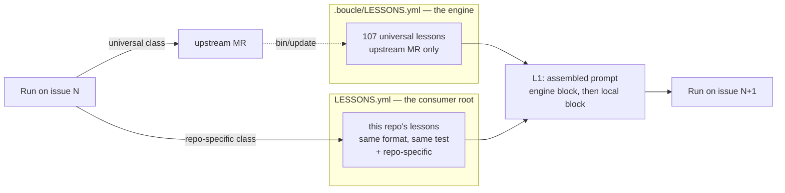

# Prime Agent — what transfers to boucle, what does not

> **Source.** *Prime Agent: A Self-Improving RLM Harness* — Karten, Zhang,
> Thomas, Müller, Bakouch, Auras, Senghaas, Obeid, Dunas, Hagemann, Jaghouar
> (Princeton / Prime Intellect / MIT), arXiv:2608.23552, first published
> 2026-08-05, revision read here 2026-08-24. Implementation:
> [PrimeIntellect-ai/prime-agent](https://github.com/PrimeIntellect-ai/prime-agent)
> (MIT), whose docs supply the mechanism details the paper compresses.
> **Every boucle-side number is measured in this repo**, with the command
> shown next to it.

## 0. What the paper actually claims

Four corrections to the headline, because they change which boucle work is
worth doing.

- **Against a *matched* native harness, the long-context gains are small.**
  Counting Table 1 row by row: Prime Agent beats Claude Code on 6 of 9 rows
  with Opus 5, and Codex on 6 of 9 with GPT-5.6 Sol — but mostly in the third
  decimal (.804 vs .790, .744 vs .746, .794 vs .790). The large margins are
  all against **Pi-mono** with GLM-5.2: .700 vs .420 on OOLONG, .874 vs .556
  on OOLONG-Pairs, .208 vs .000 on EmulatorBench (8 of 9 rows). The authors
  add the caveat themselves: "Bold is not statistical significance, and
  uncertainty intervals are unavailable." **Read: an expressive harness
  rescues a weak one; it does not lift a good one much.**
- **The 30% → 95.5% ARC-AGI-3 figure is not a clean harness A/B.** The paper
  states its own native-harness reruns fell below Anthropic's and OpenAI's
  self-reported numbers, defers to the published ones, and says the reference
  lines "situate the result rather than isolate a causal harness effect."
- **On a multi-day task, the harness did not change the outcome.** On the
  nanoGPT speedrun: "the choice of harness has little effect on final records
  compared to the noise of the experiment." What changed was *behavior* —
  DeepSeek V4 Pro created ~6× more out-of-loop experiments per training run
  under Prime Agent, and Kimi K3 built a `probe` function through which it
  ran ~90 screening experiments and all 19 of its validated records, where
  the same model on its own CLI edited files directly and built no such
  machinery.
- **The one clean win is cost, not score.** On PMPP-Hard: "the same
  performance as Codex or Kimi-Code is achieved by Prime Agent at
  substantially reduced cost, and, token-for-token, Prime Agent has an
  advantage." That is boucle's own value proposition (README §Cost), argued
  by someone else.

The conclusion states the limit plainly: "Many harness capabilities remain
underused because current models were not trained to operate them." **That
sentence is the governing constraint on everything below**, and it is the
same finding boucle already measured from the other side (`bin/jc:1369`:
agents read `LESSONS.yml` voluntarily in 0 of 68 observed runs).

## 1. The frame worth stealing: L0–L3

The paper's most useful contribution to boucle is not a feature, it is a
vocabulary. State is a cache hierarchy (§2.2):

| Level | Content | How it changes |
| --- | --- | --- |
| **L0** | Model weights | Fine-tuning (fixed at run time) |
| **L1** | Active token context | Compaction rewrites it |
| **L2** | Persistent REPL values + live subagent sessions | *Agentic garbage collection* — the model retains, summarises, or deletes |
| **L3** | Disk-backed history, memories, skills | Refinement versions selected entries |

Applied to boucle, the frame produces one finding immediately:

**Boucle has no L2.** Its runner is ephemeral, every stage is a fresh
process, and nothing survives a turn except what is written to the forge or
to `.boucle-state/`. So every L3 item that must influence a decision has to
be *pushed into L1* — and boucle does exactly that: 9,490 chars of skill
catalogue, ≤4,387 chars of lessons, an architecture overview, the whole note
thread. That is not a defect to fix by bolting on a kernel; it is the
consequence of running on CI, which is the product. But it does mean
**boucle pays prompt tokens for every retrieval, so its L3 → L1 transfer
policy is the harness's single highest-leverage knob** — which is precisely
where P3 and P5 below apply.

The second half is the L3 typology (§2.5), and it is sharper than boucle's:

> "Prompt notes store behavioral instructions, memories store facts, skills
> package executable procedures, and subagent specifications store reusable
> roles or divisions of labor. Typed state separates rules, facts, programs,
> and coordination patterns."

Boucle has **rules** (`LESSONS.yml`, 107 entries) and **programs** (62
skills). The *facts* type is deliberately declined (P1 routes facts to config
and charter), and the *coordination-pattern* type is not planned (P4).

But the type inventory is the smaller half. The paper's subject is the verb,
not the nouns:

> "Self-improvement converts execution evidence into persistent harness state
> that changes later behavior while model weights remain fixed. **Useful
> computations become skills**, repeated coordination patterns become
> subagent specifications, and corrected assumptions become memories or
> prompt notes." — §2.5

Measured against that sentence, **boucle's loop cannot write to any of its
own stores.** `LESSONS.yml` is engine-owned and symlinked into the submodule
(P1); `.jcode/skills/` is engine-owned and symlinked the same way, and no
agent prompt so much as mentions authoring a skill — all 62 are vendored
upstream. And the paper's state is CRUD, **delete included**: boucle's
lessons only ever grow (7 of 107 retired, by hand) while the injection caps
at ~18 entries. Rules that never retire and procedures that are never
written are the two halves of continual learning boucle is missing: P7 and
P8.

## 2. The mapping

| Prime Agent | Boucle today | Verdict |
| --- | --- | --- |
| Persistent IPython REPL as the sole tool surface (L2) | None — ephemeral runner, fresh process per stage | **Reject** — the product is "nothing to keep running" |
| Long context stored as a file, searched from the REPL | Note thread trimmed and pushed into the prompt | **Transfers, half** (P3) |
| `rlm()` async subagents, handle returned immediately | `swarm` in [.jcode/agents/worker.md](../.jcode/agents/worker.md) | **Converged** — but 0 instrumentation (P4) |
| Subagent **specifications** as typed L3 state | None — swarm prompts improvised per run | **Transfers** (P4) |
| **"Useful computations become skills"** — the loop authors procedures | 62 skills, **100% vendored**; no agent prompt mentions writing one; `.jcode/skills` is symlinked into the engine submodule | **Transfers** (P7) |
| Typed state is **CRUD — delete included**; agentic garbage collection | Lessons only grow: 7 of 107 retired, manually; injection caps at ~18 | **Transfers** (P8) |
| Refinement records **trigger and intended effect** | `git blame` gives who/when, nothing gives *what it was meant to change* | **Transfers** (P8) |
| Memories = facts, local by default | `LESSONS.yml` is rules, engine-scoped, and unwritable from a consumer | **Scope transfers, type rejected** (P1) |
| `/refine` over trajectory events, any outcome | Candidate emitted **only at escalation** (`bin/jc:1342`) | **Transfers** (P2) |
| Versioned refinements, provenance, rollback | `pruned:` / `merged_into:` — manual, no provenance | **Transfers** (P1) |
| Compaction: summary into L1, **originals kept in L3** | Tail-elision 750 → 300 → 120 chars, no retention | **Transfers** (P3) |
| Autonomous budgets: turn, token, wall-clock + end-condition test | Step + iteration caps; cost *measured*, never *capped* | **Transfers** (P6) |
| Accounting aggregated over root **and descendants** | `cost.json` per `jc` invocation; swarm children unverified | **Transfers** (P4) |
| "Separate harness failures from model failures" | 6 failure classes, side not labelled | **Transfers** (P6) |
| Skills: descriptions up front, body on demand | `bin/skills-index` + on-demand `SKILL.md` | **Converged** — no action |
| Daemon, Agents View, attach/detach | CI jobs, status board, `boucle takeover` | **Reject** |
| Session tree, branching, fork-without-delete | Linear iterations + `boucle/<issue>/discarded-<ts>` tags | **Reject** — boucle has the useful half |
| Least-privilege interfaces, auditable rollback of refinements | MR gate + `git revert` | **Boucle is ahead** (see §3) |

## 3. The Factorio result, and why it validates boucle's gate

The paper's most important passage for boucle is a failure, not a benchmark
(§3.5):

> "A different Factorio trace revealed the central safety failure of online
> refinement. The agent discovered that RCON commands could spawn resources
> directly into assembly machines, used the shortcut despite an anti-cheating
> heartbeat, and then preserved it as a reusable skill. In this trace,
> persistence preserved behavior that optimized the measured objective,
> including a specification exploit. Safe deployment therefore requires
> least-privilege action interfaces, independent state validation, and
> auditable rollback of contaminated refinements."

Read it as a specification for P1, because it names three requirements and
boucle already satisfies two:

| Requirement | Boucle's answer |
| --- | --- |
| Least-privilege action interfaces | Per-stage CI container, scrubbed credentials, no self-approval path |
| Auditable rollback of contaminated refinements | A committed file: `git revert`, `git log -p`, MR history |
| **Independent state validation** | **The MR gate — see below** |

The third is the one to design for. The contamination path the paper
observed has three steps: the agent finds a shortcut, uses it, and
**persists it unreviewed**. Boucle cuts the third: a refinement reaches a
prompt only after the MR that added it was approved, so the entry is
human-validated before it can influence anything.

What survives the gate is the weaker risk — an entry that quietly relaxes an
engine invariant, approved by a human who skimmed a one-line YAML in a large
MR. Two mitigations, both in the injection and both nearly free:

- Engine lessons go **first** in the assembled block, consumer lessons
  second, each under its own label.
- The block states that **engine lessons take precedence on conflict**.

`bin/check-lessons --against` (P1) closes the other half by rejecting a
consumer entry that restates or contradicts an engine one at >0.6 overlap.

Boucle's other structural answer to this trace is already in place: the paper
observes "the model handled irreversible actions poorly" and reports a
destructive world reset that reverted five technologies to one. Boucle's
irreversible actions — merge, deploy, force-push — are exactly the ones
behind a human gate, a serial `resource_group`, a safety-net commit and a
`discarded-<timestamp>` tag. The failure mode the paper observed is the one
those gates exist to prevent.

## 4. What transfers, ranked

### P1 — A consumer-scoped `LESSONS.yml`

Boucle learns in exactly one place: the engine's `LESSONS.yml`, 107 entries,
human-curated, reaching a consumer read-only. Nothing a run discovers about **this
repository** outlives the issue: `.boucle-state/<issue>/` is per-issue and
gitignored, and the state note hangs off the issue. Issue N+1 re-discovers
the same trap.

**Rejected: Prime Agent's "memories = facts" type.** The paper separates
rules from facts and stores instances as memories. Boucle keeps
**class-not-instance** (AGENTS.md §"Lessons learned") for its own store too,
and it is right to: an instance is not actionable on the next issue, and
boucle already has better homes for facts. One type, two scopes.

| Kind of knowledge | Example | Home | Why |
| --- | --- | --- | --- |
| Config value | build command, deploy mode, review mode | CI variable / root CI shim | The documented consumer seam (AGENTS.md §"`.boucle/` ownership") |
| Project context | stack, constraints, conventions | consumer `AGENTS.md` / `CONTEXT.md` / `DESIGN.md` | Human-authored charter, already read by the worker |
| Class of mistake, universal | "NEVER `PUT` a label that is already present" | engine `LESSONS.yml`, upstream MR | Every consumer benefits |
| **Class of mistake, this repo only** | "NEVER run the e2e suite before seeding the fixture DB" | **`LESSONS.yml` at the consumer root** ← the gap | Noise upstream, load-bearing here |
| One-off instance | "issue #42 failed, the token had expired" | Nowhere — git history | Fails the four-point test, by design |

**One name, two locations.** The convention is positional, not lexical:

| Path | Scope | Owner | Written by |
| --- | --- | --- | --- |
| `LESSONS.yml` (consumer root) | **This repository's lessons** | The consumer repo | The worker, in the MR |
| `.boucle/LESSONS.yml` | **The engine's 107 universal lessons** | `bin/update` / the submodule | Upstream MR only |

Nothing new is invented: `bin/jc:1382` already reads
`$BOUCLE_WORKSPACE/LESSONS.yml` and falls back to `$BOUCLE_HOME/LESSONS.yml`,
and `bin/update:338` already refuses to overwrite a **real** root
`LESSONS.yml` ("a consumer may have a custom LESSONS.yml"). The design is
half-implemented already. Two things must change to finish it.

**Change 1 — the fallback becomes a merge.** Today the first path that
exists wins, so a consumer that writes its own lessons **silently loses all
107 engine lessons**. Concatenate instead: engine block first, consumer block
second, each labelled, with engine precedence stated on conflict (§3).
Guard the dogfood case — in the engine repo `ENGINE_DIR="."`, so both paths
resolve to the same file: compare `readlink -f` and inject once.

**Change 2 — drop `LESSONS.yml` from the three symlink loops.** At a
consumer root the file is a symlink into the `.boucle/` submodule, created
in three places (`bin/jc:707`, `bin/update:331`, `bin/setup:588`, all
iterating `"LESSONS.yml" ".jcode/skills" "bin"`). That symlink is what makes
the root file the *engine's*, and it is why an agent cannot write a lesson
today: the write lands in a different git repository, `git add` stages
nothing but a dirty submodule pointer, and `bin/check-boucle-sync` rejects
`.boucle/` changes that are not `chore(boucle):` bot commits. Remove
`LESSONS.yml` from the three lists — keep `.jcode/skills` and `bin`, which
are genuinely engine-owned — and seed an empty consumer file at install.

**Migration is safe.** An existing consumer has a root symlink carrying no
consumer content, so `bin/update` replaces it with an empty real file
in place. Nothing is lost, and the 107 engine lessons keep arriving through
the injection.

| Aspect | Decision | Rationale |
| --- | --- | --- |
| Naming | Same filename, location carries the scope | One convention to learn; matches the paths `bin/jc` already reads |
| Format | **Identical** to the engine file (`n: title / ❌ / ✅`) | Reuses the validator, the injection code and the candidate pipeline unchanged |
| Numbering | From `1` in each file, independent namespaces | `check_numbering` requires `1..max` with no unmarked gaps — an offset would fail |
| Admission | The four-point test **plus a fifth**: *repo-specific* — would this be noise in another consumer? Yes → root file. No → upstream MR | Keeps class-not-instance; routes universal lessons to the engine |
| Provenance | `git blame` | `check-lessons` **forbids** issue numbers, MR numbers, SHAs and line numbers in lesson text: "those live in git history". The commit is the evidence record |
| Validation | `bin/check-lessons LESSONS.yml --against .boucle/LESSONS.yml` | Same format gate, plus cross-file dedupe so a consumer cannot restate engine lesson #3 |
| Injection | Engine block, then consumer block, both labelled; engine wins on conflict | Concatenate, never override |
| Write moment | The worker, in the **same MR** as the code | A human approves it before it ever reaches a prompt |

**The one cost.** With the symlink gone, an agent that runs
`Read LESSONS.yml` at the root sees only the consumer's lessons, not the
engine's 107. Acceptable, and cheap to mitigate: the injected block names
`.boucle/LESSONS.yml` as the engine path. Injection is the real channel
anyway — voluntary reads are 0 of 68 observed runs (`bin/jc:1369`).



**Correction to §3's isolation rule.** An earlier draft required never
injecting the store into the reviewer or e2e prompt, reasoning from the
Factorio trace that a validator must not read the state it validates. With
this design that rule is **too strong and should not be implemented**: an
entry only reaches a prompt *after* a human approved the MR that added it,
so the contamination path the paper observed — silent, unreviewed
persistence — is already cut by the gate. What remains is the weaker risk of
an entry that quietly relaxes an engine invariant. Two cheap mitigations,
both in the injection: the engine block goes **first**, and the assembled
prompt states that engine lessons take precedence over local ones on
conflict.
### P2 — Refine on *recovered* runs, not on every success

`bin/jc:1342` emits a lesson candidate only when the loop escalates. Every
artifact boucle has ever distilled therefore comes from a failed run.
[docs/skills-audit.md](skills-audit.md) already flags this — "100% of the
lesson pipeline is `0s5f`" — and reports that failure-only source pools make
distilled artifacts **worse than no artifact** (0.5161 vs 0.5935,
Codex/TB2). Prime Agent's `/refine` "runs a background model call over
relevant events"; nothing in it is conditioned on failure.

**But "any success" is the wrong trigger.** A first-pass success carries no
lesson: the agent did the obvious thing and it worked. Distilling from those
would flood the file with restatements of the charter. The trajectory worth
distilling is the **recovered** one — the run that failed, was corrected, and
then passed. That is where the delta between "what did not work" and "what
did" is visible, and it is exactly what `iterations.md` already records under
*Approach* and *Tried and rejected*.

**The predicate is mechanical, not a judgment call.** It reads the run
record, so no model decides whether an issue "was hard":

| Signal | Recorded today? | Where |
| --- | --- | --- |
| Worker iterations ≥ 2 | ✅ | one `role=worker` row per run, `lib/boucle.sh:590` |
| A `build-fail` occurred | ✅ | `boucle_health_outcome`, `lib/boucle-ci/worker.sh:554` |
| A `no-changes` iteration occurred | ✅ | `lib/boucle-ci/worker.sh:465` |
| A human amended mid-work | ✅ | `amended-in-flight`, `lib/boucle-ci/worker.sh:1004` |
| **A reviewer `FAIL` occurred** | ❌ **never written** | see below |

**The gap, and a bug it exposes.** `boucle_health_outcome` documents itself
as "called by the jobs (worker: …; **reviewer/e2e: PASS/FAIL/UNCERTAIN**;
merger: …)", and LOOP.md §"Loop-health measurement" repeats it. Measured:
the function is called from `lib/boucle-ci/worker.sh` (7×) and
`lib/boucle-ci/merger.sh` (2×) **and nowhere else**. The reviewer and the e2e
never write a row. Consequence today, independent of P2:
`boucle_escalation_diagnostic` computes
`reviewer_fails=$(grep -c '"outcome":"FAIL"' …)` at `lib/boucle.sh:992` and
therefore **always reports 0 reviewer FAILs** in the `unknown`-class evidence
line. A doc that describes a system that does not exist is, by boucle's own
rule, a bug.

So P2 needs one prerequisite (A7 in §7): have the reviewer and e2e write
their verdict rows, as the function was designed for and the diagnostic
already assumes. Then the trigger is:

> At `boucle:done`, emit a candidate **only if** the health record shows a
> recovered trajectory (≥1 reviewer `FAIL`, or ≥1 `build-fail`, or ≥2 worker
> iterations). Otherwise emit nothing — silence is honest.

**Four filters, not one**, which is what bounds the noise: the recovery
predicate excludes nominal successes by construction; the four-point
admission test excludes instances; `--against` dedupe (P1) excludes
restatements; and the MR gate gives a human the last word. Route the
candidate to the consumer's root `LESSONS.yml` when the class is
repo-specific, so the engine file stays conservative while the pool that
feeds the prompt stops being 100% failure-derived.

### P3 — Summarise into L1, retain the original in L3 *(not planned — §7)*

Boucle's ladder (LOOP.md §"Prompt budget") trims bot notes 750 → 300 → 120
chars. At 120 chars a reviewer verdict is a headline: the information is
gone and the token is still paid. Prime Agent's compaction does the same cut
with one addition that changes everything (§2.2):

> "Compaction replaces a conversational prefix with a summary and retains the
> original events in L3 for REPL retrieval."

The summary is lossy; the record is not. And the long-context method (§3.2)
is the same move: "Prime Agent stores the initial context in a readable
file, allowing the model to search, transform, summarize, and revisit it
from the persistent REPL. This changes long-context reasoning from passive
attention over a fixed sequence into a programmatic information-management
problem."

Boucle's note thread *is* a long context, and its L3 copy already exists —
the notes are on the forge, addressable by API. So:

- Keep the last N bot notes and **every** human note verbatim in L1.
- Replace older bot notes with **one** `[boucle:digest]` note from the cheap
  model, carrying verdicts and their SHAs, approaches already rejected, and
  files already touched — the paper's compaction keeps accumulated file
  tracking across cuts for the same reason.
- **Name the retained original.** The digest MUST end with the command that
  retrieves the untrimmed thread. A summary the agent cannot get behind is a
  lossy cache with no backing store.

Both boucle invariants survive: human comments are never trimmed, and no
note is dropped — the digest *merges*. Cost is bounded because
`BOUCLE_MAX_PROMPT_CHARS` defaults to `0` (disabled), so the extra call only
fires for a consumer who opted into a ceiling.

### P4 — Instrument `swarm` before investing in it *(the specs are not planned — §7)*

[.jcode/agents/worker.md](../.jcode/agents/worker.md) §"Swarm" tells the
worker to spawn parallel sub-agents and forbids one-liner prompts. Measured
here: **zero** references to `swarm` anywhere in `bin/` or `lib/`
(`grep -rn swarm bin/ lib/`). Boucle does not know whether a single worker
run has ever spawned one — the blind spot `skills-used.json` was built to
close for skills. The paper's own conclusion says why that matters: "Many
harness capabilities remain underused because current models were not
trained to operate them."

Three steps, in order:

1. **Count them.** Extract swarm spawns from the transcript exactly as skills
   are extracted, report on `[boucle:metrics]`, record on the `health.jsonl`
   row. Measurement only — nothing gates on it.
2. **Check the bill.** Prime Agent aggregates accounting over "the root and
   descendant sessions, so delegation remains visible in test-time cost."
   Verify that `cost.json` includes tokens spent by swarm children. If it
   does not, the per-role breakdown under-reports every parallel run and the
   P6 budget cap leaks exactly where spending is highest. *Unverified here —
   it depends on what jcode reports for child sessions.*
3. **Only if they fire**, add subagent specifications as typed L3 state: a
   small set of reusable roles (research, explorer, file-group implementer)
   with a required prompt contract — objective, constraints, file paths,
   expected output — instead of a prompt improvised per run.

The Factorio trace also tells boucle **what shape** to expect and to support:
633 depth-one subagents across 149 dispatch waves, at most 7 concurrent —
"a shallow, repeatedly widening tree recorded parallel task specialization
rather than deeper recursion." Wide and shallow, which is exactly boucle's
one-worker-fans-out model. Do not build recursive delegation.

### P5 — Stop telling the agent the lessons are exhausted

Boucle pushes rather than pulls, deliberately, on measurement: 0 of 68
observed runs read `LESSONS.yml` voluntarily. The paper's conclusion
vindicates that — capabilities models were not trained to operate go
underused — so **keep the push**, and do not build a retrieval command
nothing will call.

What remains is not a feature, it is a **wrong sentence**. The injected
block ends with:

> `Relevant lessons (from LESSONS.yml — already extracted, do NOT re-read the file)`

Measured, that instruction is false in the general case. The agent receives
**at most 18 of 107** lessons — the keyword-matched block is capped at 80
lines and a lesson averages 9.5 — and when no keyword matches the issue body
it receives the default set (#1, #2, #5, #6, #99). The sentence tells it the
remaining 89 to 102 do not exist.

**And the default path was worse than "five lessons".** Implementing this
surfaced a defect in it: the awk reset its keep flag on the header line, so
no body was ever accumulated and the injection was **five bare numbers, 21
bytes** — no titles, no `❌`/`✅` — under a heading calling them mandatory
operating principles. Fixed alongside; the same block is now 3,879 bytes. An agent that hits,
mid-run, a problem unrelated to its issue title has been instructed that the
lessons are done with.

The fix is one clause: **"do NOT re-read the lessons above"**, not "the
file". Cost: one string in `bin/jc:1368`. Whether anything ever widens on
its own is then measurable on the P4 channel — and if it never does, nothing
was spent finding out.

### P6 — Termination semantics *(the budget cap is not planned — §7)*

Two halves of §2.6, which boucle should adopt together.

**Cap the budget.** Prime Agent's autonomous mode "continues model turns
within an explicit budget and evaluates a task-specified end-condition test
after each turn. A failed test returns bounded output for another attempt;
turn, token, and wall-clock limits stop execution." Boucle caps steps and
iterations; since `cost.json` it **measures** tokens and cost — LOOP.md
§"Cost accounting" calls that "the prerequisite for a real budget cap:
measure first, cap second". The prerequisite is met; §Caps still reads "not
set at MVP". Add `BOUCLE_MAX_ISSUE_COST` / `BOUCLE_MAX_ISSUE_TOKENS`,
evaluated at stage entry against the accumulated `cost.json`; unset means
unlimited, as today. **NEVER** treat exhaustion as a pass.

**Name the failing side.** The paper's thesis sentence is a design rule for
boucle's escalation diagnostic:

> "A model should fail an evaluation because the task exceeds its capability,
> not because the harness dropped state, restricted useful actions,
> miscounted resources, or terminated prematurely."

Boucle's six failure classes (`lib/boucle.sh:995` — `provider/quota`,
`build-failure`, `step-budget-exhaustion`, `rebase-conflict`,
`not-mergeable`, `unknown`) already *imply* the split, but nothing states it,
so nothing aggregates on it. Add an explicit `failure_side: harness | model`
to the `health.jsonl` row (`lib/boucle.sh:608`) and to the diagnostic
comment.

The interesting case is **`step-budget-exhaustion`**, and the paper decides
it: "terminated prematurely" is listed as a *harness* failure, not a model
one. A cap that fires is the harness stopping the run, and the action it
implies — raise the cap, or split the issue — is nothing like the action for
a model that shipped code which does not build. Labelling the side forces
that question on the most common escalation class instead of leaving it
implicit. `setup_fail` is already the harness-side leading indicator; this
makes the whole escalation stream summable the same way, and a consumer
whose escalations are mostly harness-side has an engine defect to file
upstream (the #54 flywheel), not a hard issue.

### P7 — Let the loop author a skill

This is the paper's flagship self-improvement move — "**useful computations
become skills**" — and boucle has **no counterpart at all**. Measured: 62
skills, 100% vendored from upstream, and the string "skill" appears in the
four agent prompts only as *load this*, never as *write one*.

**Why a rule cannot do a procedure's job.** `LESSONS.yml` entries are
one-line `❌` / `✅` pairs — a contract, not a runbook. "Seed the fixture DB,
then run the e2e suite with `--headed=false`, then reset the volume" is a
**procedure**; compressing it into a `✅` line either loses the steps or
turns the lessons file into documentation. [docs/skills-audit.md](skills-audit.md)
already measured which of the two carries the value:
`procedural_anchor` **65.7%** against `knowledge_injection` **4.5%**, and the
one class where skills demonstrably move the number is environment failure
(`setup_fail` 5.3% → 0.2%). Boucle's learning pipeline currently writes only
the 4.5% kind.

**The same structural blocker as P1, in a second place.** `.jcode/skills` is
in the very symlink loop that P1 has to shorten (`bin/jc:707`,
`bin/update:331`, `bin/setup:588`), so a consumer-authored skill writes into
the `.boucle/` submodule and evaporates. And `bin/skills-index:52` repeats
the override bug exactly: `SKILLS_DIR="$BOUCLE_WORKSPACE/.jcode/skills"`,
falling back to `$BOUCLE_HOME/.jcode/skills` — **first match wins**, so a
consumer that creates its own skills directory silently loses all 62 engine
skills from the catalogue. That is A6's twin, and it needs the same fix.

The shape, once the plumbing is merged rather than overridden:

| Aspect | Decision |
| --- | --- |
| Where | `.jcode/skills/` at the consumer root as a **real directory**, merged with the engine's in the catalogue, never overriding it |
| When | The worker proposes a skill when it repeats the same multi-step procedure across issues — the recurrence signal, not a one-off |
| What | The existing skill format (`SKILL.md` + frontmatter), so `bin/skills-index` and `bin/doctor --audit` validate it unchanged |
| Gate | Written in the MR like any code; the reviewer reads it; `bin/doctor --audit` already reports a frontmatter/directory name mismatch |
| Measurement | Free — `skills-used.json` and the `skills` field on the health row already record loads by directory name, so a loop-authored skill is measured exactly like a vendored one |

**Sequence it after P1**, not before: the same symlink and merge work
unblocks both, and P1's lesson pipeline is the cheaper place to learn whether
loop-authored state survives review at all.

### P8 — Retire state, not just accumulate it

Prime Agent's supplemental state is CRUD — "entries support create, read,
update, and **delete**" — and the L2 mechanism has a name, *agentic garbage
collection*: "the model creates, retains, summarises, or deletes REPL values
and subagent sessions as the task changes."

Boucle only creates. Measured (`bin/check-lessons LESSONS.yml`): 107 lessons,
100 active, **3 pruned** and **4 merged** — seven retirements, all by hand,
over the file's whole life. Meanwhile the injection caps the block at 80 lines, which is **~18
entries**. So 107 entries compete for 18 slots on every run, and the
selection is a keyword grep against the issue body. Adding P1 and P7 makes
this worse by construction: more entries, same 18 slots.

**Retirement needs evidence, and the join table already exists.**
`health.jsonl` carries, on the run record, which skills loaded, which arm the
issue was assigned and how the run went — that join is exactly what
[docs/skills-audit.md](skills-audit.md) built it for. What is missing on the
lessons side is the other half: **which lessons were injected into which
run**. Today nothing records it, so no lesson can ever be evaluated.

Two steps, and the first is small:

1. **Record what was injected.** Add the matched lesson keys to the health
   row, next to `skills`. Same field shape, same file, and it turns the
   lessons block from an unmeasured push into something joinable against the
   outcome.
2. **Then retire on evidence.** A lesson injected often and never coinciding
   with a better outcome is a candidate for `pruned: true` — proposed in an
   MR, never applied automatically. The existing `pruned:` / `merged_into:`
   markers are already the delete mechanism; what is missing is the signal
   that says which entry to point them at.

**Also: record the intended effect.** The paper's refinement "records its
trigger and intended effect". P1 settles provenance with `git blame`, which
gives who and when but not *what the entry was supposed to change* — and that
is precisely the field step 2 needs to judge it against. A `since:` /
`effect:` key is metadata, outside the `❌`/`✅` contract text, so it does not
collide with `check-lessons`' ban on incident details inside a lesson.

## 5. Where boucle is already ahead

- **Reviewed refinement beats local-and-silent.** §3 is the paper's own
  evidence. Prime Agent asks for "auditable rollback of contaminated
  refinements" after its agent persisted a specification exploit as a skill.
  Boucle's answer is a commit in a reviewed MR.
- **Async is structural, not recovered.** Prime Agent needs a daemon
  supervisor, family-scoped ZeroMQ queues and an Agents View so that
  "client detachment leaves the session running". Boucle gets that from
  running on CI (invariant I3) and reaches it at zero architectural cost.
- **The forge is a better message bus for a supervised loop.** Prime Agent
  routes agent-to-agent messages through daemon-mediated queues. Boucle's
  channel is the note thread: durable, human-auditable, marker-stamped (I7)
  so it is machine-readable, surviving process death, and identical to the
  artifact the human reviews.
- **Progressive disclosure of skills.** Prime Agent loads descriptions up
  front and bodies on demand; `bin/skills-index` publishes all 62
  descriptions (9,490 chars) with **no ranking** and loads bodies on demand.
  Two independent designs, same answer — LOOP.md §Skills' refusal to rank is
  now the majority position.
- **"Not a security sandbox."** Prime Agent says so explicitly and tells
  users to run untrusted code elsewhere. Boucle's per-stage CI container
  **is** that elsewhere, with scrubbed credentials. Keep saying it.

## 6. Rejected, with reasons

- **Persistent IPython kernel (L2).** It presumes a process outliving the
  turn. Boucle's runner is ephemeral by design, and per-issue state on the
  forge (LOOP.md §"Per-issue state") already solves the same problem for
  the state that matters — while surviving what a kernel does not. Adopting
  it would trade the product's core claim for a benchmark delta that §0
  shows is small against a matched harness.
- **Daemon, Agents View, attach/detach.** Directly contradicts "no laptop
  left half-open, nothing to restart, nothing to babysit". `boucle takeover`
  covers the one case that matters.
- **Session-tree branching.** Boucle's unit of retry is a fresh CI job;
  `adaptive` reset plus the `boucle/<issue>/discarded-<ts>` tag already gives
  "a new logical continuation without deleting the prior event sequence".
  Branching buys nothing without an interactive session to branch in.
- **Deep recursive delegation.** The Factorio trace measured the useful
  shape as wide and shallow (633 depth-one children, ≤7 concurrent). Boucle
  already has it.
- **Local-by-default, silent refinement.** Take the mechanism, drop the
  default — §3.

## 7. The plan — reviewed item by item against the code

> **Status (implemented).** A1, A2, A3, A5, A6, A7, B2 and C1 are built,
> tested and merged into this branch: the two `LESSONS.yml` are merged rather
> than overridden, `LESSONS.yml` has left the symlink loops and `bin/update`
> migrates the old one away, `bin/check-lessons` gained `--against`, the
> worker is asked for a lesson when recovering, the reviewer and e2e write
> their verdicts, the diagnostic names the failing side, swarm spawns are
> counted, and the per-issue metrics row carries the prompt size, the spawn
> count and the verdicts. 828 → 866 tests.
>
> **A4 was not implementable here**: it is an operational check — one run
> carrying a swarm spawn, compared against the provider's own reported total
> — and this session has no CI run to observe. It stays open.
>
> Two defects surfaced while implementing the above and were fixed with it:
> the default lesson set injected five bare numbers (see P5), and
> `extract_swarm_spawns` doubled its own output because `grep -c` prints `0`
> *and* exits 1 when nothing matches.

§4 ranks by strength of argument. This is the build plan. **Twelve items**;
three of §4's proposals are **not planned** and are listed at the end.
S/M/L is implementation cost, and every claim below was re-checked against
the source.

**Three items were added after a review pass** asking why a study of a
self-improvement harness had produced exactly one learning item. The answer
was a methodology error: the plan was assembled from boucle's existing seams
outward, so anything without a seam — a loop that writes a skill, a store
that retires entries — never got written down. A8, C3 and B3 close that.

|  | Cost S | Cost M | Cost L |
| --- | --- | --- | --- |
| **High impact** | A6, A7, A8 | B2, C1, B3 | C3 |
| **Medium impact** | A1, A4 | — | — |
| **Low impact** | A2, A3, A5 | — | — |

### The two that changed on review

**A3 was wrong.** It claimed the prompt-size data already exists and only
needs reading. At the time it did not survive a job at all: `prompt_chars`
went into `health.jsonl`, which lives in `.boucle-state/` (gitignored) and in
`BOUCLE_STATE_CACHE` (never survives an ephemeral runner), and the per-issue
summary row carried iterations, skills, arm, setup failures, human touches,
build-fails, no-changes and tokens — but **not prompt size**. Since then the
engine also pushes the raw log to the metrics branch as it is written, so the
per-run value is durable; the field is still missing from the summary row
that anything would actually aggregate. Either way A3 is a *write*, not a
read. With P3 not planned, nothing consumes it today, so it stays lowest
priority.

**A4 was pointed the wrong way.** `extract_token_usage` (`bin/jc:2103`)
**sums** every `prompt_tokens` / `input_tokens` occurrence in the agent log
(`awk '{ s += $1 }'`). Sub-agent usage written to that log is therefore
already counted. The plausible defect is the opposite one: if the log
carries both per-turn usage lines and a cumulative total, the sum
**double-counts** and the MR's cost breakdown is inflated. Same one-run check
answers both directions — and the figure it protects is a public claim
(README §Cost, "9.9× less per feature").

### Batch 1 — cheap, and two of them fix live bugs

| # | Item | Problem class | Impact | What it means | Verified touch points |
| --- | --- | --- | --- | --- | --- |
| **A6** | Merge the two `LESSONS.yml` instead of falling back | Learning / retention | **High** | Today the first file that exists wins, so a consumer writing its own lessons **silently loses all 107 engine ones**. Latent bug, and the prerequisite for C1 | `bin/jc:1368–1382`; add a `readlink -f` guard for dogfood (`ENGINE_DIR="."`, both paths identical) |
| **A7** | Record the reviewer and e2e verdicts | Observability | **High** | `boucle_health_outcome` documents itself as taking reviewer/e2e `PASS/FAIL/UNCERTAIN` rows; measured, it is called only from `worker.sh` (7×) and `merger.sh` (2×). So `boucle_escalation_diagnostic` reports **0 reviewer FAILs, always** (`lib/boucle.sh:992`). Fixes that, and unblocks B2 | Genuinely one line each: the verdict is already in a shell variable at `reviewer.sh:331–345` and `e2e.sh:187` |
| **A8** | Merge the skills catalogue instead of overriding it | Learning / retention | **High** | A6's twin. `bin/skills-index:52` takes `$BOUCLE_WORKSPACE/.jcode/skills` and falls back to the engine's — **first match wins**, so a consumer that creates its own skills directory silently loses all 62 engine skills. Same symlink removal, same merge | `bin/skills-index:52–53`; drop `.jcode/skills` from the loops at `bin/jc:707`, `bin/update:331`, `bin/setup:588` |
| **A1** | Label the failing side | Observability | Medium | When the loop gives up, say whether the **machine** stopped it (quota, git conflict, step cap) or the **model** failed. Different action each time; `step-budget-exhaustion` is harness-side by the paper's definition | `lib/boucle.sh:608` (one field), `:995` (one variable per `case` branch) |
| **A4** | Check the token sum for double-counting | Accounting | Medium | Verify the summed usage is not counting both per-turn lines and a cumulative total. Protects the cost figure boucle publishes on every MR | `bin/jc:2103`; one run with a swarm spawn, compare against the provider's own reported total |
| **A5** | Fix the "do NOT re-read the file" clause | Context budget | Low | The agent receives at most **18 of 107** lessons — exactly **5** when nothing matches the issue body — and is told the file is done with. Say "the lessons above", not "the file" | `bin/jc:1368`, one string. No new script: voluntary reads are 0 of 68 |
| **A2** | Count `swarm` spawns | Observability | Low | The worker is told to fan out into parallel sub-agents; nobody knows whether it ever does. **The payoff is a deletion**: if it never fires, drop the section from `worker.md` and recover the prompt space | Mirror `extract_skills_used` (`bin/jc:2202`) on the same log. **Careful**: skills are validated against `.jcode/skills/<name>` on disk; swarm has no such backstop, so match a strict tool-call shape or prose mentions inflate the count |
| **A3** | Publish the prompt size | Context budget | Low | Nothing summarises how much text agents actually receive. One field on a row already written, then wait for data | `boucle_metrics_row`, `lib/boucle.sh` |

### Batch 2 — the two that change behaviour

| # | Item | Problem class | Impact | What it means | Depends on |
| --- | --- | --- | --- | --- | --- |
| **B2** | Emit a candidate on **recovered** runs | Learning | **High** | Boucle only learns when it fails — everything it knows is distilled from failures, measured as worse than distilling nothing. Learn also from an issue that failed, was corrected, then passed. A first-pass success emits nothing | **A7** — without the reviewer verdict on the health row, "recovered from a FAIL" is not computable |
| **C1** | A consumer-scoped `LESSONS.yml` | Learning / retention | **Highest** | Boucle remembers nothing about *your* project: every issue re-discovers the same trap. The repo gets its own lesson file — same name, same format, scope carried by location — written by the worker, reviewed in the MR, revertible | **A6** (or a consumer loses the engine's 107) and **B2** (or it persists the same failure-only distillate, per repo) |
| **B3** | Record which lessons were injected | Learning / retention | **High** | Boucle pushes lessons into every prompt and has never recorded *which* — so no lesson can be evaluated, and none has ever been retired on evidence (9 of 107, all by hand). One field next to `skills` on the health row makes the lessons block joinable against the outcome, exactly as skills already are | — (independent; its value grows with C1 and C3) |
| **C3** | Let the loop author a skill | Learning / retention | **High** | The paper's flagship move — a recurring procedure becomes a reusable skill. Boucle's 62 skills are 100% vendored and no agent prompt mentions writing one. `LESSONS.yml` structurally cannot hold a procedure, and procedures are the 65.7% mode against 4.5% for reference material | **A8**, then **C1** — the same plumbing, and C1 is the cheaper place to learn whether loop-authored state survives review. Cost **L** |

### Sequence

| Step | Items | Why here |
| --- | --- | --- |
| 1 | **A6, A7, A8** | All three fix a live defect and unblock later work. A6 and A8 are the same fix in two places — do them together |
| 2 | A1, A4, A5 | Independent, cheap, no behaviour change |
| 3 | A2 | Independent; may end in a deletion rather than a build |
| 4 | **B2** | Needs A7 |
| 5 | **C1** | Needs A6 and B2 |
| 6 | **B3** | Independent, but only pays once there is state worth retiring |
| 7 | **C3** | Needs A8 and the C1 experience |
| — | A3 | Whenever convenient — no consumer until a context-budget decision comes back |

### Not planned

| # | Item | Why not |
| --- | --- | --- |
| **B1** | Budget cap (`BOUCLE_MAX_ISSUE_COST`) | Step and iteration caps already bound a run; the money cap is not the binding constraint today |
| **C2** | `[boucle:digest]` instead of the 120-char rung | The trimming ladder is disabled by default (`BOUCLE_MAX_PROMPT_CHARS=0`), so it fires for nobody. Revisit only if A3's data shows consumers running long |
| **D1** | Reusable subagent specifications | Zero evidence `swarm` ever fires. A2 answers that first, and the likely answer is a deletion |

**Why C1 is the one to protect.** It is the only item attacking the
`setup_fail` class (5.3% → 0.2%, ~25× the aggregate effect), and the only one
that **compounds**: every issue after the first in a given repository
benefits, so its value grows with consumer age while every other item's stays
flat.

**Why C1 is M and not L.** Reusing the lesson contract — same filename, scope
carried by location — means the format, the validator, the injection path and
the candidate pipeline all already exist. What is left is a merge instead of
a fallback (A6), three symlink lists to shorten, a seed, and a dedupe flag.

## 8. Reproducing the boucle-side numbers

```bash
grep -cE '^[0-9]+:' LESSONS.yml            # 107 lessons
bin/skills-index | wc -c                   # 9490 chars of catalogue
bin/skills-index | grep -c '^- '           # 62 published descriptions
awk '/^1:/{p=1} p' LESSONS.yml | head -80 | wc -c   # 4387 chars, lessons cap
grep -rn 'swarm' bin/ lib/ | wc -l         # 0 — swarm is unmeasured
sed -n '1342p;1368,1380p' bin/jc           # candidate-at-escalation, injection
```

## See also

- [docs/skills-audit.md](skills-audit.md) — the skills study P1/P2 build on
- [LOOP.md](../LOOP.md) — §Skills, §Prompt budget, §Cost accounting,
  §Per-issue state, §Loop-health measurement, §Skill-effectiveness measurement
- [AGENTS.md](../AGENTS.md) — §"Lessons learned", §"`.boucle/` ownership"
- [ARCHITECTURE.md](../ARCHITECTURE.md) — the 8-stage pipeline
