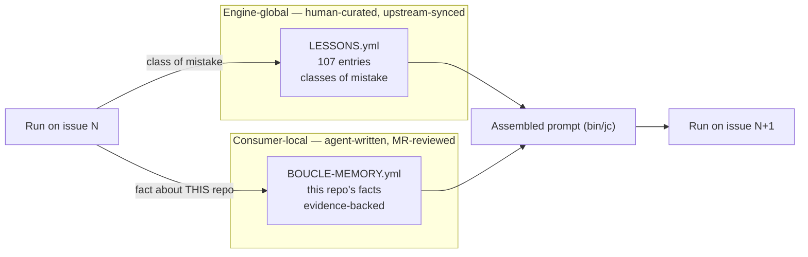

# Prime Agent — what transfers to boucle, what does not

> **Source.** *Prime Agent: A Self-Improving RLM Harness* (Karten, Zhang,
> Thomas, Müller, Bakouch et al., Prime Intellect, arXiv:2608.23552, released
> 2026-08-06) and the MIT-licensed implementation at
> [PrimeIntellect-ai/prime-agent](https://github.com/PrimeIntellect-ai/prime-agent).
>
> **Source-access caveat — read this before citing the numbers below.**
> `arxiv.org` and `huggingface.co` are blocked by this environment's egress
> policy, so the **full paper text was NOT read**. Every paper-level claim
> here comes from the abstract and the announcement summary; every mechanism
> claim comes from the repository's own docs
> (`packages/coding-agent/docs/{rlm,architecture,skills,compaction,sessions,long-running-agents}.md`),
> which are the implementation of the paper. There are therefore **no
> benchmark deltas in this study** — unlike
> [docs/skills-audit.md](skills-audit.md), nothing here is backed by an
> effect size from the source. Treat the "what transfers" section as design
> argument, not as measured evidence. Re-read the paper and revise this doc
> before quoting it as an authority.
>
> **Every boucle-side number is measured in this repo**, with the command
> shown next to it.

## 0. What Prime Agent actually is

Two ideas, one harness.

- **RLM (Recursive Language Model)** — the model does not get a tool schema.
  It gets a **persistent IPython kernel**. Files, shell, context handling and
  sub-agents are all *Python code* it writes. Context is
  *prompt-as-a-variable*: results stay as live Python variables that "survive
  across tool calls and compaction". Sub-agents are function calls:
  `handle = await rlm("Review auth security", name="auth-reviewer")` returns
  a **handle immediately** — never the child's answer. Results come back only
  through explicit `agent_message` replies or files.
- **Continual harness** — supplemental prompts, memories, skill descriptions
  and **reusable sub-agent specifications** are stored as durable state,
  refined by `/refine` in "small, evidence-backed updates", **local to the
  session by default**, with snapshots for rollback. The immutable base
  system prompt is never rewritten.

Around them: a daemon supervisor, session workers and kernels as separate
processes (explicitly "**not** a security sandbox"), JSONL session trees with
branching, auto-compaction, `/goal`, `/heartbeat`, `prime-agent schedule`,
and an autonomous mode bounded by continuation / turn / token / wall-clock
budgets plus command-based quality gates.

## 1. The mapping

| Prime Agent | Boucle's equivalent today | Verdict |
| --- | --- | --- |
| Persistent IPython kernel as the only tool surface | `bin/jc` + jcode tools + CI shell; state re-materialised per stage | **Reject** — a kernel cannot survive an ephemeral runner |
| Prompt-as-a-variable (pull) | Blobs pushed into the prompt: 9,490-char skill catalogue + ≤4,387-char lessons block + architecture overview | **Partial** — keep pushing, make it addressable (P5) |
| `rlm()` recursive sub-agents, async handles | `swarm` in [.jcode/agents/worker.md](../.jcode/agents/worker.md) §"Swarm — parallel sub-agents" | **Converged** — but 0 instrumentation (P4) |
| Reusable **sub-agent specifications** as durable state | None — swarm prompts are written from scratch every run | **Transfers** (P4) |
| Continual harness: memories, local by default | `LESSONS.yml` — engine-global, human-curated, `bin/update`-synced | **Transfers, inverted** (P1) |
| `/refine` on trajectories | Lesson candidate emitted **only at escalation** (`bin/jc:1342`) | **Transfers** (P2) |
| Snapshots + rollback of refinements | `pruned: true` / `merged_into:` — manual, no evidence trail | **Partial** (P1) |
| Compaction: cut point + LLM summary + keep recent | Tail-elision ladder 750 → 300 → 120 chars, bot notes only | **Transfers** (P3) |
| Autonomous budgets: continuations, turns, tokens, wall clock, quality gates | Step + iteration caps; token/cost **measured** (`cost.json`) but never **capped** | **Transfers** (P6) |
| Skills: descriptions at startup, body on demand | `bin/skills-index` catalogue + on-demand `SKILL.md` | **Converged** — no action |
| Daemon, `attach`, Agents View | CI jobs + status board + `boucle takeover` | **Reject** — contradicts "nothing to keep running" |
| Session tree, `/tree` branching | Linear iterations + discarded-head tags | **Reject** — no consumer need |
| "Not a security sandbox" | CI container, per-stage, credentials scrubbed | **Boucle is ahead** |

## 2. What transfers, ranked

### P1 — Learn *per consumer*, not only per engine

Boucle learns in exactly one place: `LESSONS.yml`, 107 entries, engine-global,
human-curated, pushed to every consumer by `bin/update`. Nothing a run
discovers about **this repository** outlives the issue:
`.boucle-state/<issue>/` is per-issue and gitignored, and the state note is
attached to the issue. So the build command, the flaky suite, the deploy
quirk, the missing binary are re-discovered on issue N+1.

That is precisely the `setup_fail` class — the environment blocking a run
before the agent reaches the task — which
[docs/skills-audit.md](skills-audit.md) measures dropping **5.3% → 0.2%**,
"an effect ~25× the aggregate one". Boucle already knows this is the class
worth attacking; it just has no place to write what it learned.

Prime Agent's answer is the continual harness: memories that are **local by
default**. Boucle should take the mechanism and **invert the default**:

- **Where.** A consumer-root, agent-writable, **committed** file (e.g.
  `BOUCLE-MEMORY.yml`). **NEVER** under `.boucle/` — that directory is 100%
  owned by `bin/update` and `bin/check-boucle-sync` rejects agent commits
  touching it (see [AGENTS.md](../AGENTS.md) §"`.boucle/` ownership").
- **What.** One entry per fact, each carrying its evidence: issue iid, SHA,
  the observed error string. No entry without evidence — that is the whole
  point of "evidence-backed updates".
- **Who.** The worker writes it in the **same MR** as the code, so every
  memory passes through the reviewer and the human MR gate. Prime Agent's
  refinements are local and silent; boucle's must be reviewed. That is the
  house rule, and it is the stronger design: a bad memory is a bad memory in
  every future run.
- **Rollback for free.** It is a committed file: `git revert` is the
  snapshot mechanism Prime Agent had to build.
- **Injection.** Reuse the `LESSONS.yml` path in `bin/jc:1368` verbatim —
  same keyword extraction, same "already extracted, do NOT re-read" framing.



**The admission test must differ.** `LESSONS.yml` demands
class-not-instance (AGENTS.md §"Lessons learned"). A repo memory is the
**opposite**: instances are exactly what it is for. Reusing the four-point
test would reject every useful entry. Write a separate, narrower test —
reproducible, repo-specific, falsifiable, non-duplicate — or the file fills
with re-worded lessons.

### P2 — Refine on success too, not only at escalation

`bin/jc:1342` emits a lesson candidate only when the loop escalates. Every
artifact boucle has ever distilled therefore comes from a failed run.
[docs/skills-audit.md](skills-audit.md) already calls this out — "100% of the
lesson pipeline is `0s5f`" — and reports that failure-only source pools make
distilled artifacts **worse than no artifact** (0.5161 vs 0.5935 Codex/TB2).

Prime Agent is independent evidence for the same fix: `/refine` reviews **a
trajectory**, not a post-mortem. Nothing in it is conditioned on failure.

Emit a candidate at the terminal `boucle:done` transition as well — the same
place the metrics row is already published, so the hook exists. Route
success-derived candidates to the P1 repo memory rather than to
`LESSONS.yml`, so the global file stays conservative while the pool that
feeds the prompt stops being 100% failure-derived.

### P3 — Summarise the tail instead of amputating it

Boucle's ladder (LOOP.md §"Prompt budget") trims bot notes 750 → 300 → 120
chars. At 120 chars a reviewer verdict is a headline: the information is
gone, but the token is still paid. Prime Agent compacts instead: walk back to
`keepRecentTokens` (default 20,000), LLM-summarise everything before the cut,
append one `CompactionEntry`, and **accumulate file-operation tracking across
compactions** so the "what was touched" record never degrades.

Keep boucle's two invariants — human comments never trimmed, no note ever
dropped — and replace the bottom rung:

- Keep the last N bot notes and every human note **verbatim**.
- Replace older bot notes with **one** `[boucle:digest]` note produced by the
  cheap model, carrying: verdicts and their SHAs, approaches already
  rejected, files already touched.
- The digest merges; it does not drop. The invariant holds.

Cost is bounded: `BOUCLE_MAX_PROMPT_CHARS` defaults to `0` (disabled), so the
extra call only ever fires for a consumer who has opted into a ceiling.

### P4 — Instrument `swarm` before investing in it

[.jcode/agents/worker.md](../.jcode/agents/worker.md) §"Swarm" tells the
worker to spawn parallel sub-agents and forbids one-liner prompts. Measured
here: **zero** references to `swarm` anywhere in `bin/` or `lib/`
(`grep -rn swarm bin/ lib/`). Boucle does not know whether a single worker
run has ever spawned one — the same blind spot `skills-used.json` was built
to close for skills, and the house rule is measure first.

1. Extract swarm spawns from the transcript exactly as skills are extracted,
   record them on the `[boucle:metrics]` channel and on the `health.jsonl`
   row. Measurement only — nothing gates on it.
2. **Only if they fire**, take Prime Agent's *sub-agent specification*: a
   small set of reusable specs (research, explorer, file-group implementer)
   with a required prompt contract — objective, constraints, file paths,
   expected output — instead of a prompt improvised per run.

Do not build (2) before (1) answers whether the feature exists in practice.

### P5 — Make the pushed blobs addressable

Prime Agent pulls: state is a variable the model queries. Boucle pushes,
deliberately — `bin/jc:1369` records that agents read `LESSONS.yml`
voluntarily in **0 of 68 observed runs**, so the blobs are injected and the
agent gets no choice. That measurement stands, and the push should stay.

The cheap half of the pull model still applies: an injected excerpt should
say what it is an excerpt **of**. The lessons block is capped at 80 lines of
107 entries and the agent is told "do NOT re-read the file" — correct for the
file, wrong for the rest of the knowledge. Append one line naming the
remainder and the command that widens it (`bin/lessons --grep <kw>`, to be
added). It costs ~1 line against a 4,387-char block, and whether it is ever
used is measurable on the same channel as P4.

### P6 — Cap the budget, and keep "limit reached ≠ success"

Prime Agent bounds autonomous work by continuations, turns, tokens and wall
clock, adds command-based quality gates, and states plainly that reaching a
limit does not imply success. Boucle caps steps and iterations, and since
`cost.json` it **measures** tokens and cost — LOOP.md §"Cost accounting"
calls that "the prerequisite for a real budget cap: measure first, cap
second". The prerequisite is met; §Caps still reads "not set at MVP".

Add `BOUCLE_MAX_ISSUE_COST` / `BOUCLE_MAX_ISSUE_TOKENS`, evaluated at stage
entry against the accumulated `cost.json`. On breach: escalate to
`boucle:human` through the existing `boucle_escalation_diagnostic` with a new
failure class `budget-exhausted`. **NEVER** treat exhaustion as a pass — the
classifier already distinguishes provider/quota from build-fail, and this is
a third thing. Unset means unlimited, as today.

## 3. Where boucle is already ahead

Three convergences worth stating, because they are load-bearing arguments for
choices boucle has already defended and should not revisit:

- **Progressive disclosure of skills.** Prime Agent loads skill
  *descriptions* at startup and the body on demand. `bin/skills-index`
  publishes all 62 skill descriptions (9,490 chars) with **no ranking**, and
  the body loads on demand. Two independent designs, same answer. The "no
  ranking" refusal in LOOP.md §Skills is now the majority position.
- **Async is the point.** "Closing the terminal UI detaches the client; it
  does not stop the worker" is Prime Agent working to recover what boucle
  gets structurally: CI runs it, nothing is attached, invariant I3.
  Prime Agent needs a daemon supervisor, ZeroMQ and an Agents View to reach
  where boucle starts.
- **Agent-to-agent messaging.** Prime Agent routes inter-agent messages
  through the supervisor. Boucle's channel is the forge note thread —
  durable, human-auditable, survives process death, and is the same artifact
  the human reviews. That is a better fit for a supervised loop, and
  marker-stamping (I7) already makes it machine-readable.
- **"Not a security sandbox."** Prime Agent says so explicitly and tells
  users to run untrusted code in an external sandbox. Boucle's per-stage CI
  container **is** that sandbox, with scrubbed credentials. Keep saying it.

## 4. Rejected, with reasons

- **Persistent IPython kernel.** It presumes a process that outlives the
  turn. Boucle's runner is ephemeral by design; per-issue state on the forge
  (LOOP.md §"Per-issue state") is the deliberate answer to the same problem
  and survives what a kernel does not.
- **Daemon, `attach`, Agents View.** Directly contradicts "no laptop left
  half-open, nothing to restart, nothing to babysit". `boucle takeover`
  already covers the one case that matters (resuming after escalation).
- **Session-tree branching.** Boucle's unit of retry is a CI job with a fresh
  process; `adaptive` reset plus the `boucle/<issue>/discarded-<ts>` tag
  already preserves the abandoned path. Branching buys nothing without an
  interactive session to branch in.
- **Local-by-default, silent refinement.** Boucle's thesis is human gates.
  Any refinement must land in an MR. Take the mechanism, drop the default.

## 5. Reproducing the boucle-side numbers

```bash
grep -cE '^[0-9]+:' LESSONS.yml            # 107 lessons
bin/skills-index | wc -c                   # 9490 chars of catalogue
bin/skills-index | grep -c '^- '           # 62 published descriptions
awk '/^1:/{p=1} p' LESSONS.yml | head -80 | wc -c   # 4387 chars, lessons cap
grep -rn 'swarm' bin/ lib/ | wc -l         # 0 — swarm is unmeasured
sed -n '1342p;1368,1380p' bin/jc           # candidate-at-escalation, injection
```

## See also

- [docs/skills-audit.md](skills-audit.md) — the skills study P1/P2 build on
- [LOOP.md](../LOOP.md) — §Skills, §Prompt budget, §Cost accounting,
  §Per-issue state, §Skill-effectiveness measurement
- [AGENTS.md](../AGENTS.md) — §"Lessons learned", §"`.boucle/` ownership"
- [ARCHITECTURE.md](../ARCHITECTURE.md) — the 8-stage pipeline
