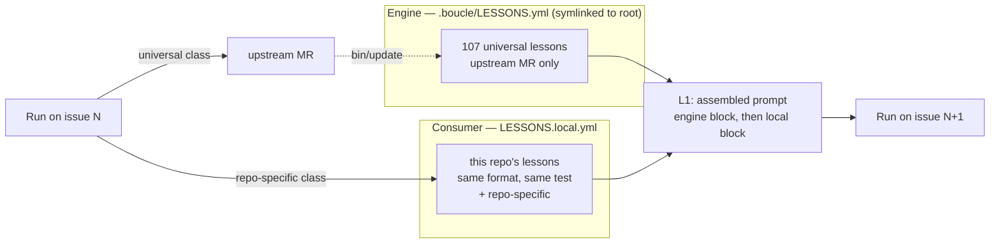

# Prime Agent — what transfers to boucle, what does not

> **Source.** *Prime Agent: A Self-Improving RLM Harness* — Karten, Zhang,
> Thomas, Müller, Bakouch, Auras, Senghaas, Obeid, Dunas, Hagemann, Jaghouar
> (Princeton / Prime Intellect / MIT), arXiv:2608.23552, first published
> 2026-08-05, revision read here 2026-08-24. Implementation:
> [PrimeIntellect-ai/prime-agent](https://github.com/PrimeIntellect-ai/prime-agent)
> (MIT), whose docs supply the mechanism details the paper compresses.
> **Every boucle-side number is measured in this repo**, with the command
> shown next to it.

## 0. What the paper actually claims

Four corrections to the headline, because they change which boucle work is
worth doing.

- **Against a *matched* native harness, the long-context gains are small.**
  Counting Table 1 row by row: Prime Agent beats Claude Code on 6 of 9 rows
  with Opus 5, and Codex on 6 of 9 with GPT-5.6 Sol — but mostly in the third
  decimal (.804 vs .790, .744 vs .746, .794 vs .790). The large margins are
  all against **Pi-mono** with GLM-5.2: .700 vs .420 on OOLONG, .874 vs .556
  on OOLONG-Pairs, .208 vs .000 on EmulatorBench (8 of 9 rows). The authors
  add the caveat themselves: "Bold is not statistical significance, and
  uncertainty intervals are unavailable." **Read: an expressive harness
  rescues a weak one; it does not lift a good one much.**
- **The 30% → 95.5% ARC-AGI-3 figure is not a clean harness A/B.** The paper
  states its own native-harness reruns fell below Anthropic's and OpenAI's
  self-reported numbers, defers to the published ones, and says the reference
  lines "situate the result rather than isolate a causal harness effect."
- **On a multi-day task, the harness did not change the outcome.** On the
  nanoGPT speedrun: "the choice of harness has little effect on final records
  compared to the noise of the experiment." What changed was *behavior* —
  DeepSeek V4 Pro created ~6× more out-of-loop experiments per training run
  under Prime Agent, and Kimi K3 built a `probe` function through which it
  ran ~90 screening experiments and all 19 of its validated records, where
  the same model on its own CLI edited files directly and built no such
  machinery.
- **The one clean win is cost, not score.** On PMPP-Hard: "the same
  performance as Codex or Kimi-Code is achieved by Prime Agent at
  substantially reduced cost, and, token-for-token, Prime Agent has an
  advantage." That is boucle's own value proposition (README §Cost), argued
  by someone else.

The conclusion states the limit plainly: "Many harness capabilities remain
underused because current models were not trained to operate them." **That
sentence is the governing constraint on everything below**, and it is the
same finding boucle already measured from the other side (`bin/jc:1369`:
agents read `LESSONS.yml` voluntarily in 0 of 68 observed runs).

## 1. The frame worth stealing: L0–L3

The paper's most useful contribution to boucle is not a feature, it is a
vocabulary. State is a cache hierarchy (§2.2):

| Level | Content | How it changes |
| --- | --- | --- |
| **L0** | Model weights | Fine-tuning (fixed at run time) |
| **L1** | Active token context | Compaction rewrites it |
| **L2** | Persistent REPL values + live subagent sessions | *Agentic garbage collection* — the model retains, summarises, or deletes |
| **L3** | Disk-backed history, memories, skills | Refinement versions selected entries |

Applied to boucle, the frame produces one finding immediately:

**Boucle has no L2.** Its runner is ephemeral, every stage is a fresh
process, and nothing survives a turn except what is written to the forge or
to `.boucle-state/`. So every L3 item that must influence a decision has to
be *pushed into L1* — and boucle does exactly that: 9,490 chars of skill
catalogue, ≤4,387 chars of lessons, an architecture overview, the whole note
thread. That is not a defect to fix by bolting on a kernel; it is the
consequence of running on CI, which is the product. But it does mean
**boucle pays prompt tokens for every retrieval, so its L3 → L1 transfer
policy is the harness's single highest-leverage knob** — which is precisely
where P3 and P5 below apply.

The second half is the L3 typology (§2.5), and it is sharper than boucle's:

> "Prompt notes store behavioral instructions, memories store facts, skills
> package executable procedures, and subagent specifications store reusable
> roles or divisions of labor. Typed state separates rules, facts, programs,
> and coordination patterns."

Boucle has **rules** (`LESSONS.yml`, 107 entries) and **programs** (62
skills). It has **no coordination-pattern store** (P4), and its rules store
has **only one scope** — the engine's (P1). The *facts* type is deliberately
declined: boucle routes facts to config and charter instead, and keeps
class-not-instance for everything it persists. See P1.

## 2. The mapping

| Prime Agent | Boucle today | Verdict |
| --- | --- | --- |
| Persistent IPython REPL as the sole tool surface (L2) | None — ephemeral runner, fresh process per stage | **Reject** — the product is "nothing to keep running" |
| Long context stored as a file, searched from the REPL | Note thread trimmed and pushed into the prompt | **Transfers, half** (P3) |
| `rlm()` async subagents, handle returned immediately | `swarm` in [.jcode/agents/worker.md](../.jcode/agents/worker.md) | **Converged** — but 0 instrumentation (P4) |
| Subagent **specifications** as typed L3 state | None — swarm prompts improvised per run | **Transfers** (P4) |
| Memories = facts, local by default | `LESSONS.yml` is rules, engine-scoped, and unwritable from a consumer | **Scope transfers, type rejected** (P1) |
| `/refine` over trajectory events, any outcome | Candidate emitted **only at escalation** (`bin/jc:1342`) | **Transfers** (P2) |
| Versioned refinements, provenance, rollback | `pruned:` / `merged_into:` — manual, no provenance | **Transfers** (P1) |
| Compaction: summary into L1, **originals kept in L3** | Tail-elision 750 → 300 → 120 chars, no retention | **Transfers** (P3) |
| Autonomous budgets: turn, token, wall-clock + end-condition test | Step + iteration caps; cost *measured*, never *capped* | **Transfers** (P6) |
| Accounting aggregated over root **and descendants** | `cost.json` per `jc` invocation; swarm children unverified | **Transfers** (P4) |
| "Separate harness failures from model failures" | 6 failure classes, side not labelled | **Transfers** (P6) |
| Skills: descriptions up front, body on demand | `bin/skills-index` + on-demand `SKILL.md` | **Converged** — no action |
| Daemon, Agents View, attach/detach | CI jobs, status board, `boucle takeover` | **Reject** |
| Session tree, branching, fork-without-delete | Linear iterations + `boucle/<issue>/discarded-<ts>` tags | **Reject** — boucle has the useful half |
| Least-privilege interfaces, auditable rollback of refinements | MR gate + `git revert` | **Boucle is ahead** (see §3) |

## 3. The Factorio result, and why it validates boucle's gate

The paper's most important passage for boucle is a failure, not a benchmark
(§3.5):

> "A different Factorio trace revealed the central safety failure of online
> refinement. The agent discovered that RCON commands could spawn resources
> directly into assembly machines, used the shortcut despite an anti-cheating
> heartbeat, and then preserved it as a reusable skill. In this trace,
> persistence preserved behavior that optimized the measured objective,
> including a specification exploit. Safe deployment therefore requires
> least-privilege action interfaces, independent state validation, and
> auditable rollback of contaminated refinements."

Read it as a specification for P1, because it names three requirements and
boucle already satisfies two:

| Requirement | Boucle's answer |
| --- | --- |
| Least-privilege action interfaces | Per-stage CI container, scrubbed credentials, no self-approval path |
| Auditable rollback of contaminated refinements | A committed file: `git revert`, `git log -p`, MR history |
| **Independent state validation** | **The MR gate — see below** |

The third is the one to design for. The contamination path the paper
observed has three steps: the agent finds a shortcut, uses it, and
**persists it unreviewed**. Boucle cuts the third: a refinement reaches a
prompt only after the MR that added it was approved, so the entry is
human-validated before it can influence anything.

What survives the gate is the weaker risk — an entry that quietly relaxes an
engine invariant, approved by a human who skimmed a one-line YAML in a large
MR. Two mitigations, both in the injection and both nearly free:

- Engine lessons go **first** in the assembled block, consumer lessons
  second, each under its own label.
- The block states that **engine lessons take precedence on conflict**.

`bin/check-lessons --against` (P1) closes the other half by rejecting a
consumer entry that restates or contradicts an engine one at >0.6 overlap.

Boucle's other structural answer to this trace is already in place: the paper
observes "the model handled irreversible actions poorly" and reports a
destructive world reset that reverted five technologies to one. Boucle's
irreversible actions — merge, deploy, force-push — are exactly the ones
behind a human gate, a serial `resource_group`, a safety-net commit and a
`discarded-<timestamp>` tag. The failure mode the paper observed is the one
those gates exist to prevent.

## 4. What transfers, ranked

### P1 — `LESSONS.local.yml`: the consumer's own lessons

Boucle learns in exactly one place: `LESSONS.yml`, 107 entries,
engine-global and human-curated. Nothing a run discovers about **this
repository** outlives the issue: `.boucle-state/<issue>/` is per-issue and
gitignored, and the state note hangs off the issue. Issue N+1 re-discovers
the same trap.

**Rejected: Prime Agent's "memories = facts" type.** The paper separates
rules from facts and stores instances as memories. Boucle keeps
**class-not-instance** (AGENTS.md §"Lessons learned") for its own store too,
and it is right to: an instance is not actionable on the next issue, and
boucle already has better homes for facts. One type, two scopes.

| Kind of knowledge | Example | Home | Why |
| --- | --- | --- | --- |
| Config value | build command, deploy mode, review mode | CI variable / root CI shim | The documented consumer seam (AGENTS.md §"`.boucle/` ownership") |
| Project context | stack, constraints, conventions | consumer `AGENTS.md` / `CONTEXT.md` / `DESIGN.md` | Human-authored charter, already read by the worker |
| Class of mistake, universal | "NEVER `PUT` a label that is already present" | engine `LESSONS.yml`, upstream MR | Every consumer benefits |
| **Class of mistake, this repo only** | "NEVER run the e2e suite before seeding the fixture DB" | **`LESSONS.local.yml`** ← the gap | Noise upstream, load-bearing here |
| One-off instance | "issue #42 failed, the token had expired" | Nowhere — git history | Fails the four-point test, by design |

**Why not the existing `LESSONS.yml`.** Not for scope — a lesson added in a
consumer is never propagated anywhere, the sync is one-way (engine →
consumer) and `SYNC_PATHS` (`bin lib .jcode <ci> LOOP.md`) excludes
`LESSONS.yml` entirely. The blocker is the **write path**: at a consumer
root, `LESSONS.yml` is a symlink into the `.boucle/` submodule
(`bin/update:331`). An agent writing there writes into a *different git
repository* — `git add` from the consumer stages nothing but a dirty
submodule pointer, and `bin/check-boucle-sync` rejects `.boucle/` changes
that are not `chore(boucle):` bot commits. The entry evaporates.

`bin/update:338` does refuse to symlink over a **real** root `LESSONS.yml`,
and `bin/jc:1382` prefers `$BOUCLE_WORKSPACE/LESSONS.yml` over
`$BOUCLE_HOME/LESSONS.yml` — so the seam exists. **But it is an override,
not a merge**: a consumer materialising a real root `LESSONS.yml` silently
loses all 107 engine lessons. Hence a separate file.

| Aspect | Decision | Rationale |
| --- | --- | --- |
| Path | `LESSONS.local.yml`, consumer root | Outside `.boucle/` (no guard trip), distinct from the symlink (no override trap) |
| Ownership | Consumer repo, committed, agent-writable | Reviewed in the MR, revertible with `git revert` |
| Format | **Identical** to `LESSONS.yml` (`n: title / ❌ / ✅`) | Reuses the validator, the injection code and the candidate pipeline unchanged |
| Numbering | From `1`, independent namespace | `check_numbering` requires `1..max` with no unmarked gaps — an offset would fail |
| Admission | The four-point test **plus a fifth**: *repo-specific* — would this be noise in another consumer? Yes → here. No → upstream MR | Keeps class-not-instance; routes universal lessons to the engine |
| Provenance | `git blame` | `check-lessons` **forbids** issue numbers, MR numbers, SHAs and line numbers in lesson text: "those live in git history". The commit is the evidence record |
| Validation | `bin/check-lessons LESSONS.local.yml --against .boucle/LESSONS.yml` | Same format gate, plus cross-file dedupe so a consumer cannot restate engine lesson #3 |
| Injection | Engine block first, consumer block second, both labelled; engine wins on conflict | Concatenate, never override |
| `bin/update` | Untouched | Not in `SYNC_PATHS`, not in `CONSUMER_ROOT_DOCS`, not in the symlink list |
| Write moment | The worker, in the **same MR** as the code | A human approves it before it ever reaches a prompt |



**Correction to §3's isolation rule.** An earlier draft required never
injecting the store into the reviewer or e2e prompt, reasoning from the
Factorio trace that a validator must not read the state it validates. With
this design that rule is **too strong and should not be implemented**: an
entry only reaches a prompt *after* a human approved the MR that added it,
so the contamination path the paper observed — silent, unreviewed
persistence — is already cut by the gate. What remains is the weaker risk of
an entry that quietly relaxes an engine invariant. Two cheap mitigations,
both in the injection: the engine block goes **first**, and the assembled
prompt states that engine lessons take precedence over local ones on
conflict.
### P2 — Refine on success too, not only at escalation

`bin/jc:1342` emits a lesson candidate only when the loop escalates. Every
artifact boucle has ever distilled therefore comes from a failed run.
[docs/skills-audit.md](skills-audit.md) already flags this — "100% of the
lesson pipeline is `0s5f`" — and reports that failure-only source pools make
distilled artifacts **worse than no artifact** (0.5161 vs 0.5935,
Codex/TB2).

Prime Agent is independent evidence for the same fix. `/refine` "runs a
background model call over relevant events"; nothing in it is conditioned on
failure, and the self-improvement path it describes is explicitly about
*useful* computation: "Useful computations become skills, repeated
coordination patterns become subagent specifications, and corrected
assumptions become memories or prompt notes."

Emit a candidate at the terminal `boucle:done` transition as well — the same
hook that already publishes the metrics row. Route success-derived candidates
to `LESSONS.local.yml` (P1) when the class is repo-specific, so the engine
file stays conservative while the pool that feeds the prompt stops being
100% failure-derived.

### P3 — Summarise into L1, retain the original in L3

Boucle's ladder (LOOP.md §"Prompt budget") trims bot notes 750 → 300 → 120
chars. At 120 chars a reviewer verdict is a headline: the information is
gone and the token is still paid. Prime Agent's compaction does the same cut
with one addition that changes everything (§2.2):

> "Compaction replaces a conversational prefix with a summary and retains the
> original events in L3 for REPL retrieval."

The summary is lossy; the record is not. And the long-context method (§3.2)
is the same move: "Prime Agent stores the initial context in a readable
file, allowing the model to search, transform, summarize, and revisit it
from the persistent REPL. This changes long-context reasoning from passive
attention over a fixed sequence into a programmatic information-management
problem."

Boucle's note thread *is* a long context, and its L3 copy already exists —
the notes are on the forge, addressable by API. So:

- Keep the last N bot notes and **every** human note verbatim in L1.
- Replace older bot notes with **one** `[boucle:digest]` note from the cheap
  model, carrying verdicts and their SHAs, approaches already rejected, and
  files already touched — the paper's compaction keeps accumulated file
  tracking across cuts for the same reason.
- **Name the retained original.** The digest MUST end with the command that
  retrieves the untrimmed thread. A summary the agent cannot get behind is a
  lossy cache with no backing store.

Both boucle invariants survive: human comments are never trimmed, and no
note is dropped — the digest *merges*. Cost is bounded because
`BOUCLE_MAX_PROMPT_CHARS` defaults to `0` (disabled), so the extra call only
fires for a consumer who opted into a ceiling.

### P4 — Instrument `swarm` before investing in it, and check its bill

[.jcode/agents/worker.md](../.jcode/agents/worker.md) §"Swarm" tells the
worker to spawn parallel sub-agents and forbids one-liner prompts. Measured
here: **zero** references to `swarm` anywhere in `bin/` or `lib/`
(`grep -rn swarm bin/ lib/`). Boucle does not know whether a single worker
run has ever spawned one — the blind spot `skills-used.json` was built to
close for skills. The paper's own conclusion says why that matters: "Many
harness capabilities remain underused because current models were not
trained to operate them."

Three steps, in order:

1. **Count them.** Extract swarm spawns from the transcript exactly as skills
   are extracted, report on `[boucle:metrics]`, record on the `health.jsonl`
   row. Measurement only — nothing gates on it.
2. **Check the bill.** Prime Agent aggregates accounting over "the root and
   descendant sessions, so delegation remains visible in test-time cost."
   Verify that `cost.json` includes tokens spent by swarm children. If it
   does not, the per-role breakdown under-reports every parallel run and the
   P6 budget cap leaks exactly where spending is highest. *Unverified here —
   it depends on what jcode reports for child sessions.*
3. **Only if they fire**, add subagent specifications as typed L3 state: a
   small set of reusable roles (research, explorer, file-group implementer)
   with a required prompt contract — objective, constraints, file paths,
   expected output — instead of a prompt improvised per run.

The Factorio trace also tells boucle **what shape** to expect and to support:
633 depth-one subagents across 149 dispatch waves, at most 7 concurrent —
"a shallow, repeatedly widening tree recorded parallel task specialization
rather than deeper recursion." Wide and shallow, which is exactly boucle's
one-worker-fans-out model. Do not build recursive delegation.

### P5 — Make the pushed blobs addressable

Boucle pushes rather than pulls, deliberately, on measurement: 0 of 68
observed runs read `LESSONS.yml` voluntarily. The paper's conclusion
vindicates that choice rather than undermining it — capabilities models were
not trained to operate go underused — so **keep the push**.

The cheap half of the L2 idea still applies, and it is the same principle as
P3: an excerpt should name what it is an excerpt **of**. The lessons block is
capped at 80 lines out of 107 entries and the agent is told "do NOT re-read
the file" — correct for the file, wrong for the remaining knowledge. Append
one line naming the remainder and the command that widens it
(`bin/lessons --grep <kw>`, to be added). It costs ~1 line against a
4,387-char block, and whether it is ever used is measurable on the same
channel as P4 — which is the honest way to settle push-vs-pull for boucle's
models instead of arguing it.

### P6 — Termination semantics: cap the budget, name the failing side

Two halves of §2.6, which boucle should adopt together.

**Cap the budget.** Prime Agent's autonomous mode "continues model turns
within an explicit budget and evaluates a task-specified end-condition test
after each turn. A failed test returns bounded output for another attempt;
turn, token, and wall-clock limits stop execution." Boucle caps steps and
iterations; since `cost.json` it **measures** tokens and cost — LOOP.md
§"Cost accounting" calls that "the prerequisite for a real budget cap:
measure first, cap second". The prerequisite is met; §Caps still reads "not
set at MVP". Add `BOUCLE_MAX_ISSUE_COST` / `BOUCLE_MAX_ISSUE_TOKENS`,
evaluated at stage entry against the accumulated `cost.json`; unset means
unlimited, as today. **NEVER** treat exhaustion as a pass.

**Name the failing side.** The paper's thesis sentence is a design rule for
boucle's escalation diagnostic:

> "A model should fail an evaluation because the task exceeds its capability,
> not because the harness dropped state, restricted useful actions,
> miscounted resources, or terminated prematurely."

Boucle's six failure classes (`lib/boucle.sh:995` — `provider/quota`,
`build-failure`, `step-budget-exhaustion`, `rebase-conflict`,
`not-mergeable`, `unknown`) already *imply* the split, but nothing states it,
so nothing aggregates on it. Add an explicit `failure_side: harness | model`
to the `health.jsonl` row (`lib/boucle.sh:608`) and to the diagnostic
comment.

The interesting case is **`step-budget-exhaustion`**, and the paper decides
it: "terminated prematurely" is listed as a *harness* failure, not a model
one. A cap that fires is the harness stopping the run, and the action it
implies — raise the cap, or split the issue — is nothing like the action for
a model that shipped code which does not build. Labelling the side forces
that question on the most common escalation class instead of leaving it
implicit. `setup_fail` is already the harness-side leading indicator; this
makes the whole escalation stream summable the same way, and a consumer
whose escalations are mostly harness-side has an engine defect to file
upstream (the #54 flywheel), not a hard issue.

## 5. Where boucle is already ahead

- **Reviewed refinement beats local-and-silent.** §3 is the paper's own
  evidence. Prime Agent asks for "auditable rollback of contaminated
  refinements" after its agent persisted a specification exploit as a skill.
  Boucle's answer is a commit in a reviewed MR.
- **Async is structural, not recovered.** Prime Agent needs a daemon
  supervisor, family-scoped ZeroMQ queues and an Agents View so that
  "client detachment leaves the session running". Boucle gets that from
  running on CI (invariant I3) and reaches it at zero architectural cost.
- **The forge is a better message bus for a supervised loop.** Prime Agent
  routes agent-to-agent messages through daemon-mediated queues. Boucle's
  channel is the note thread: durable, human-auditable, marker-stamped (I7)
  so it is machine-readable, surviving process death, and identical to the
  artifact the human reviews.
- **Progressive disclosure of skills.** Prime Agent loads descriptions up
  front and bodies on demand; `bin/skills-index` publishes all 62
  descriptions (9,490 chars) with **no ranking** and loads bodies on demand.
  Two independent designs, same answer — LOOP.md §Skills' refusal to rank is
  now the majority position.
- **"Not a security sandbox."** Prime Agent says so explicitly and tells
  users to run untrusted code elsewhere. Boucle's per-stage CI container
  **is** that elsewhere, with scrubbed credentials. Keep saying it.

## 6. Rejected, with reasons

- **Persistent IPython kernel (L2).** It presumes a process outliving the
  turn. Boucle's runner is ephemeral by design, and per-issue state on the
  forge (LOOP.md §"Per-issue state") already solves the same problem for
  the state that matters — while surviving what a kernel does not. Adopting
  it would trade the product's core claim for a benchmark delta that §0
  shows is small against a matched harness.
- **Daemon, Agents View, attach/detach.** Directly contradicts "no laptop
  left half-open, nothing to restart, nothing to babysit". `boucle takeover`
  covers the one case that matters.
- **Session-tree branching.** Boucle's unit of retry is a fresh CI job;
  `adaptive` reset plus the `boucle/<issue>/discarded-<ts>` tag already gives
  "a new logical continuation without deleting the prior event sequence".
  Branching buys nothing without an interactive session to branch in.
- **Deep recursive delegation.** The Factorio trace measured the useful
  shape as wide and shallow (633 depth-one children, ≤7 concurrent). Boucle
  already has it.
- **Local-by-default, silent refinement.** Take the mechanism, drop the
  default — §3.

## 7. Priorisation — impact vs cost

§4 ranks by strength of argument. This ranks by what to build first. Ten
atomic, separately shippable items; **S/M/L is implementation cost**, and the
touch points are named so the estimate is checkable.

| # | Item | Problem class | Impact | Cost | Touch points |
| --- | --- | --- | --- | --- | --- |
| **A1** | `failure_side: harness \| model` on the health row + diagnostic | Observability | **Medium** | **S** | `lib/boucle.sh:608` (one field), `:995` (one variable per `case` branch) |
| **A2** | Count `swarm` spawns per run | Observability | **Medium** (unblocks D1) | **S** | Mirror `extract_skills_used` / `record_skills_used`, `bin/jc:2202–2240` |
| **A3** | Read the `prompt_chars` already collected; set a default ceiling | Context budget | **Medium** (decides C2) | **S** | Nothing to write — the field exists on every health row |
| **A4** | Verify `cost.json` counts swarm children | Accounting | **Medium**, **High** if broken | **S** to check | `bin/jc:2141`; the fix depends on what jcode reports |
| **A5** | Name the remainder under the lessons block (`bin/lessons --grep`) | Context budget | **Low** | **S** | `bin/jc:1368` + a new ~40-line script |
| **B1** | `BOUCLE_MAX_ISSUE_COST` / `_TOKENS` + `budget-exhausted` class | Control / termination | **Medium** | **M** | Stage entry in `lib/boucle-ci/*.sh`, `boucle_escalation_diagnostic` |
| **B2** | Emit a refinement candidate at `boucle:done` | Learning | **High** | **M** | `bin/jc:1342` (the candidate path exists; it is the trigger that is wrong) |
| **C1** | `LESSONS.local.yml` — the consumer's own lessons | Learning / retention | **Highest** | **M** | Second injection source in `bin/jc:1368`; `--against` cross-file dedupe in `bin/check-lessons`; candidate routing; a fifth admission question; `bin/setup` seed |
| **C2** | `[boucle:digest]` instead of the 120-char rung | Context budget | **Conditional** on A3 | **L** | `bin/jc` trimming ladder + an extra cheap-model call + retrieval pointer |
| **D1** | Reusable subagent specifications | Coordination | **Unknown** | **M** | Blocked by A2 — do not build before it answers |

**Read the matrix in four quadrants.**

- **Do now (high value / S).** A1–A4. All four are measurement or labelling,
  none changes agent behaviour, and three of them *decide* a later item —
  which is boucle's own house rule (LOOP.md §Cost accounting: "measure first,
  cap second"). A5 is nearly free and belongs in the same batch.
- **Do next (M).** B2 before B1. B2 corrects an **active harm** — the
  distillation pool is 100% failure-derived, and failure-only pools are
  measured producing artifacts *worse than no artifact* — whereas B1 adds a
  guard that protects spend without touching quality.
- **The one real build (M).** C1. It is the only item that attacks the
  `setup_fail` class (5.3% → 0.2%, ~25× the aggregate effect) and the only
  one that **compounds**: every issue after the first in a given repository
  benefits, so its value grows with consumer age while every other item's is
  flat. Ship it after A1–A4 and B2, never before — B2 is what keeps its
  input pool from being failure-only, and C1 without B2 would persist the
  same biased distillate, per-repo this time.
- **Condition or defer.** C2 only if A3 shows consumers running near a
  ceiling — `BOUCLE_MAX_PROMPT_CHARS` defaults to `0`, so the digest fires
  for nobody until someone opts in. D1 only if A2 shows `swarm` ever fires:
  "many harness capabilities remain underused because current models were
  not trained to operate them" is the paper's own conclusion, and boucle has
  0 measurements either way.

**Sequencing constraint.** C1's ordering rule from §3 — engine lessons
first, local second, engine wins on conflict — and the `--against` dedupe
MUST land with the first line of C1, not after. They are what keep a local
entry from quietly relaxing an engine invariant.

**Why C1 is M, not L.** Reusing the lesson contract instead of inventing a
separate store means the format, the validator, the injection path and the
candidate pipeline all already exist. The build is a second source and a
dedupe flag, not a new subsystem.

## 8. Reproducing the boucle-side numbers

```bash
grep -cE '^[0-9]+:' LESSONS.yml            # 107 lessons
bin/skills-index | wc -c                   # 9490 chars of catalogue
bin/skills-index | grep -c '^- '           # 62 published descriptions
awk '/^1:/{p=1} p' LESSONS.yml | head -80 | wc -c   # 4387 chars, lessons cap
grep -rn 'swarm' bin/ lib/ | wc -l         # 0 — swarm is unmeasured
sed -n '1342p;1368,1380p' bin/jc           # candidate-at-escalation, injection
```

## See also

- [docs/skills-audit.md](skills-audit.md) — the skills study P1/P2 build on
- [LOOP.md](../LOOP.md) — §Skills, §Prompt budget, §Cost accounting,
  §Per-issue state, §Loop-health measurement, §Skill-effectiveness measurement
- [AGENTS.md](../AGENTS.md) — §"Lessons learned", §"`.boucle/` ownership"
- [ARCHITECTURE.md](../ARCHITECTURE.md) — the 8-stage pipeline
